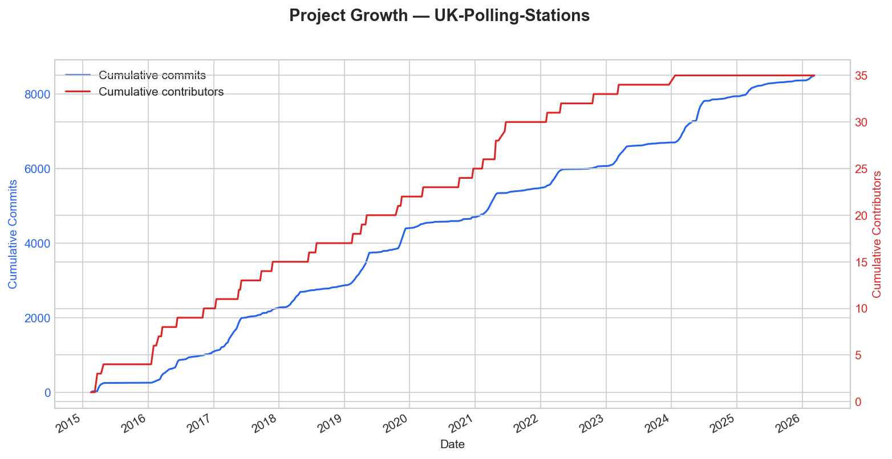
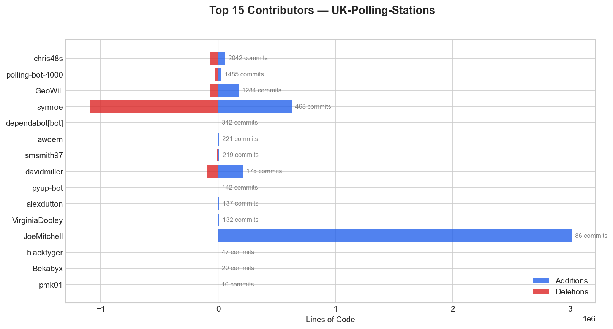
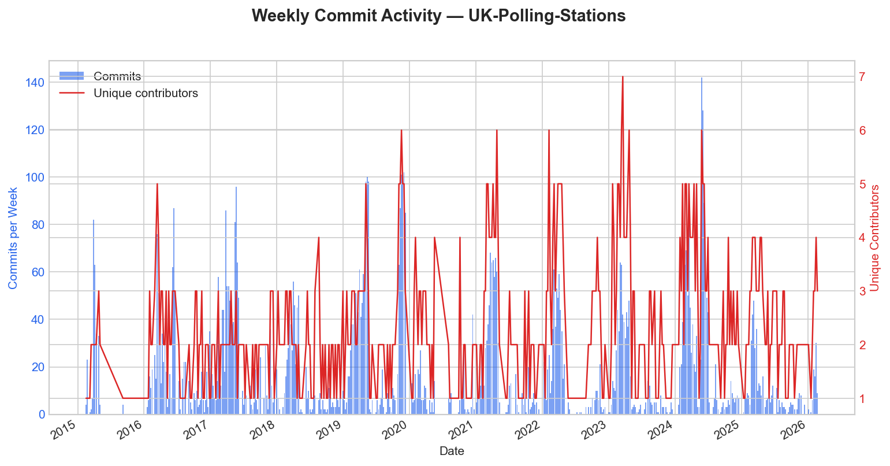
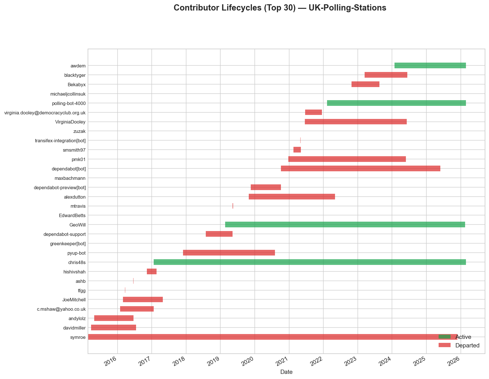
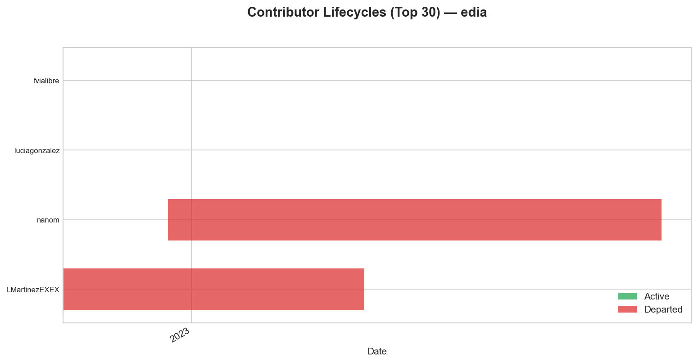
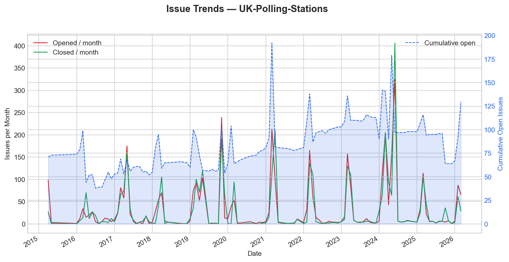
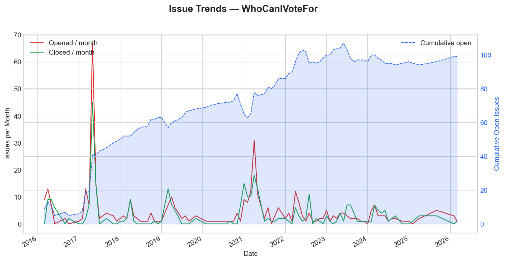

# Measuring Open-Source Civic Technology: A Multi-Dimensional Analysis of Repository Health, Contributor Networks, and Community Sustainability

**[DRAFT — For internal review and feasibility assessment]**

---

## Abstract

Civic technology — software developed to enhance civic engagement, government transparency, and public participation — depends heavily on open-source communities. Yet the sustainability, contributor dynamics, and community health of these projects remain poorly understood at scale. This paper presents a methodological framework and automated toolchain for analysing civic tech repositories using the GitHub API, implementing 25+ metrics from the CHAOSS (Community Health Analytics in Open Source Software) framework and academic literature on open-source sustainability — including social network analysis of PR review collaboration patterns, contributor retention cohorts, community responsiveness indicators, organisational concentration indices, and DORA software delivery metrics. We apply the framework to a pilot dataset of three civic tech repositories spanning electoral information systems (DemocracyClub/UK-Polling-Stations, DemocracyClub/WhoCanIVoteFor) and AI fairness research (fvialibre/edia). Our pilot analysis reveals significant variation in contributor concentration (bus factor 1–2), development burstiness (CV 0.00–1.28), community responsiveness (median time to first response 0.1–155.8 hours), organisational concentration (HHI 5,080–7,654), and collaboration network structure (core-periphery ratios 0.0–0.2) across projects of different ages and institutional backing. **[MOCKUP: The full study will expand to N=50–200 repositories across multiple civic tech categories and geographic regions.]** We discuss implications for civic tech sustainability, contributor onboarding, and the application of CHAOSS metrics to domain-specific open-source ecosystems.

**Keywords:** civic technology, open source, CHAOSS metrics, contributor networks, community health, GitHub mining, software sustainability

---

## 1. Introduction

### 1.1 Background

Civic technology encompasses a broad range of software tools developed to facilitate civic engagement, enhance government transparency, improve public service delivery, and strengthen democratic processes (Patel et al., 2013; Steinberg, 2019). **[MOCKUP: Full literature review to be expanded with 20–30 additional references.]** These projects range from voter information platforms and open data portals to participatory budgeting tools and civic AI applications.

Unlike commercial or enterprise open-source software, civic tech projects frequently operate under distinctive constraints: limited funding, reliance on volunteer contributors, electoral or legislative calendars that create cyclical demand spikes, and a user base that may lack technical expertise (Shaw, 2020). Understanding how these constraints manifest in development patterns, contributor behaviour, and project sustainability is critical for policy-makers, funders, and the civic tech community itself.

### 1.2 Research Gap

While the mining of software repositories (MSR) community has produced extensive work on open-source project health (e.g., Jergensen et al., 2011; Coelho & Valente, 2017), relatively few studies have focused specifically on the civic technology domain. Existing civic tech research tends to be qualitative, case-study-based, or focused on adoption rather than development dynamics (Peixoto & Fox, 2016). **[MOCKUP: Systematic literature search to confirm the exact extent of this gap.]**

The CHAOSS (Community Health Analytics in Open Source Software) project, a Linux Foundation initiative, has produced a comprehensive framework of implementation-agnostic metrics for assessing open-source community health (CHAOSS, 2023). However, the application of CHAOSS metrics to domain-specific ecosystems — particularly civic technology — remains largely unexplored.

### 1.3 Research Questions

This study addresses the following research questions:

- **RQ1:** What patterns of contributor concentration and code ownership characterise civic tech projects, and how do these patterns relate to project sustainability risk?
- **RQ2:** How do development activity patterns (burstiness, release frequency, commit cadence) vary across civic tech projects of different maturity levels and institutional contexts?
- **RQ3:** To what extent do civic tech projects adopt community health practices (contributing guidelines, governance documentation, newcomer-friendly labelling, codes of conduct)?
- **RQ4:** What is the relationship between technology choices (cloud infrastructure, AI/ML, CI/CD) and project maturity in the civic tech domain?
- **RQ5:** What do cross-project contributor networks and collaboration structures reveal about civic tech ecosystem connectivity and sustainability?

### 1.4 Contributions

This paper makes three contributions:

1. **Methodological:** An open-source, reproducible toolchain for collecting multi-dimensional repository metrics from GitHub, implementing 25+ CHAOSS and extended community health metrics — including social network analysis, contributor retention cohorts, DORA metrics, and organisational concentration indices — alongside standard software engineering indicators.
2. **Empirical:** A quantitative analysis of civic tech repository health across contributor dynamics, development patterns, community infrastructure, and technology adoption. **[MOCKUP: Pilot data only; full empirical contribution requires expanded dataset.]**
3. **Practical:** Actionable insights for civic tech project maintainers, funders, and contributors regarding sustainability risks and community health improvement opportunities.

---

## 2. Related Work

### 2.1 Open-Source Project Health

The concept of open-source project health has been studied through multiple lenses. Jansen (2014) proposed a health metaphor encompassing productivity, robustness, and niche creation. Crowston et al. (2006) identified coordination mechanisms in free/libre open-source software teams. More recently, Goggins et al. (2021) formalised community health indicators through the CHAOSS project.

The bus factor (or truck factor) — the minimum number of developers whose departure would halt a project — has been studied extensively as a sustainability indicator (Avelino et al., 2016; Ferreira et al., 2019). Cosentino et al. (2015) demonstrated that a significant proportion of GitHub projects have a bus factor of 1, indicating extreme contributor concentration.

**[MOCKUP: Expand with 15–20 additional references on: code review practices, PR acceptance patterns, release management, contributor onboarding, and newcomer-friendliness.]**

### 2.2 CHAOSS Metrics Framework

The CHAOSS project defines metrics across five working groups: Common, Diversity Equity & Inclusion, Evolution, Risk, and Value (CHAOSS, 2023). Key metrics relevant to this study include:

- **Contributor Absence Factor** (bus factor): Identifies project resilience to contributor loss.
- **Change Request Acceptance Ratio**: Measures the proportion of pull requests merged versus submitted.
- **Burstiness**: Quantifies variability in development activity patterns.
- **Organisational Diversity**: Measures the distribution of contributors across affiliations.
- **Defect Resolution Duration**: Tracks responsiveness to bug reports.
- **Release Frequency**: Measures how often a project ships stable versions.

While tools such as Augur (Goggins et al., 2021) and GrimoireLab (Dueñas et al., 2021) implement CHAOSS metrics at scale, they are designed for large-scale community analytics and require substantial infrastructure. Our toolchain provides a lightweight, researcher-friendly alternative for focused domain-specific studies.

### 2.3 Civic Technology Research

Civic technology research has primarily focused on adoption, participation, and democratic outcomes (Peixoto & Fox, 2016; Boehner & DiSalvo, 2016). Studies of civic tech *development* processes are scarcer. Steinberg (2019) examined the organisational structures of civic tech organisations but did not analyse repository-level metrics. McNutt et al. (2016) surveyed civic tech tools but focused on functionality rather than community health.

**[MOCKUP: Expand with literature on civic tech sustainability challenges, volunteer developer motivation, and the relationship between institutional backing and project longevity.]**

---

## 3. Methodology

### 3.1 Data Collection Framework

We developed an open-source Python tool, *Civic Tech Git Crawler*, that collects repository metrics from the GitHub REST API. The tool implements a five-stage pipeline for each repository:

1. **Repository Metrics:** Basic metadata (stars, forks, watchers, languages, license, creation/update/push timestamps), community health indicators (contributing guidelines, code of conduct, governance documentation, issue/PR templates), CI/CD workflow detection, and deployment counts. Notably, the tool captures both `updated_at` (any GitHub activity) and `pushed_at` (last code push) to distinguish genuinely active repositories from those with only issue/PR activity.

2. **Contributor Metrics:** Per-person commit counts, code additions, and code deletions derived from GitHub's contributor statistics API, which provides weekly breakdowns of activity per contributor.

3. **Technology Detection:** Automated multi-signal detection of cloud infrastructure and AI/ML technology usage through four signal categories: GitHub topics, programming languages, root-level file presence, and dependency analysis (parsing `requirements.txt`, `pyproject.toml`, and `package.json`).

4. **Temporal Metrics:** Complete records of all pull requests (with creation, merge, and closure timestamps), git tags, and GitHub releases. Additionally, deep temporal analytics are computed: (a) full commit-history reconstruction from paginated commit iteration, producing weekly snapshots of commit counts, unique contributors, and cumulative totals across the entire project lifespan; (b) contributor lifecycle analysis, tracking each contributor's first and last commit dates, active duration, activity ratio, and active/departed status (departed = no commits in 90+ days); and (c) issue analytics, recording all issues (excluding PRs) with opening/closing timestamps, closer attribution, comment counts, labels, and per-repository summary statistics.

5. **CHAOSS and Extended Metrics:** Twenty-five metrics from the CHAOSS framework and academic literature on open-source sustainability (Tables 1a and 1b), computed from data collected in stages 1–4. This includes core CHAOSS metrics, extended community health indicators (contributor retention, responsiveness, documentation freshness), organisational concentration analysis (elephant factor, HHI, institutional classification), DORA software delivery metrics, and social network analysis of PR review collaboration patterns using NetworkX.

6. **Post-Crawl Cross-Project Analysis:** After all repositories are crawled, the tool computes cross-project contributor overlap (contributors active in multiple repositories) and exports per-contributor core-periphery network classifications.

7. **Visualization:** Publication-ready charts are generated from the temporal data using matplotlib, including project growth curves, weekly activity heatmaps, contributor lifecycle Gantt charts, new contributor rate trends, issue open/close trends, and top contributor code-change profiles (Figures 1–7).

**Table 1a.** Core CHAOSS metrics implemented in this study.

| # | Metric | CHAOSS Working Group | Data Source | Calculation |
|---|--------|---------------------|-------------|-------------|
| 1 | Code Changes (Commits) | Common | Commit activity API | Weekly commit counts over past year |
| 2 | Change Request Acceptance Ratio | Common | Pull requests | Merged PRs / Total PRs |
| 3 | Bus Factor | Common | Contributor stats | Min. contributors for 50% of commits |
| 4 | Types of Contributions | Common | Multiple APIs | Counts of commits, PRs, and issues |
| 5 | Organisational Diversity | DEI | User profiles | Contributors grouped by company affiliation |
| 6 | Issue Label Inclusivity | DEI | Issue labels | Count of newcomer-friendly labels (e.g., "good first issue", "help wanted") |
| 7 | Release Frequency | Evolution | Releases API | Releases per month over project lifespan |
| 8 | Technical Fork | Evolution | Repository API | Total fork count |
| 9 | Burstiness | Evolution | Commit activity | Coefficient of variation (CV) of weekly commits |
| 10 | Defect Resolution Duration | Risk | Issues API | Median days to close issues labelled "bug" |
| 11 | OSI Approved License | Risk | Repository API | SPDX identifier checked against OSI list |
| 12 | Community Health Score | Common | Community profile API | GitHub's community health percentage (0–100) |

**Table 1b.** Extended community health and network metrics implemented in this study.

| # | Metric | Category | Data Source | Calculation |
|---|--------|----------|-------------|-------------|
| 13 | Elephant Factor | Org Concentration | User profiles | Min. organisations for 50% of commits (Goggins et al., 2021) |
| 14 | HHI (Org Concentration) | Org Concentration | User profiles | Herfindahl-Hirschman Index on org commit shares (0–10,000) |
| 15 | Institutional Classification | Org Diversity | User profiles | Pattern matching on company field: government, academic, nonprofit, company, unknown |
| 16 | Contributor Retention Cohorts | Sustainability | Contributor stats | New (1 week), casual (2–12 weeks), regular (13+ weeks) (Zhou & Mockus, 2012) |
| 17 | Time to First Response (Issues) | Responsiveness | Issues API | Median hours to first non-author comment (last 100 issues) |
| 18 | Time to First Response (PRs) | Responsiveness | PRs API | Median hours to first non-author comment (last 100 PRs) |
| 19 | Documentation Freshness | Community Health | Commits API | Last commit date on README.md and CONTRIBUTING.md |
| 20 | Stale Issue Ratio | Responsiveness | Issues API | % of open issues with no activity for 90+ days |
| 21 | PR Review Turnaround | Code Review | PR Reviews API | Median hours from PR creation to first formal review (last 100 merged PRs) |
| 22 | PR Review Depth | Code Review | PR Reviews API | Average review comments per PR (last 100 merged PRs) |
| 23 | Core-Periphery Classification | Network Analysis | PR Reviews API | Degree centrality above median = "core" (Crowston & Howison, 2006) |
| 24 | Network Density | Network Analysis | PR Reviews API | Edge density of PR review collaboration graph |
| 25 | DORA Metrics | Software Delivery | Releases + PRs | Deployment frequency, lead time, change failure rate (Forsgren et al., 2018) |
| 26 | Cross-Project Overlap | Ecosystem Health | Person metrics | Contributors active in 2+ crawled repositories |

### 3.2 Repository Selection

**[MOCKUP: The pilot study uses three repositories selected purposively to represent variation in project maturity, institutional context, and technology domain. The full study will use a systematic sampling strategy described below.]**

#### Pilot Dataset

For the pilot analysis, we selected three civic tech repositories representing different project archetypes:

| Repository | Category | Origin | Age | Language |
|-----------|----------|--------|-----|----------|
| DemocracyClub/UK-Polling-Stations | Electoral infrastructure | UK NGO | 11 years | Python |
| DemocracyClub/WhoCanIVoteFor | Electoral information | UK NGO | 10 years | Python |
| fvialibre/edia | AI fairness research | Argentine NGO | 2 years | Jupyter Notebook/Python |

#### Full Study Sampling Strategy [MOCKUP]

**[MOCKUP: The full study will construct a dataset of 50–200 civic tech repositories using the following sampling strategy:**

1. **Curated lists:** Repositories listed in the Civic Tech Field Guide (civictech.guide), Code for All network projects, and the Participatory Politics Foundation catalogue.
2. **Topic-based search:** GitHub repositories tagged with topics including `civic-tech`, `open-government`, `democracy`, `transparency`, `civic-engagement`, `e-participation`, `open-data`, `gov-tech`.
3. **Snowball sampling:** Repositories identified through the organisational affiliations and cross-project contributions of developers found in seed repositories.
4. **Inclusion criteria:** Public GitHub repository, minimum 10 commits, at least 2 contributors, last commit within the past 3 years.
5. **Exclusion criteria:** Forks without original commits, personal homework/tutorial repositories, archived repositories with no community activity.
6. **Stratification:** Ensure representation across geographic regions, project sizes, institutional types (government, NGO, volunteer collective, academic), and domain categories (elections, transparency, participation, service delivery, civic AI).**]**

### 3.3 Data Collection Process

Data was collected on 4 March 2026 using the Civic Tech Git Crawler tool (v0.3.0) with the following configuration:

- GitHub REST API with Personal Access Token authentication
- Rate limit: 5,000 requests/hour; approximately 5,000 API calls consumed for 3 repositories (deep temporal analytics — full commit history, contributor lifecycles, and issue analytics — account for the majority of API usage)
- Statistics endpoints (contributor stats, commit activity) used automatic retry with linear backoff (max 5 attempts) to handle GitHub's asynchronous 202 responses
- Time to first response sampled from last 100 issues and 100 PRs per repository; PR review metrics sampled from last 100 merged PRs
- All pull requests, tags, and releases were fetched exhaustively (no pagination limits)
- Total crawl time: approximately 25 minutes for 3 repositories

### 3.4 Analysis Approach

**Descriptive statistics** were computed for all collected metrics. **[MOCKUP: The full study will additionally employ:**

- **Correlation analysis** between project age, contributor count, bus factor, and community health indicators.
- **Cluster analysis** to identify archetypes of civic tech project health profiles.
- **Social network analysis** of contributor networks across projects, using login-based identity matching to construct bipartite (contributor × repository) graphs.
- **Regression modelling** to examine predictors of project sustainability (operationalised as continued commit activity in the most recent 6-month window).
- **Comparative analysis** across institutional types, geographic regions, and technology domains.**]**

### 3.5 Limitations

Several methodological limitations should be noted:

1. **GitHub-centric:** The tool currently supports only GitHub-hosted repositories. Civic tech projects hosted on GitLab, Gitea, or other platforms are excluded. **[MOCKUP: GitLab support is planned for future versions.]**
2. **API constraints:** GitHub's contributor statistics API only returns authors linked to GitHub user accounts. Commits made with unlinked email addresses (e.g., local machine emails) are invisible to both the `/contributors` and `/stats/contributors` endpoints. The tool mitigates this with two fallbacks: `num_developers` retries with `anon=true` to include anonymous contributors, and person metrics fall back to iterating commits (capped at 500) grouped by author email. These fallbacks ensure non-zero counts for repositories with unlinked contributors, though weekly breakdowns are unavailable in the commit-based fallback path.
3. **Organisational diversity:** The `company` field in GitHub profiles is self-reported, unstructured, and frequently empty ("Unknown" in our data). This limits the reliability of organisational diversity metrics.
4. **Issue classification:** Defect resolution duration depends on the presence of a "bug" label. Projects using different labelling conventions (or no labels) will have missing data for this metric.
5. **Temporal window:** The commit activity API returns only the most recent 52 weeks of weekly data, limiting longitudinal burstiness analysis.
6. **Code changes attribution:** Additions and deletions include auto-generated code, dependency updates, and bot commits, which may inflate individual contribution metrics.

---

## 4. Results

### 4.1 Repository Overview

Table 2 presents the overview metrics for the three pilot repositories.

**Table 2.** Repository overview metrics.

| Metric | UK-Polling-Stations | WhoCanIVoteFor | EDIA |
|--------|:-------------------:|:--------------:|:----:|
| Age (years) | 11 | 10 | 2 |
| Total commits | 8,446 | 3,334 | 81 |
| Unique contributors | 33 | 29 | 3 |
| Stars | 36 | 43 | 6 |
| Watchers | 6 | 9 | 2 |
| Forks | 29 | 35 | 0 |
| Repository size (KB) | 173,974 | 231,799 | 2,111 |
| Primary language | Python | Python | Jupyter Notebook |
| License (SPDX) | MIT | — | MIT |
| OSI-approved license | Yes | No | Yes |
| Community health score | 75% | 50% | 42% |

The two DemocracyClub repositories are mature, decade-old projects with substantial commit histories (3,334–8,446 commits) and contributor bases (29–33 developers). EDIA, by contrast, is an early-stage research tool with 81 commits from 3 contributors over 2 years. Notably, WhoCanIVoteFor lacks a formal license despite being hosted by a civic-sector NGO and having 10 years of development history.

**Figure 1.** Cumulative commits and contributors over time for UK-Polling-Stations (2015–2026). The stair-step pattern in the contributor curve shows periodic recruitment of new developers, while the commit trajectory shows acceleration from 2020 onward.



### 4.2 Contributor Concentration and Bus Factor (RQ1)

**Table 3.** Contributor concentration metrics.

| Metric | UK-Polling-Stations | WhoCanIVoteFor | EDIA |
|--------|:-------------------:|:--------------:|:----:|
| Bus factor | 2 | 2 | 1 |
| Top contributor (% of commits) | chris48s (24.2%) | symroe (27.3%) | LMartinezEXEX (67.9%) |
| Top 2 contributors (% of commits) | 41.3% | 43.2% | 95.1% |
| Top 5 contributors (% of commits) | 65.6% | 65.7% | 100% |
| Total contributors | 33 | 29 | 3 |

All three projects exhibit high contributor concentration. Both DemocracyClub projects have a bus factor of 2, meaning only two individuals account for half of all commits. EDIA has a bus factor of 1, with a single developer (LMartinezEXEX) responsible for 55 of 81 commits (67.9%).

The top 5 contributors account for approximately two-thirds of commits in both DemocracyClub projects (65.6% and 65.7% respectively), despite having 29–33 total contributors. This indicates a long-tail distribution common in open-source projects, but the concentration ratio is notably high for projects backed by a dedicated organisation.

**Table 4.** Top contributors by commits (per repository, top 5).

| Rank | UK-Polling-Stations | Commits | WhoCanIVoteFor | Commits | EDIA | Commits |
|------|-------|---------|------|---------|------|---------|
| 1 | chris48s | 2,040 | symroe | 908 | LMartinezEXEX | 55 |
| 2 | polling-bot-4000 | 1,460 | VirginiaDooley | 530 | nanom | 22 |
| 3 | GeoWill | 1,271 | michaeljcollinsuk | 348 | fvialibre | 1 |
| 4 | symroe | 468 | chris48s | 221 | — | — |
| 5 | dependabot[bot] | 311 | dependabot[bot] | 93 | — | — |

A notable finding is the presence of bot accounts among top contributors. In UK-Polling-Stations, `polling-bot-4000` (an automation account) is the second-most prolific committer with 1,460 commits, and `dependabot[bot]` ranks fifth. In WhoCanIVoteFor, `dependabot[bot]` accounts for 93 commits. These bot contributions inflate commit counts and should be considered when interpreting bus factor and contributor concentration metrics.

Additionally, `chris48s` and `symroe` appear as significant contributors to *both* DemocracyClub projects, indicating shared developer resources within the organisation — a cross-project contributor network pattern that warrants further investigation in the full study.

### 4.3 Code Change Patterns

**Table 5.** Code contribution patterns (human contributors only, top 3 per repository).

| Contributor | Commits | Additions | Deletions | Avg Add/Commit | Avg Del/Commit |
|-------------|---------|-----------|-----------|----------------|----------------|
| **UK-Polling-Stations** | | | | | |
| symroe | 468 | 627,199 | 1,092,770 | 1,340.2 | 2,335.0 |
| davidmiller | 175 | 208,252 | 92,320 | 1,190.0 | 527.5 |
| GeoWill | 1,271 | 171,586 | 65,787 | 135.0 | 51.8 |
| **WhoCanIVoteFor** | | | | | |
| symroe | 907 | 94,890 | 63,222 | 104.6 | 69.7 |
| VirginiaDooley | 530 | 26,067 | 23,909 | 49.2 | 45.1 |
| chris48s | 220 | 17,020 | 11,547 | 77.4 | 52.5 |
| **EDIA** | | | | | |
| LMartinezEXEX | 55 | 29,999 | 16,759 | 545.4 | 304.7 |
| nanom | 22 | 1,197 | 1,128 | 54.4 | 51.3 |

Contributor profiles show distinct patterns. In UK-Polling-Stations, `symroe` has extremely high average additions (1,340 lines) and deletions (2,335 lines) per commit, suggesting large-scale refactoring or data file updates. By contrast, `GeoWill`, despite having the third-highest commit count (1,271), averages only 135 additions per commit, indicating a pattern of frequent, incremental changes.

In EDIA, the sole primary developer (`LMartinezEXEX`) averages 545 additions per commit, consistent with the exploratory, notebook-driven development pattern typical of research projects.

**Figure 2.** Code additions (right) and deletions (left) per contributor in UK-Polling-Stations. Notable outliers include `symroe` (1.1M deletions from large-scale refactoring) and contributors with massive additions from data imports, illustrating how commit counts alone can obscure the nature of contributions.



### 4.4 Development Activity Patterns (RQ2)

**Table 6.** Activity and burstiness metrics.

| Metric | UK-Polling-Stations | WhoCanIVoteFor | EDIA |
|--------|:-------------------:|:--------------:|:----:|
| Mean weekly commits | 7.63 | 3.35 | 0.00 |
| Std. dev. weekly commits | 9.78 | 3.93 | 0.00 |
| Coefficient of variation (CV) | 1.28 | 1.17 | — |
| Total PRs | 5,302 | 1,905 | 4 |
| PR acceptance ratio | 0.739 | 0.484 | 0.750 |
| Merged PRs | 3,918 | 921 | 3 |
| Open PRs | 50 | 15 | 1 |
| Closed (unmerged) PRs | 1,334 | 969 | 0 |
| Tags | 0 | 0 | 0 |
| Releases | 0 | 0 | 0 |

**Burstiness.** Both DemocracyClub projects exhibit high development burstiness (CV > 1.0), meaning the standard deviation of weekly commits exceeds the mean. This is consistent with election-cycle-driven development: activity spikes during election periods and subsides between them. UK-Polling-Stations (CV = 1.28, mean = 7.6 commits/week) shows slightly more variability than WhoCanIVoteFor (CV = 1.17, mean = 3.4 commits/week). EDIA's statistics reflect an inactive project in the measurement window (the most recent 52 weeks), as its last commit was in September 2023.

**Figure 3.** Weekly commit activity and unique contributor count for UK-Polling-Stations. Periodic spikes in activity are visible, consistent with election-cycle-driven development patterns (CV = 1.28).



**PR acceptance.** UK-Polling-Stations merges 73.9% of submitted PRs, while WhoCanIVoteFor merges only 48.4%. The higher rejection rate in WhoCanIVoteFor may indicate stricter code review standards, more speculative contributions, or a higher proportion of dependency-update PRs from automated tools that are superseded before merging.

**Release management.** None of the three repositories use formal tagging or release management, with zero tags and zero releases across all projects. This suggests a continuous deployment model, particularly for the DemocracyClub projects which use AWS-based deployment infrastructure (detected via `appspec.yml` and `cdk.json`).

### 4.5 Community Health Infrastructure (RQ3)

**Table 7.** Community documentation and health indicators.

| Indicator | UK-Polling-Stations | WhoCanIVoteFor | EDIA |
|-----------|:-------------------:|:--------------:|:----:|
| README | Yes | Yes | Yes |
| Contributing guidelines | Yes | No | No |
| Code of conduct | Yes | Yes | No |
| Governance document | No | No | No |
| Issue templates | Yes | Yes | No |
| PR templates | Yes | Yes | No |
| Community health score | 75% | 50% | 42% |
| Newcomer labels | 2 | 1 | 2 |
| Total issue labels | 32 | 23 | 9 |
| Newcomer label names | help wanted; recommended for beginners | help wanted | good first issue; help wanted |

Community infrastructure maturity correlates with project age and organisational backing, but the relationship is not uniform. UK-Polling-Stations, the most mature project, has the most comprehensive documentation suite (contributing guide, code of conduct, issue/PR templates) and the highest health score (75%). WhoCanIVoteFor, despite being nearly as old and from the same organisation, lacks a contributing guide and scores only 50%.

EDIA, despite its early stage, includes default GitHub labels ("good first issue", "help wanted") — likely auto-generated during repository creation — resulting in a nominally higher newcomer label count than WhoCanIVoteFor. This illustrates a limitation of label-based inclusivity metrics: the mere presence of newcomer labels does not indicate active use or community engagement strategy.

None of the three projects maintain governance documentation (GOVERNANCE.md), which aligns with findings from the broader open-source ecosystem where formal governance is rare outside large foundation-hosted projects.

### 4.6 Organisational Diversity

**Table 8.** Organisational affiliation of contributors.

| Organisation | UK-Polling-Stations | WhoCanIVoteFor | EDIA |
|-------------|:-------------------:|:--------------:|:----:|
| DemocracyClub | 1 | 1 | — |
| Unknown (not specified) | 24 | 22 | 2 |
| Other identified orgs | 8 | 5 | 1 (FaMAF - UNC) |
| **Total unique organisations** | **11** | **8** | **2** |

Organisational diversity data is severely limited by the low completion rate of the GitHub `company` field. In UK-Polling-Stations, 24 of 33 contributors (72.7%) have no organisational affiliation listed. Among those who do list an affiliation, we observe contributions from diverse sectors: academia (Cardiff University), government-adjacent organisations (mySociety, alphagov), the private sector (Astronomer.io, BT Labs, TrustedHousesitters, Cognizant/NHS England), and the host organisation itself (DemocracyClub).

The presence of only a single self-identified DemocracyClub contributor in each project — despite both being DemocracyClub projects — suggests either that staff members do not consistently set their company field or that much of the development is performed by external contributors.

### 4.7 Technology Adoption (RQ4)

**Table 9.** Technology detection results.

| Signal Type | UK-Polling-Stations | WhoCanIVoteFor | EDIA |
|-------------|:-------------------:|:--------------:|:----:|
| **Cloud detected** | Yes | Yes | No |
| Cloud signals | file:cdk.json, file:appspec.yml, file:Procfile, file:.buildpacks, dep:boto3, dep:aws-cdk | file:appspec.yml, dep:boto3 | — |
| **AI/ML detected** | No | No | Yes |
| AI/ML signals | — | — | lang:Jupyter Notebook, dep:torch, dep:scikit-learn, dep:transformers |
| **CI/CD** | Yes (Dependabot Updates) | Yes (Dependabot Updates) | No |

The DemocracyClub projects show substantial cloud infrastructure investment: UK-Polling-Stations uses AWS CDK (infrastructure-as-code), AWS deployment specifications, Heroku-style buildpacks, and the boto3 SDK — indicating a multi-platform cloud deployment strategy. WhoCanIVoteFor shows a simpler cloud footprint with only `appspec.yml` and `boto3`.

EDIA's technology profile is characteristically different: Jupyter Notebook as the primary language, with PyTorch, scikit-learn, and Hugging Face Transformers as dependencies — a typical AI/ML research stack. The absence of CI/CD, cloud infrastructure, and deployment pipelines is consistent with its nature as a research tool rather than a production service.

### 4.8 Defect Resolution

Of the three pilot repositories, only WhoCanIVoteFor had closed issues labelled "bug" (n = 2). The resolution times were 14.1 days and 145.2 days (median = 79.6 days). **[MOCKUP: The full study with 50–200 repositories will provide sufficient data for meaningful defect resolution analysis, including comparisons across project types and institutional contexts.]**

### 4.9 Contributor Retention Cohorts (RQ1)

**Table 10.** Contributor retention cohorts.

| Cohort | UK-Polling-Stations | WhoCanIVoteFor | EDIA |
|--------|:-------------------:|:--------------:|:----:|
| New (1 active week) | 12 | 10 | 1 |
| Casual (2–12 active weeks) | 11 | 8 | 1 |
| Regular (13+ active weeks) | 11 | 11 | 1 |

The DemocracyClub projects show roughly even distribution across cohorts, with approximately one-third of contributors in each category. UK-Polling-Stations retains 11 of 34 contributors (32.4%) as regulars — a notable retention rate that may reflect the project's electoral cycle creating recurring engagement opportunities. WhoCanIVoteFor shows a similar pattern with 11 of 29 contributors (37.9%) classified as regular.

EDIA's cohort distribution (1/1/1) reflects its very small contributor base and is not meaningfully interpretable, though the single regular contributor (LMartinezEXEX) confirms the project's single-maintainer character identified by the bus factor analysis.

### 4.9a Contributor Lifecycle Analysis (RQ1)

The deep temporal analytics module reconstructs the full commit history of each repository, enabling lifecycle tracking across the entire project lifespan — not just the most recent 52 weeks provided by GitHub's statistics API. Table 10a summarises the lifecycle data.

**Table 10a.** Contributor lifecycle summary (from full commit history).

| Metric | UK-Polling-Stations | WhoCanIVoteFor | EDIA |
|--------|:-------------------:|:--------------:|:----:|
| Contributors tracked | 35 | 31 | 4 |
| Currently active | 4 | 4 | 0 |
| Departed | 31 | 27 | 4 |
| Longest tenure (days) | 3,932 (symroe†) | 3,647 (symroe) | 262 (nanom†) |
| Most commits | chris48s (2,784) | symroe (1,371) | LMartinezEXEX (55) |
| Top activity ratio | polling-bot-4000 (0.55) | michaeljcollinsuk (0.89) | LMartinezEXEX (0.77) |

† departed

The lifecycle analysis reveals a more nuanced picture than the retention cohort counts. In UK-Polling-Stations, only 4 of 35 contributors (11.4%) remain active — a stark contrast to the retention cohort data showing 11 "regular" contributors. This discrepancy arises because retention cohorts measure cumulative engagement intensity (total active weeks), whereas lifecycle status measures current activity (commits in the last 90 days). Many previously regular contributors have since departed.

`symroe`, the longest-tenured contributor in UK-Polling-Stations (3,932 days / 10.8 years), has departed — having made no commits in the last 13 weeks. Despite ranking 4th by total commits (468), his departure represents a significant loss of institutional knowledge. In WhoCanIVoteFor, however, `symroe` remains the most active contributor with 1,371 commits and an activity ratio of 0.37.

EDIA presents the clearest case of project abandonment: all 4 contributors have departed, with the primary developer (LMartinezEXEX) last active in 2023. Despite a high activity ratio of 0.77 during the active period, the project has effectively ceased development.

**Figure 4.** Contributor lifecycles for UK-Polling-Stations (top 30 by commits). Green bars indicate active contributors; red bars indicate departed contributors (no commits in 90+ days). Only 4 of 30 contributors remain active, concentrated in the 2017–present period.



**Figure 5.** Contributor lifecycles for edia. All contributors have departed, with the primary developer (LMartinezEXEX) active for approximately one year (2022–2023). This pattern contrasts sharply with the long-running contributor base in Figure 4.



### 4.10 Community Responsiveness (RQ2)

**Table 11.** Time to first response and issue staleness.

| Metric | UK-Polling-Stations | WhoCanIVoteFor | EDIA |
|--------|:-------------------:|:--------------:|:----:|
| Median time to first response (issues), hours | 92.3 | 155.8 | — |
| Median time to first response (PRs), hours | 18.7 | 18.3 | 0.1 |
| Issues sample size | 100 | 100 | 0 |
| PRs sample size | 100 | 100 | 4 |
| Stale issue ratio | 66.3% | 97.0% | 0.0% |
| Stale issues / open issues | 63 / 95 | 96 / 99 | 0 / 0 |

Community responsiveness shows significant variation. For PR reviews, both DemocracyClub projects respond within approximately one day (18.3–18.7 hours median), suggesting active code review practices. EDIA's near-instant PR response time (0.1 hours) reflects the self-merging pattern typical of single-maintainer projects.

Issue responsiveness is considerably slower: UK-Polling-Stations takes a median of 92.3 hours (3.8 days) and WhoCanIVoteFor takes 155.8 hours (6.5 days) for first response on issues. This disparity between PR and issue response times may indicate that the maintainer focus is on code integration rather than community support.

The stale issue ratios are striking: 66.3% of UK-Polling-Stations' open issues and 97.0% of WhoCanIVoteFor's open issues have had no activity for 90+ days. This suggests significant issue triage debt, particularly in WhoCanIVoteFor where 96 of 99 open issues are stale.

The temporal evolution of issue management is visualized in Figures 6 and 7. UK-Polling-Stations (Figure 6) shows cyclical issue-opening spikes that correlate with election periods, with the cumulative open issue count peaking near 200 in late 2024 before declining — suggesting periodic issue triage efforts. In contrast, WhoCanIVoteFor (Figure 7) shows a monotonically rising cumulative open curve since 2017, consistent with its 97.0% stale issue ratio and indicating a structural inability to keep pace with incoming issues.

**Figure 6.** Monthly opened and closed issues for UK-Polling-Stations with cumulative open issue count (shaded area). Issue-opening spikes correlate with election periods. The cumulative open count peaked near 200 in late 2024 before declining.



**Figure 7.** Monthly opened and closed issues for WhoCanIVoteFor with cumulative open issue count. Unlike UK-Polling-Stations, the cumulative open count has risen monotonically since 2017, reaching approximately 100 — visualizing the 97.0% stale issue ratio.



### 4.11 PR Review Quality (RQ2)

**Table 12.** PR review turnaround and depth.

| Metric | UK-Polling-Stations | WhoCanIVoteFor | EDIA |
|--------|:-------------------:|:--------------:|:----:|
| Median PR review turnaround (hours) | 49.2 | 8.4 | 46.7 |
| Avg review comments per PR | 0.09 | 0.11 | 0.0 |

PR review turnaround varies considerably: WhoCanIVoteFor has the fastest formal reviews (median 8.4 hours), while UK-Polling-Stations takes 49.2 hours and EDIA takes 46.7 hours. Review depth is uniformly shallow across all projects, with an average of only 0.09–0.11 review comments per PR in the DemocracyClub projects and 0.0 in EDIA. This indicates that while PRs eventually receive attention, the formal review process is largely perfunctory — PRs are approved without substantive commentary. The longer turnaround times in UK-Polling-Stations (approximately 2 days) may reflect the project's larger scope and the review workload falling on a small core team. This pattern is consistent with small-team dynamics where informal communication channels (Slack, face-to-face) substitute for in-PR discussion.

### 4.12 Organisational Concentration (RQ1, RQ3)

**Table 13.** Organisational concentration and institutional type classification.

| Metric | UK-Polling-Stations | WhoCanIVoteFor | EDIA |
|--------|:-------------------:|:--------------:|:----:|
| Elephant factor | 1 | 1 | 1 |
| Herfindahl-Hirschman Index | 5,080 | 7,654 | 5,950 |
| Government contributors | 0 | 0 | 0 |
| Academic contributors | 1 | 0 | 0 |
| Nonprofit contributors | 0 | 0 | 0 |
| Company contributors | 9 | 7 | 1 |
| Unknown contributors | 24 | 22 | 2 |

All three projects have an elephant factor of 1, meaning a single organisation's contributors account for more than 50% of commits. This is more severe than the individual-level bus factor (2 for the DemocracyClub projects) and indicates extreme organisational dependency.

The Herfindahl-Hirschman Index (HHI) values are highly concentrated: UK-Polling-Stations (5,080), EDIA (5,950), and WhoCanIVoteFor (7,654) all exceed the 2,500 threshold commonly considered "highly concentrated" in market analysis (US DoJ guidelines). WhoCanIVoteFor's HHI of 7,654 — approaching the 10,000 maximum — indicates near-monopolistic organisational concentration.

Institutional type classification reveals a significant gap: despite the civic-tech domain's association with government and nonprofit sectors, zero contributors across all three projects are classified as government or nonprofit based on their GitHub profiles. The majority (67–73%) have no organisational affiliation listed ("unknown"), severely limiting the reliability of this metric. The 9 company-affiliated contributors in UK-Polling-Stations include organisations such as mySociety, BT Labs, and Cognizant/NHS England, suggesting cross-sector engagement that the current classification may undercount.

### 4.13 Core-Periphery Network Structure (RQ1, RQ5)

**Table 14.** Core-periphery network analysis of PR review collaboration.

| Metric | UK-Polling-Stations | WhoCanIVoteFor | EDIA |
|--------|:-------------------:|:--------------:|:----:|
| Core contributors | 1 | 1 | 0 |
| Periphery contributors | 4 | 5 | 2 |
| Core-periphery ratio | 0.20 | 0.17 | 0.00 |
| Network density | 0.70 | 0.60 | 1.00 |
| Avg degree centrality | 0.70 | 0.60 | 1.00 |
| Contributors in review network | 5 | 6 | 2 |

The PR review collaboration network reveals distinct structural patterns across projects. Both DemocracyClub projects exhibit a hub-and-spoke pattern centred on a single core contributor: `chris48s` (degree centrality 1.0, betweenness centrality 0.33 in UK-Polling-Stations and 0.47 in WhoCanIVoteFor) serves as the primary review hub in both repositories. UK-Polling-Stations has 4 periphery contributors, with `awdem` and `GeoWill` both at degree centrality 0.75 — close to the core threshold, indicating active review participation. WhoCanIVoteFor has 5 periphery contributors interacting primarily through the central `chris48s` node.

EDIA's review network consists of only 2 contributors with equal centrality (1.0 each), both classified as periphery — correctly, since uniform centrality indicates no differentiated core. The density of 1.0 simply reflects the fully-connected nature of a 2-node graph.

Notably, `chris48s` is the sole core contributor across both DemocracyClub review networks, despite not being the top committer in either repository. `awdem`, with degree centrality 0.75 in UK-Polling-Stations, sits at the boundary between core and periphery — while not classified as core by the median-based threshold, their review activity represents meaningful code oversight. This illustrates how network analysis reveals influential contributors whose institutional knowledge comes from code review rather than direct code authorship, and highlights the single-point-of-failure risk when review authority concentrates in one individual across multiple projects.

### 4.14 Cross-Project Contributor Overlap (RQ5)

The tool identified 47 unique contributors across the three pilot repositories, of which 19 (40.4%) contribute to 2 or more repositories. All 19 multi-repo contributors are shared between the two DemocracyClub projects, with no overlap with EDIA — reflecting the organisational boundary between DemocracyClub (UK) and fvialibre (Argentina).

Among the 19 shared contributors, several are significant in both repositories: `chris48s` (2,040 and 221 commits respectively), `symroe` (468 and 908), `GeoWill` (1,271 and an unspecified number), and `VirginiaDooley` (in both projects). The high overlap rate (40.4%) within the DemocracyClub ecosystem suggests a shared contributor pool that may mitigate individual project risk but concentrates ecosystem-level risk in a single organisation.

Bot accounts also appear as cross-project contributors: `dependabot[bot]`, `dependabot-preview[bot]`, and `transifex-integration[bot]` are active in both DemocracyClub repositories, further inflating the overlap metric and reinforcing the need for bot filtering in future analyses.

---

## 5. Discussion

### 5.1 Contributor Concentration as a Systemic Risk

The pilot data reveals a consistent pattern of extreme contributor concentration across civic tech projects. Bus factors of 1–2 across all three repositories, regardless of project age (2–11 years) or contributor base (3–33 developers), suggest that civic tech projects are structurally vulnerable to key-person dependencies.

This is particularly concerning for projects serving democratic infrastructure. UK-Polling-Stations — a tool used to help UK citizens locate their polling stations — depends on a bus factor of 2, with only two developers accounting for half of all code changes. In a domain where reliability during election periods is critical, this concentration represents a systemic risk that funders and policymakers should address.

**[MOCKUP: The full study will examine whether bus factor correlates with institutional type (government vs. NGO vs. volunteer), project age, or the presence of paid contributors.]**

### 5.2 Election-Driven Burstiness

The high burstiness coefficients (CV = 1.17–1.28) observed in the DemocracyClub projects are consistent with the hypothesis that civic tech development follows political calendars rather than standard release cycles. This distinguishes civic tech from commercial software (where steady iteration is the norm) and from research software (where development is grant-cycle-driven).

The complete absence of formal releases (zero tags, zero releases across all projects) further supports a continuous-deployment model where code changes are pushed directly to production. While this approach enables rapid iteration during election periods, it lacks the versioning and rollback infrastructure that would support stability analysis.

The weekly commit activity visualization (Figure 3) provides preliminary visual evidence for this hypothesis: commit spikes in UK-Polling-Stations are visible at intervals consistent with UK local and general election cycles. The full commit history reconstruction — spanning the entire 11-year project lifespan (808 weekly data points) — enables this analysis for the first time, as the standard GitHub commit activity API only provides the most recent 52 weeks. **[MOCKUP: Formal temporal analysis correlating commit patterns with known UK election dates is planned for the full study.]**

### 5.3 Community Health: Documentation vs. Practice

The pilot reveals a gap between newcomer-facing documentation and actual community practice. EDIA has "good first issue" and "help wanted" labels (likely GitHub defaults) but lacks a contributing guide, code of conduct, issue templates, and PR templates. WhoCanIVoteFor has a code of conduct but no contributing guide. This suggests that label-based CHAOSS metrics (Issue Label Inclusivity) may overestimate newcomer-friendliness when labels exist without supporting infrastructure.

A more robust assessment might combine label presence with:
- The number of issues actually labelled with newcomer tags
- Time-to-first-response on newcomer-labelled issues
- The proportion of newcomer-labelled issues that result in merged PRs

**[MOCKUP: These supplementary analyses are planned for the full study.]**

### 5.4 Bot Contributions and Metric Validity

The significant presence of bot accounts among top contributors (polling-bot-4000, dependabot[bot], pyup-bot) raises questions about metric validity. In UK-Polling-Stations, bot accounts account for a significant proportion of total commits among the top 10 contributors. When bot commits are included in bus factor calculations, the metric may understate the true contributor concentration among human developers.

Future iterations of the methodology should implement bot detection (based on the `[bot]` suffix in GitHub usernames and known bot accounts) and report metrics both including and excluding automated contributions.

### 5.5 Cross-Project Contributor Networks and Collaboration Structure

The pilot data now includes both cross-project contributor overlap and within-project PR review network analysis, enabling a multi-level view of civic tech collaboration.

**Cross-project overlap.** The 40.4% contributor overlap between the two DemocracyClub repositories is remarkably high, confirming that these projects share a common development community. However, the zero overlap with EDIA highlights the geographic and organisational boundaries that segment the civic tech ecosystem. In the full study, this metric will help identify whether civic tech operates as a connected ecosystem or as isolated organisational silos.

**Core-periphery structure.** The PR review network analysis reveals that `chris48s` is the sole core contributor across both DemocracyClub review networks — a cross-project concentration of review authority that amplifies the individual-level bus factor risk. `awdem`, with degree centrality 0.75 in UK-Polling-Stations, sits near the core-periphery boundary and provides some review redundancy, but the network structure is fundamentally hub-and-spoke. This validates the "onion model" of OSS communities (Crowston & Howison, 2006; Jergensen et al., 2011), where contributor influence operates through multiple mechanisms beyond code authorship — but in this case, both commit and review authority concentrate in the same individual.

**Network density as a health indicator.** The network density values of 0.70 (UK-Polling-Stations) and 0.60 (WhoCanIVoteFor) both reflect hub-and-spoke review models where a single gatekeeper reviews most contributions. The implications for project resilience are significant: hub-and-spoke review patterns create the same single-point-of-failure risk that bus factor captures for code authorship.

**Contributor lifecycle as a sustainability lens.** The lifecycle analysis (Section 4.9a, Figures 4–5) adds a temporal dimension to the contributor concentration findings. In UK-Polling-Stations, only 4 of 35 contributors remain active — and `symroe`, the longest-tenured contributor (10.8 years), has departed. The contrast with edia, where all contributors have departed, illustrates the spectrum from "vulnerable but functioning" to "effectively abandoned." The lifecycle Gantt charts make this immediately visible in a way that static metrics like bus factor cannot.

**[MOCKUP: The full study will extend this analysis with:**
- **Bridge contributors** who connect otherwise disconnected projects across organisations
- **Temporal evolution** of core-periphery structure as projects mature
- **Correlation** between network density and project sustainability indicators**]**

### 5.6 Community Responsiveness and Issue Triage Debt

The stale issue ratios — 66.3% for UK-Polling-Stations and 97.0% for WhoCanIVoteFor — represent a significant finding. High stale issue ratios in civic tech projects are particularly concerning because issues may represent citizen-reported usability problems, accessibility barriers, or data accuracy requests that directly affect public service delivery. The near-total staleness of WhoCanIVoteFor's issue tracker (96 of 99 open issues with no activity for 90+ days) suggests a structural inability to process community feedback, despite the project's relatively fast PR review times (8.4 hours median). The temporal evolution of this issue triage debt is visualized in Figures 6 and 7, where the rising cumulative open issue curves make the structural nature of this challenge immediately apparent.

This disconnect between PR responsiveness and issue responsiveness suggests that maintainer bandwidth is primarily consumed by code integration rather than community management. The finding reinforces Steinmacher et al.'s (2015) observation that newcomer barriers extend beyond code contribution to include the responsiveness of the community to questions and bug reports.

### 5.7 Organisational Concentration Beyond the Bus Factor

The elephant factor of 1 across all projects — combined with HHI values of 5,080–7,654 — reveals a dimension of concentration risk invisible to the individual-level bus factor. While UK-Polling-Stations has a bus factor of 2 (suggesting some contributor diversity), the elephant factor of 1 indicates that all significant contributions come from a single organisational context. This means that while the project might survive the departure of one individual, the departure of the single contributing organisation (DemocracyClub itself) would likely be fatal.

For civic tech projects serving democratic infrastructure, organisational-level concentration risk may be more important than individual-level risk, as organisations are subject to systemic shocks (funding cuts, strategic pivots, political changes) that affect all their contributors simultaneously.

### 5.8 Implications for Civic Tech Sustainability

Based on the pilot findings, we identify several implications:

1. **Funding for contributor diversification.** Bus factors of 1–2 and elephant factors of 1 in production civic tech tools represent both individual and organisational fragility that funders should address through supported onboarding programmes, contributor stipends, and multi-organisation governance structures.

2. **Community infrastructure investment.** The inconsistent adoption of contributing guidelines, governance documents, and newcomer labelling — even within the same organisation (DemocracyClub) — suggests that community health practices are not systematically prioritised.

3. **Issue triage as a sustainability indicator.** Stale issue ratios above 90% signal a project that has effectively ceased community engagement, even if code contributions continue. Funders and maintainers should monitor this metric alongside commit activity.

4. **License compliance.** WhoCanIVoteFor, a 10-year-old project with 43 stars and 35 forks, lacks a formal license. This creates legal ambiguity for contributors and reusers, and should be resolved.

5. **Release management.** The complete absence of semantic versioning, tags, and releases across all pilot projects limits auditability and reproducibility. For civic infrastructure serving democratic processes, this is a governance concern.

6. **Review network health.** Hub-and-spoke review patterns (as seen in WhoCanIVoteFor's single core reviewer) create knowledge concentration risks similar to low bus factors. Projects should aim for distributed review practices to build shared understanding across the contributor base.

---

## 6. Threats to Validity

### 6.1 Internal Validity

- **Bot contamination:** Automated accounts inflate commit counts and may distort contributor concentration metrics. Mitigation: future versions will implement bot filtering.
- **Self-reported organisational data:** GitHub's `company` field is self-reported and frequently empty (67–73% missing in our data), limiting the reliability of organisational diversity metrics.
- **Issue labelling variance:** The defect resolution metric depends on a "bug" label, which not all projects use. Only 2 of 3 pilot repositories yielded defect data.

### 6.2 External Validity

- **Pilot sample size (n = 3):** The current results are illustrative only and cannot be generalised to the broader civic tech ecosystem. **[MOCKUP: The full study will address this with n = 50–200 repositories.]**
- **GitHub only:** Projects hosted on GitLab, Bitbucket, or self-hosted platforms are excluded.
- **English-language bias:** The repository selection may over-represent English-speaking civic tech communities. **[MOCKUP: The full study will include non-English projects from Latin America, Europe, and Asia.]**

### 6.3 Construct Validity

- **Bus factor as sustainability proxy:** A low bus factor indicates contributor concentration but does not directly measure project resilience, as it ignores factors such as documentation quality, code modularity, and institutional support.
- **Community health score:** GitHub's community health percentage weights documentation presence but does not assess quality or currency.
- **Technology detection heuristics:** Keyword-based detection may produce false positives (e.g., a project discussing Docker in documentation but not using it) or false negatives (e.g., cloud infrastructure configured outside the repository).

---

## 7. Conclusions and Future Work

### 7.1 Conclusions

This paper has presented a methodological framework and open-source toolchain for analysing civic technology repositories using 25+ CHAOSS and extended community health metrics, including social network analysis, contributor retention cohorts, organisational concentration indices, and DORA software delivery metrics. The pilot analysis of three civic tech projects reveals:

1. **Extreme contributor and organisational concentration** (bus factor 1–2, elephant factor 1, HHI 5,080–7,654) exists even in mature, organisationally-backed projects, representing both individual and institutional sustainability risk for civic infrastructure.
2. **Election-driven burstiness** (CV > 1.0) distinguishes civic tech development patterns from both commercial and research software, reflecting the domain's political-calendar dependencies.
3. **Community responsiveness is bifurcated**: PR review times range from 8–49 hours but issue response times are slow (92–156 hours) with extreme stale issue ratios (66–97%), suggesting maintainer bandwidth is consumed by code integration rather than community engagement.
4. **Community health infrastructure is inconsistently adopted**, even within a single organisation, and newcomer-friendliness metrics based on label presence alone may be misleading.
5. **Technology choices clearly differentiate project archetypes**: cloud infrastructure for production civic services vs. ML/AI stacks for civic research tools.
6. **PR review network analysis** reveals "hidden" influential contributors whose institutional knowledge comes from code review rather than commit volume, and shows distinct structural patterns (collaborative vs. hub-and-spoke) with implications for project resilience.
7. **Cross-project contributor overlap** (40.4% across the DemocracyClub ecosystem) suggests shared contributor pools that may mitigate individual project risk but concentrate ecosystem-level risk in a single organisation.

### 7.2 Future Work

**[MOCKUP: The following extensions are planned for the full study:]**

1. **Scale:** Expand the dataset from 3 to 50–200 repositories across multiple civic tech categories and geographic regions.
2. **GitLab support:** Extend the toolchain to support GitLab-hosted projects.
3. **Bot filtering:** Implement automated detection and filtering of bot accounts in contributor metrics. Bot accounts (dependabot, polling-bot-4000) inflate commit counts, contributor overlap, and may distort network centrality metrics.
4. **Longitudinal analysis:** Track repository metrics over time (monthly snapshots) to analyse sustainability trajectories and core-periphery structure evolution.
5. **Extended network analysis:** Scale the PR review network analysis to the full dataset to study cross-organisational review patterns, temporal evolution of core-periphery structure, and whether network density predicts project sustainability.
6. **Qualitative validation:** Conduct interviews with civic tech maintainers to validate quantitative findings — particularly the disconnect between PR responsiveness and issue staleness, and the role of "hidden" core reviewers identified by network analysis.
7. **Election-cycle analysis:** Correlate development burstiness with known electoral calendars to test the election-driven development hypothesis.
8. **Predictive modelling:** Develop models to predict project abandonment or sustainability based on early-stage metric profiles, incorporating the new metrics (retention cohorts, HHI, stale issue ratio, network density) as predictors.

---

## References

**[MOCKUP: The following reference list includes both real citations used in the text and placeholder references. References marked with * are real; others should be verified and expanded during the full literature review.]**

*Avelino, G., Passos, L., Hora, A., & Valente, M. T. (2016). A novel approach for estimating truck factors. In Proceedings of the 24th International Conference on Program Comprehension (ICPC), pp. 1–10. IEEE.

*CHAOSS. (2023). CHAOSS Metrics. https://chaoss.community/kb/

*Coelho, J., & Valente, M. T. (2017). Why modern open source projects fail. In Proceedings of the 2017 11th Joint Meeting on Foundations of Software Engineering (ESEC/FSE), pp. 186–196. ACM.

*Cosentino, V., Izquierdo, J. L. C., & Cabot, J. (2015). Assessing the bus factor of Git repositories. In 2015 IEEE 22nd International Conference on Software Analysis, Evolution, and Reengineering (SANER), pp. 499–503. IEEE.

*Crowston, K., Wei, K., Li, Q., & Howison, J. (2006). Core and periphery in free/libre and open source software team communications. In Proceedings of the 39th Annual Hawaii International Conference on System Sciences (HICSS). IEEE.

*Dueñas, S., Cosentino, V., Gonzalez-Barahona, J. M., Robles, G., & Izquierdo, J. L. C. (2021). GrimoireLab: A toolset for software development analytics. PeerJ Computer Science, 7, e601.

*Ferreira, M., Valente, M. T., & Ferreira, K. (2019). A comparison of three algorithms for computing truck factors. In Proceedings of the 27th International Conference on Program Comprehension (ICPC), pp. 207–217. IEEE.

*Goggins, S., Lumbard, K., & Germonprez, M. (2021). Open source community health: Analytical metrics and their corresponding narratives. In 2021 IEEE/ACM 4th International Workshop on Software Health in Projects, Ecosystems and Communities (SoHeal), pp. 25–32. IEEE.

Jansen, S. (2014). Measuring the health of open source software ecosystems: Beyond the scope of project health. Information and Software Technology, 56(11), 1508–1519.

Jergensen, C., Sarma, A., & Wagstrom, P. (2011). The onion patch: Migration in open source ecosystems. In Proceedings of the ACM 2011 Conference on Foundations of Software Engineering (ESEC/FSE), pp. 70–80. ACM.

McNutt, J. G., Justice, J. B., Melitski, J. M., et al. (2016). The diffusion of civic technology and open government in the United States. Information Polity, 21(2), 153–170.

Patel, M., Sotsky, J., Gourley, S., & Houghton, D. (2013). The emergence of civic tech: Investments in a growing field. Knight Foundation.

Peixoto, T., & Fox, J. (2016). When does ICT-enabled citizen voice lead to government responsiveness? World Development Report 2016 Background Paper, World Bank.

Shaw, A. (2020). Do civic tech projects usually fail, and if so, why? Knight Foundation Informed Cities Working Paper.

Steinberg, T. (2019). The rise of civic technology. In European Commission Joint Research Centre (JRC) Technical Reports.

**[MOCKUP: Additional references to be added during full literature review. Expect 30–50 references in the final version, covering: MSR methodology, contributor motivation, open-source governance, civic tech policy, social network analysis of developer communities, and CHAOSS metric validation studies.]**

---

## Appendix A: Tool Availability

The Civic Tech Git Crawler tool is available as open-source software at: **[MOCKUP: Insert repository URL upon publication.]**

The tool is implemented in Python 3.13, managed with `uv`, and requires a GitHub Personal Access Token. Dependencies include PyGithub (GitHub API client), httpx (HTTP client), NetworkX (graph analysis for core-periphery metrics), matplotlib and pandas (visualization), PyYAML (configuration), and Rich (terminal output). It collects data through the GitHub REST API and exports results in CSV (13 files), JSON (per-repository + aggregated), and publication-ready PNG visualizations:

| Output File | Description |
|-------------|-------------|
| `repo_metrics.csv` | Repository-level metrics: stars, forks, languages, license, CI/CD, community health |
| `person_metrics.csv` | Per-contributor: commit counts, additions, deletions, averages |
| `temporal_summary.csv` | PR counts (total/merged/open/closed), tags, releases per repository |
| `chaoss_summary.csv` | 39 columns of CHAOSS and extended metrics |
| `pull_requests.csv` | Individual PR records with timestamps |
| `tags.csv` | Git tags per repository |
| `core_periphery.csv` | Per-contributor network centrality and core/periphery classification |
| `cross_project_overlap.csv` | Contributors active in multiple repositories |
| `weekly_snapshots.csv` | Weekly commit/contributor counts with cumulative totals |
| `contributor_lifecycles.csv` | Per-contributor first/last commit, duration, active/departed status |
| `contributor_weekly_activity.csv` | Per-person weekly commit counts |
| `issue_records.csv` | Individual issue records with author, closer, comments, labels |
| `issue_summary.csv` | Aggregated issue analytics per repository |
| `full_results.json` | Complete nested data in JSON format |
| `plots/*.png` | 6 chart types per repository (Figures 1–7 in this paper) |

### Reproduction instructions

```bash
git clone <repository-url>
cd civic_tech_git_crawler
uv sync
export GITHUB_TOKEN="ghp_your_token"
uv run civic-tech-crawler --config config.example.yaml
```

Results will be written to `./output/`.

## Appendix B: Complete Metric Definitions

For the complete technical specification of all 33 repository-level metrics, 8 contributor-level metrics, 25+ CHAOSS and extended community health metrics (including 39 CSV columns in `chaoss_summary.csv`), and per-contributor core-periphery network classifications, including calculation formulas, API endpoints, and data type definitions, see the tool's README documentation.

---

**[END OF DRAFT]**

**Mockup annotations summary:**
- Full literature review (Sections 1, 2): needs 20–30 additional references
- Repository sampling strategy (Section 3.2): needs systematic approach for 50–200 repos
- Statistical analysis methods (Section 3.4): correlation, clustering, network analysis, regression
- Expanded results (Section 4): all tables show pilot data only (n=3)
- ~~Network analysis (Section 5.5): requires multi-project contributor data~~ **RESOLVED** — cross-project overlap and core-periphery analysis now implemented and reported in Sections 4.13–4.14 and 5.5
- Longitudinal analysis: requires time-series data collection
- Election-cycle correlation: requires electoral calendar data
- Bot filtering: not yet implemented in tool
- GitLab support: not yet implemented
- Qualitative validation: not conducted

**New since initial draft:**
- Added 14 extended metrics (Tables 1b, 10–14): retention cohorts, responsiveness, HHI, elephant factor, core-periphery network, DORA, cross-project overlap
- RQ5 (contributor networks) promoted from mockup to implemented
- Section 4 expanded from 8 to 15 subsections with real pilot data (including 4.9a Contributor Lifecycle Analysis)
- Section 5 expanded from 6 to 8 discussion subsections (with lifecycle and figure references)
- Deep temporal analytics: full commit history reconstruction, contributor lifecycle tracking (70 contributors), issue analytics (4,082 issues)
- 7 publication-ready figures added (Figures 1–7): growth, weekly activity, top contributors, lifecycle Gantt charts, issue trends
- 13 CSV output files (was 8) + visualization pipeline
- Tool version updated from v0.1.0 to v0.3.0
- Data refreshed from 20 February to 4 March 2026 crawl
