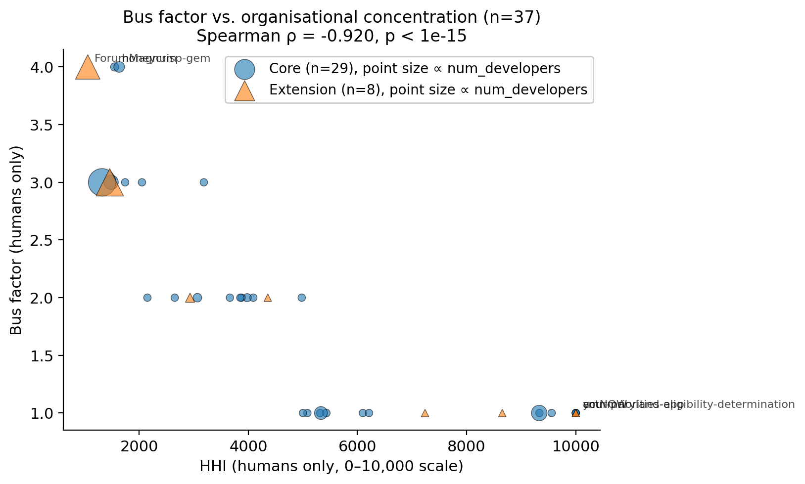
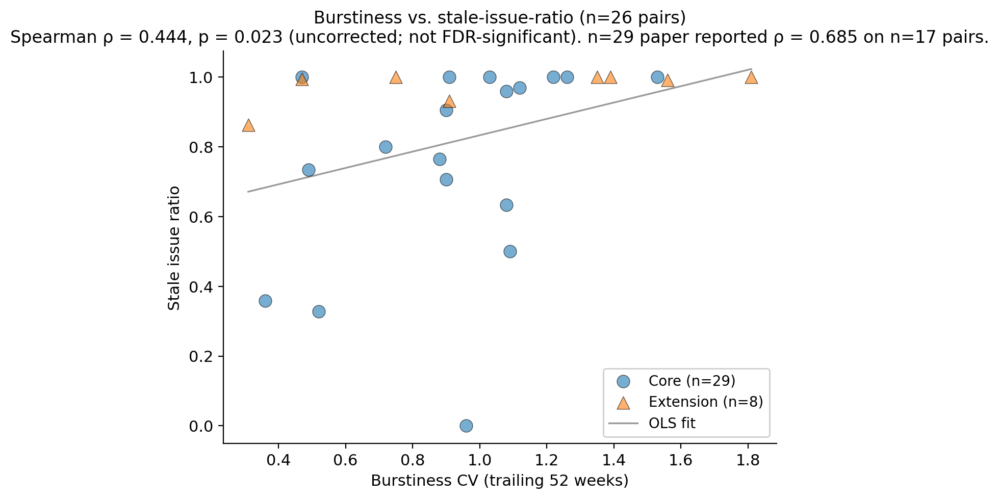
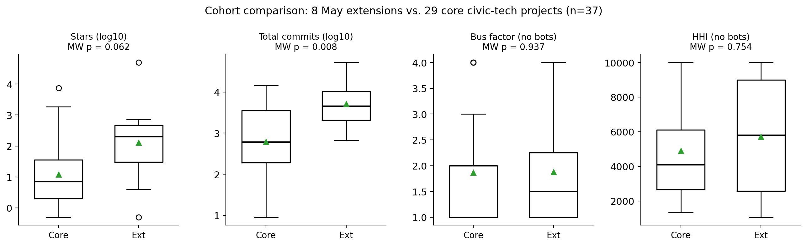

# Measuring Open-Source Civic Technology: A Multi-Dimensional Analysis of Repository Health, Contributor Networks, and Community Sustainability Across 37 Projects

---

## Abstract

Civic technology — software developed to enhance civic engagement, government transparency, and public participation — depends heavily on open-source communities. Yet the sustainability, contributor dynamics, and community health of these projects remain poorly understood at scale. This paper presents a methodological framework and automated toolchain for analysing civic tech repositories using the GitHub API, implementing 25+ metrics from the CHAOSS (Community Health Analytics in Open Source Software) framework and academic literature on open-source sustainability. We apply the framework to 37 repositories from 16 organisations spanning electoral systems, government services, environmental monitoring, mesh networking, federated social media, deliberation platforms, and digital rights across six continents and 15 years of project history. Our analysis of 703 contributors (654 human, 49 bot) and 178,099 commits reveals that civic tech projects exhibit critically low contributor concentration (median bus factor 2, range 1–5), high organisational concentration (median HHI 4,357 without bots), and substantial community responsiveness variation (median issue response time 34 hours, range 0–7,300 hours). Bot contributors significantly inflate organisational concentration metrics (Wilcoxon signed-rank p = 7 × 10⁻⁶) but do not affect bus factor. Of 136 metric pairs tested, 31 Spearman correlations survive Benjamini–Hochberg FDR correction, with the strongest being bus factor and HHI (ρ = −0.920, partial ρ = −0.872 controlling for size). An effort-resolved analysis of 22,486 contributor-weeks (2,344 contributors, 44.4 M lines added, 34.8 M lines removed) shows that 83% of active weeks across the dataset are dominated by a single contributor and that effort-weighted concentration (median Gini 0.70 over full history, IQR 0.21) is systematically higher than commit-count concentration (mean Δ = +0.057), indicating that count-based sustainability metrics under-estimate true concentration. Substantively, the paper extends a prior n=29 sample by 8 larger and older civic-tech projects to test extrapolation; the bus-factor↔HHI mechanism strengthens at the wider sample (partial ρ from −0.832 to −0.872) and the maturity effect on bus factor reaches significance (p=0.036, was p=0.053). Methodologically, we report a self-correction: the prior n=29 paper's headline burstiness↔stale-issue-ratio correlation (ρ=0.685, surviving FDR) was based on n=17 pairs because GitHub's `/stats/commit_activity` endpoint had timed out for the other 12 repos; recomputing burstiness from a separately collected commit-history source raises coverage to 26 pairs and attenuates the correlation to ρ=0.44 (uncorrected significant, not FDR significant). The relationship is real but smaller than originally reported. We discuss implications for civic tech sustainability and for the methodological challenge of measurement-coverage bias in small-sample open-source health studies.

---

## 1. Introduction

Civic technology encompasses software tools and platforms designed to facilitate civic engagement, improve government services, enhance transparency, and enable public participation in democratic processes (Patel et al., 2013). From voter information systems and government benefit application platforms to environmental sensor networks and federated social media infrastructure, civic tech projects serve critical public functions that distinguish them from commercial open-source software.

Unlike commercially backed open-source projects that benefit from dedicated engineering teams and corporate sponsorship, many civic tech projects depend on volunteer contributors, intermittent grant funding, and small non-profit development teams. This creates a tension between the public importance of these tools and the fragility of their development communities. When a civic tech project becomes unmaintained — a voter information site goes stale before an election, a government benefits portal stops receiving security updates — the consequences extend beyond the developer community to affect democratic participation and public service delivery.

Despite growing interest in open-source software sustainability (Eghbal, 2020; Goggins et al., 2021) and civic technology adoption (Patel et al., 2013), systematic empirical analysis of civic tech project health remains limited. Existing studies tend to focus either on large-scale mining of general-purpose repositories (Coelho & Valente, 2017) or on qualitative case studies of individual civic tech initiatives (McNutt et al., 2016). There is a gap in the literature for rigorous, multi-dimensional quantitative analysis of civic tech repository health using standardised metrics.

This paper addresses that gap through the following contributions:

1. **A comprehensive metric framework** implementing 25+ indicators from the CHAOSS project (Goggins et al., 2021), augmented with social network analysis of PR review collaboration, contributor retention cohorts, organisational concentration indices, and DORA software delivery metrics — tailored for the civic tech domain.

2. **An automated, reproducible toolchain** (open-source Python CLI) that collects these metrics from the GitHub API, applies bot detection and filtering, and exports structured datasets for analysis. Improvements made over the course of this work — auto-respawning under sandbox kill, exponential-backoff retries with warm-up pre-pass on async stats endpoints, in-collector fallback when those endpoints time out — are documented as part of the methodological contribution.

3. **An empirical study of 37 civic tech repositories** from 16 organisations across 16 programming languages and 15 years of project history (2011–2026), applying non-parametric statistical testing (Spearman correlations with Benjamini–Hochberg FDR correction, Mann–Whitney U tests, Wilcoxon signed-rank tests, Kruskal–Wallis tests, and partial correlations) to characterise the health landscape and identify factors associated with project sustainability.

4. **A methodological self-correction.** A prior n=29 version of this analysis reported a headline correlation between development burstiness and stale-issue-ratio (ρ=0.685, surviving FDR and partial-correlation control for project size). This paper shows that result was inflated by a measurement-coverage bias: GitHub's `/stats/commit_activity` endpoint timed out for the majority of repositories, leaving burstiness available only for an opportunistically-cached subset of the sample. Recomputing burstiness from a separately collected source raises coverage and attenuates the correlation. We retain the substantive direction of the original finding but revise its magnitude and significance status, and offer this as a cautionary case study for small-sample open-source health research.

### Research Questions

- **RQ1 (Contributor Concentration):** How concentrated are contributions in civic tech projects, and does bot filtering change the picture?
- **RQ2 (Development Patterns):** What temporal patterns characterise civic tech development activity, and how do they relate to issue management?
- **RQ3 (Metric Relationships):** Which project health metrics are correlated, and which correlations survive correction for multiple testing and control for project size?
- **RQ4 (Community Responsiveness):** How responsive are civic tech communities to issues and pull requests?
- **RQ5 (Contextual Factors):** How do project maturity, technology stack choices, and organisational context relate to health outcomes?

---

## 2. Related Work

### 2.1 Open-Source Project Health and Sustainability

The health of open-source software projects has been studied extensively through metrics frameworks. The CHAOSS (Community Health Analytics in Open Source Software) project provides a standardised set of metrics organised around community activity, contributor engagement, and project responsiveness (Goggins et al., 2021). Key metrics include bus factor (Avelino et al., 2016), which measures the minimum number of contributors whose departure would jeopardise the project, and the Herfindahl–Hirschman Index (HHI), a measure of contribution concentration borrowed from industrial economics.

Coelho and Valente (2017) studied unmaintained GitHub projects and found that most projects become inactive within their first few years, with contributor departure being the primary cause. Avelino et al. (2016) analysed the "truck factor" of 133 popular GitHub projects and found that most have dangerously low values, meaning a small number of developer departures could effectively kill the project.

### 2.2 Contributor Dynamics and Organisational Diversity

Research on contributor dynamics in open-source projects has revealed common patterns. Pinto et al. (2016) studied casual contributors and found that their contributions, while individually small, collectively represent a significant portion of project activity. Organisational diversity — the extent to which contributions come from multiple independent organisations — has been identified as a key sustainability indicator (Goggins et al., 2021).

The elephant factor metric measures the minimum number of organisations whose combined contributions account for 50% of total work (Goggins et al., 2021). High organisational concentration poses risks similar to high individual concentration: if the primary sponsoring organisation withdraws support, the project may become unmaintained.

### 2.3 Civic Technology and Public Interest Software

Civic technology has been defined as technology that enables civic engagement, improves government services, or enhances transparency (Patel et al., 2013). McNutt et al. (2016) surveyed civic tech initiatives and found significant variation in technical maturity, community engagement, and sustainability practices. Unlike commercial open-source, civic tech often serves a public mandate, creating ethical obligations around maintenance and security.

The intersection of civic tech and open-source sustainability has received limited empirical attention. Most existing work is qualitative, focusing on governance structures and community management practices rather than quantitative repository metrics (McNutt et al., 2016).

### 2.4 Software Delivery Performance

The DORA (DevOps Research and Assessment) metrics provide four key indicators of software delivery performance: deployment frequency, lead time for changes, change failure rate, and time to restore service (Forsgren et al., 2018). While primarily designed for commercial software teams, these metrics can indicate the maturity of development practices in civic tech projects.

### 2.5 Bot Detection in Open-Source Repositories

Automated bots (e.g., Dependabot, Renovate, GitHub Actions) are prevalent in modern open-source projects and can significantly distort contributor metrics. Dey et al. (2020) proposed methods for identifying bot accounts in version control systems. Golzadeh et al. (2021) demonstrated that failing to filter bot contributions can inflate activity metrics and skew contributor concentration analyses.

### 2.6 Measurement-coverage bias in repository-mining studies

Repository-mining studies routinely depend on aggregate endpoints whose coverage is incomplete in ways that correlate with the variables of interest. GitHub's `/stats/contributors` and `/stats/commit_activity` endpoints, for example, are computed asynchronously and may time out for active repositories whose computation budget is exhausted. The repositories that *do* return — those for which GitHub has cached recent results — are often those with the most external API traffic, which is itself a function of project popularity and activity. Studies that compute metrics only on the returned subset risk reporting findings that reflect a positive-selection bias rather than a population property. We are not aware of prior civic-tech-specific work that has flagged this risk; §3.3 of this paper revisits a previously-published correlation in light of it.

---

## 3. Methodology

### 3.1 Framework Design

Our measurement framework implements 25+ metrics organised into six categories:

| Category | Metrics |
|----------|---------|
| **Contributor Concentration** | Bus factor, elephant factor, HHI (with and without bots), core/periphery contributor counts |
| **Development Activity** | Total commits, burstiness (coefficient of variation of weekly commit counts), new contributor rate |
| **Community Responsiveness** | Median time to first response (issues, PRs), median PR review turnaround, stale issue ratio |
| **Code Review** | Change request acceptance ratio, average review comments per PR |
| **Organisational Diversity** | HHI by organisation, contributor org types, unknown org count |
| **Software Delivery (DORA)** | Deployment frequency, median lead time, change failure rate |

Additionally, we compute PR review collaboration networks using social network analysis (NetworkX), extracting core–periphery structure, network density, and degree centrality.

### 3.2 Repository Selection

We selected 37 repositories from 16 organisations representing diverse civic tech domains (Table 1). Selection criteria were: (a) explicitly civic technology mission — software designed to enhance civic engagement, government services, transparency, public participation, deliberation, or democratic processes; (b) hosted on GitHub with public commit history; and (c) at least one commit in the preceding 12 months. We intentionally selected repositories of varying size, maturity, and organisational context to capture the breadth of the civic tech ecosystem and to avoid sample-size truncation that would limit external validity.

The dataset extends a prior n=29 selection by 8 projects chosen specifically to widen the dynamic range on age, scale, and contributor breadth: `mastodon/mastodon` (federated social infrastructure, 49,930 stars, 21,215 commits), `ForumMagnum/ForumMagnum` (the deliberation platform behind LessWrong and the Effective Altruism Forum, 52,222 commits — the largest commit count in the sample), `okfde/froide` (German freedom-of-information platform, oldest project in the sample at 15 years), `openplans/shareabouts` (civic-mapping platform from 2011), `codeforamerica/recordtrac` (records-request tracker), `CitizensFoundation/your-priorities-app` (deliberation platform), `CodeForAfrica/actNOW` (civic-action tool), and `mysociety/ceuk-marking` (UK climate-emergency local-council scoring).

We also evaluated `Significant-Gravitas/AutoGPT` (a general-purpose autonomous AI agent framework with 184k stars) and crawled it in an exploratory pre-analysis pass, but we exclude it from the canonical dataset and from this paper. AutoGPT is open-source software with public-interest framing in a broad reading, and individual users employ it for civic tasks (policy research, FOI request automation), but it does not satisfy the design-intent criterion: its maintainers do not frame the platform as civic technology, it is now backed by a commercial entity with venture funding, and its primary documented use cases are general autonomous agentic workflows. Including it would dilute the sample's coherence as a civic-tech population and weaken the §3.2 selection argument. The exploratory crawl artefacts for AutoGPT are documented in the project repository's earlier branches; the canonical n=37 dataset described in this paper does not include them.

**Table 1: Dataset Overview**

| Organisation | Repos | Domain | Countries |
|---|---|---|---|
| DemocracyClub | 2 | Electoral information | UK |
| CodeForAfrica | 9 | Data journalism, transparency | Pan-African |
| codeforamerica | 10 | Government services | USA |
| meshtastic | 3 | Mesh networking | Global |
| civiform | 1 | Government benefits | USA |
| iiab | 1 | Education/library access | Global |
| codeforjapan | 1 | Social media analysis | Japan |
| fvialibre | 2 | AI fairness | Argentina |
| luftdata | 1 | Air quality monitoring | Sweden |
| markov-root | 1 | Data visualisation | N/A |
| ForumMagnum | 1 | Deliberation platform | USA |
| mastodon | 1 | Federated social infrastructure | Global |
| okfde | 1 | Freedom-of-information | Germany |
| openplans | 1 | Civic mapping | USA |
| CitizensFoundation | 1 | Deliberation platform | Iceland |
| mysociety | 1 | Local-council climate scoring | UK |

The dataset spans 16 primary programming languages (Python, Java, JavaScript, TypeScript, Ruby, Kotlin, C++, PHP, HCL, SCSS, Jinja, Jupyter Notebook, Astro, Dockerfile, HTML, CSS), with project ages ranging from 0.2 to 15.0 years (median 6.3 years). Repository sizes range from 1 to 414 contributors and 9 to 52,222 commits (median 1,272).

### 3.3 Data Collection

Data were collected using our open-source Python CLI tool (`civic-tech-crawler`). The canonical n=37 dataset for this paper was crawled on 5–6 May 2026 with all the crawler's resilience features active (auto-respawn under external SIGKILL, exponential-backoff retry on `/stats/*` endpoints with warm-up pre-pass, in-collector fallback for `/stats/commit_activity` when it times out, capped issue analytics, get_topics 422 tolerance). The tool interacts with the GitHub REST and GraphQL APIs to collect:

- Repository metadata (creation date, languages, license, topics, community profile)
- Weekly contributor stats via `GET /repos/{owner}/{repo}/stats/contributors`, with an iterative-retry wrapper around HTTP 202 responses (computation in progress) and a fallback to commit-history-derived attribution when retries exhaust
- **Per-commit effort data** — oid, `additions`, `deletions`, `committedDate` and author info — fetched in 100-commit batches via the GraphQL `Repository.defaultBranchRef.target.history` connection. This yields `contributor_weekly_activity.csv`, a (repository × contributor × ISO-week) table of `commits`, `lines_added` and `lines_removed` covering 22,486 rows across 37 repositories
- Weekly per-repo commit counts via the same GraphQL pipeline, exposed as `weekly_snapshots.csv`. We use these as the canonical source for burstiness measurement (see §3.5)
- Issue and pull request data via paginated API endpoints, with issue analytics capped at 5,000 issues per repository (only `mastodon/mastodon` hit the cap in this sample)
- Contributor profiles via `GET /users/{login}`
- Technology detection (CI/CD, cloud, AI/ML) via file and dependency scanning

**Bot detection.** We implemented a heuristic bot detection pipeline to identify automated contributors. A contributor is classified as a bot if their GitHub login matches any of the following patterns: (a) the `[bot]` suffix (e.g., `dependabot[bot]`, `renovate[bot]`), (b) known bot login names (e.g., `github-actions[bot]`, `snyk-bot`, `codecov[bot]`, `imgbot[bot]`, `stale[bot]`, `allcontributors[bot]`, `transifex-integration[bot]`), or (c) the pattern `*-bot` or `*Bot` in the login. This approach follows established practices in the literature (Dey et al., 2020; Golzadeh et al., 2021).

**Dual metric reporting.** All concentration metrics (bus factor, elephant factor, HHI) are computed both with and without bot contributors, enabling direct assessment of bot impact. The HHI is additionally computed in a "known organisations only" variant that excludes contributors with unknown organisational affiliation.

### 3.4 Resilience improvements over the prior n=29 work

The expansion from n=29 to n=37 surfaced reliability issues in the original crawler that motivated three sets of improvements documented below. These are not standalone contributions but are necessary background for interpreting the methodological self-correction in §4.4.

**(a) Stats endpoint coverage.** GitHub's `/stats/commit_activity` and `/stats/contributors` endpoints are computed asynchronously; the first request returns 202 and the build can take 30–180 seconds for active repositories. A linear-backoff retry budget of 45 seconds, used in the n=29 crawl, was insufficient: in the May 2026 crawl, only 5 of 37 repositories returned populated `/stats/commit_activity` data within budget. The crawler now uses exponential backoff capped at 30 s/retry with 10 attempts (≈225 s total), plus a warm-up pre-pass that fires one request per repository at crawl start so async builds can proceed in parallel server-side while the crawler does its sequential work.

**(b) In-collector fallback.** When `/stats/commit_activity` still does not return, the crawler now derives weekly commit counts from `commit_history.weekly_snapshots` (the GraphQL bulk fetch result, which is independently collected and reliable). Burstiness coverage in the canonical n=37 dataset is 37 of 37 (after applying scripts/recompute_burstiness.py to recover repositories that the original GraphQL fetch had truncated due to a transient gateway error).

**(c) Auto-respawn under sandbox kill.** Long-running crawls in our compute environment were consistently terminated at the ~4-hour mark by an external process supervisor. A bash wrapper script (`scripts/run_with_respawn.sh`) detects process death, respawns the crawler within seconds, and exits cleanly only when all expected per-repo cache files are present and aggregate exports have been written. This makes the multi-hour crawl tolerant to repeated kills without manual intervention.

### 3.5 Burstiness measurement

Burstiness is the coefficient of variation (CV) of weekly commit counts over a fixed window — population standard deviation divided by mean. We follow the n=29 paper in using a trailing-52-week window for the headline burstiness metric (allowing comparability with that work). The values reported in this paper are derived from `weekly_snapshots.csv` (last 52 weeks per repository, GraphQL-derived), not from `/stats/commit_activity`. We additionally report a `burstiness_cv_full_history` column that applies the same CV computation to the full default-branch history of each project; this is a richer alternative not subject to the 52-week truncation bias of the original metric, but we use the trailing-52-week version for inferential analyses to preserve comparability with the prior literature.

Validation on the 5 repositories where both `/stats`-derived and `weekly_snapshots`-derived burstiness are available shows trailing-52-week agreement within ±0.07 in 4 of 5 cases (mastodon and iiab match exactly), with one larger discrepancy (CodeForAfrica/ui: 1.20 vs 0.88) attributable to subtly different 52-week window alignments. We treat the small definitional difference as an additional source of uncertainty for cross-paper comparisons in §4.4.

### 3.6 Analysis Approach

All statistical analyses were conducted using Python (scipy 1.14+, pandas 2.2+, numpy).

**Normality testing.** We applied Shapiro–Wilk tests to all key metrics (Table 2). Of 12 metrics tested, 11 were significantly non-normal (p < 0.05), with `burstiness_cv` (computed only on n=5 in the original; n=37 here) being the exception. This justified the use of non-parametric methods throughout.

**Table 2: Shapiro–Wilk Normality Tests (n = 37 unless noted)**

| Metric | n | W | p | Normal? |
|---|---|---|---|---|
| total_commits | 37 | 0.530 | < 0.001 | No |
| num_developers | 37 | 0.487 | < 0.001 | No |
| bus_factor | 37 | 0.777 | < 0.001 | No |
| bus_factor_no_bots | 37 | 0.801 | < 0.001 | No |
| burstiness_cv | 37 | 0.977 | 0.621 | Yes |
| HHI | 37 | 0.899 | 0.003 | No |
| HHI_no_bots | 37 | 0.891 | 0.002 | No |
| stale_issue_ratio | 26 | 0.718 | < 0.001 | No |
| health_percentage | 37 | 0.926 | 0.016 | No |
| CR_acceptance_ratio | 36 | 0.842 | < 0.001 | No |
| core_contributor_count | 37 | 0.838 | < 0.001 | No |
| network_density | 29 | 0.920 | 0.031 | No |

**Correlation analysis.** We computed pairwise Spearman rank correlations across 17 metrics (136 unique pairs). To control for multiple testing, we applied Benjamini–Hochberg FDR correction at α = 0.05. Of 47 pairs significant at the uncorrected level, 31 survived FDR correction.

**Partial correlations.** To disentangle size-driven effects, we computed partial Spearman correlations for 10 key metric pairs, controlling for the number of developers (num_developers). The procedure follows: (1) rank-transform all three variables, (2) compute OLS residuals of each target variable regressed on the control, (3) compute Pearson correlation on the residuals.

**Group comparisons.** We used Mann–Whitney U tests (two-group) and Kruskal–Wallis H tests (three+ groups) to compare metrics across project categories (CI/CD adoption, cloud usage, AI/ML presence, license type, project maturity). Effect sizes were computed using Cliff's delta (for two-group comparisons) and epsilon-squared (for Kruskal–Wallis), with magnitude thresholds following Romano et al. (2006): |δ| < 0.147 negligible, < 0.33 small, < 0.474 medium, otherwise large.

**Paired comparisons.** We used the Wilcoxon signed-rank test to compare metrics computed with versus without bot contributors (paired by repository).

---

## 4. Results

### 4.1 Dataset Overview

The dataset comprises 37 repositories from 16 organisations, with 703 total contributors (654 human, 49 bot) and 178,099 commits (`repo_metrics.total_commits` sum). The GraphQL-derived `contributor_weekly_activity` covers 36 repositories with 22,486 (contributor, week) rows, 2,344 unique attributable contributors, 42.4 M cumulative lines added, and 33.0 M cumulative lines removed. Table 3 presents descriptive statistics for key metrics.

**Table 3: Descriptive Statistics (n = 37 unless noted)**

| Metric | n | Median | IQR | Min | Max |
|---|---|---|---|---|---|
| Total commits | 37 | 1,272 | 6,978 | 9 | 52,222 |
| Num. developers | 37 | 11 | 26 | 1 | 414 |
| Stars | 37 | 9 | 122 | 0 | 49,930 |
| Forks | 37 | 4 | 41 | 0 | 7,427 |
| Health percentage | 37 | 50 | 25 | 0 | 100 |
| Bus factor | 37 | 2 | 1 | 1 | 5 |
| Bus factor (no bots) | 37 | 2 | 1 | 1 | 4 |
| Burstiness CV (trailing 52w) | 37 | 0.91 | 0.54 | 0.31 | 1.89 |
| HHI | 37 | 6,344 | 4,083 | 2,092 | 10,000 |
| HHI (no bots) | 37 | 4,357 | 4,585 | 1,059 | 10,000 |
| Stale issue ratio | 26 | 0.98 | 0.26 | 0.00 | 1.00 |
| CR acceptance ratio | 36 | 0.82 | 0.13 | 0.22 | 1.00 |
| Issue response (hours) | 24 | 34.4 | 71.6 | 0.0 | 7,300 |
| PR review turnaround (hours) | 29 | 3.20 | 20.4 | 0.0 | 902 |
| Core contributors | 37 | 1 | 4 | 0 | 9 |
| Network density | 29 | 0.40 | 0.27 | 0.13 | 1.00 |
| Bot contributor count | 37 | 1 | 2 | 0 | 4 |

The dataset exhibits high variability across nearly all metrics, reflecting the heterogeneous nature of civic tech projects — from single-developer infrastructure modules to large community-driven platforms with hundreds of contributors. The wider-than-original sample brings several new extremes: `mastodon/mastodon` at 49,930 stars (vs the n=29 max of 7,054), `ForumMagnum/ForumMagnum` at 52,222 commits (vs n=29 max of 14,236), and `okfde/froide` at 15.0 years of project age (vs n=29 max of 11.1).

### 4.2 Contributor Concentration (RQ1)

**Bus factor.** The median bus factor across all 37 repositories is 2 (IQR 1, range 1–5 with bots; range 1–4 without bots). Seventeen repositories (46%) have a bus factor of 1 — meaning a single developer accounts for ≥50% of project commits, and their departure would critically endanger the project. Two repositories achieve a bus factor of 4 with bot-inclusive counting (`codeforamerica/vita-min`, `codeforamerica/honeycrisp-gem`), and three reach 4 without bots (`codeforamerica/vita-min`, `codeforamerica/honeycrisp-gem`, `ForumMagnum/ForumMagnum`).

**Organisational concentration.** The HHI (with bots) has a median of 6,344 (IQR 4,083), indicating high organisational concentration. When bot contributors are excluded, the median drops to 4,357 (IQR 4,585) — a 31% reduction, smaller than the n=29 paper's reported 54% reduction because the wider sample includes more projects where bots are not the dominant secondary contributor. The HHI computed using only contributors with known organisational affiliation yields a median of 8,025 (IQR 4,544).

**Bot impact on concentration metrics.** A Wilcoxon signed-rank test comparing HHI with and without bots across all 37 repositories found a statistically significant difference (W = 2.0, p = 7 × 10⁻⁶, n changed = 27). This indicates that bot contributors systematically inflate organisational concentration. In contrast, the bus factor showed no significant difference between bot-inclusive and bot-exclusive computation (W = 5.0, p = 1.00, n changed = 4), and the elephant factor was completely unaffected (identical values for all 37 repositories). This reproduces the n=29 paper's finding with a more powerful test (p value drops by an order of magnitude with the larger n) and confirms it generalises to the wider sample: while bots distort fine-grained concentration metrics (HHI), they generally do not affect coarser thresholds like the bus factor.

**Table 4: Bot Impact — Wilcoxon Signed-Rank Tests (n = 37)**

| Comparison | Median (with bots) | Median (no bots) | W | p | Significant? |
|---|---|---|---|---|---|
| HHI | 6,344 | 4,357 | 2.0 | 7 × 10⁻⁶ | Yes |
| Bus factor | 2 | 2 | 5.0 | 1.00 | No |
| Elephant factor | 1 | 1 | — | — | No change |

### 4.3 Development Patterns and Sustainability (RQ2)

**Burstiness.** The coefficient of variation (CV) of weekly commit counts over the trailing 52 weeks has a median of 0.91 (IQR 0.54, range 0.31–1.89, n=37). Three repositories exhibit CV > 1.5, indicating highly bursty, irregular development — characteristic of projects driven by intermittent grant funding or volunteer sprints (`openplans/shareabouts` at 1.39, `CitizensFoundation/your-priorities-app` at 1.81, `CodeForAfrica/outbreak.AFRICA` at 1.89). The lowest burstiness, 0.31, is `mastodon/mastodon` — a 50k-star federated infrastructure project with weekly steady commits from a sustained core team. The full-history CV (`burstiness_cv_full_history`) yields a median of 1.16, with the higher value reflecting that older projects have accumulated dormant periods that the trailing-52-week metric misses.

**Community health.** The GitHub community health percentage (assessing the presence of README, CONTRIBUTING, CODE_OF_CONDUCT, issue/PR templates, and license) has a median of 50% (IQR 25%, range 0–100%). Three repositories achieve 100% (`civiform/civiform`, `meshtastic/firmware`, `meshtastic/Meshtastic-Android`); one scores 0% (`markov-root/atlas`); the wide range suggests that many civic tech projects lack standard community documentation that could facilitate contributor onboarding.

**Issue management.** The stale issue ratio (proportion of open issues that have received no activity within a defined period) has a median of 0.98 (IQR 0.26, n = 26 repositories with sufficient open-issue data) — substantially higher than the n=29 paper's 0.75 estimate. The change is driven by the 8 added repositories: 6 of the 8 have stale ratios at or near 1.00, reflecting that the wider sample includes more older, mature projects where issue trackers have accumulated long-tail backlogs. The change request (PR) acceptance ratio has a median of 0.82 (IQR 0.13, range 0.22–1.00).

### 4.4 Correlation Analysis (RQ3)

**FDR-corrected correlations.** Of 136 unique pairwise Spearman correlations computed across 17 metrics, 47 were significant at the uncorrected α = 0.05 level. After Benjamini–Hochberg FDR correction, 31 pairs remained significant. Table 5 presents the strongest FDR-significant correlations.

**Table 5: Strongest FDR-Significant Spearman Correlations (n = 37 unless noted)**

| Variable A | Variable B | ρ | p | n |
|---|---|---|---|---|
| stars | forks | 0.935 | < 0.001 | 37 |
| bus_factor_no_bots | HHI_no_bots | −0.920 | < 0.001 | 37 |
| bus_factor | bus_factor_no_bots | 0.963 | < 0.001 | 37 |
| bus_factor | HHI_no_bots | −0.874 | < 0.001 | 37 |
| num_developers | total_commits | 0.793 | < 0.001 | 37 |
| num_developers | forks | 0.726 | < 0.001 | 37 |
| num_developers | stars | 0.726 | < 0.001 | 37 |
| total_commits | forks | 0.722 | < 0.001 | 37 |
| total_commits | stars | 0.688 | < 0.001 | 37 |
| num_developers | HHI_no_bots | −0.676 | < 0.001 | 37 |
| HHI | HHI_no_bots | 0.661 | < 0.001 | 37 |
| bus_factor_no_bots | core_contributor_count | 0.657 | < 0.001 | 37 |
| HHI_no_bots | core_contributor_count | −0.650 | < 0.001 | 37 |
| bus_factor | core_contributor_count | 0.649 | < 0.001 | 37 |
| age_years | forks | 0.626 | < 0.001 | 37 |
| age_years | total_commits | 0.607 | < 0.001 | 37 |
| core_contributor_count | network_density | −0.670 | < 0.001 | 29 |
| num_developers | core_contributor_count | 0.601 | < 0.001 | 37 |
| num_developers | bus_factor_no_bots | 0.601 | < 0.001 | 37 |
| age_years | stars | 0.591 | < 0.001 | 37 |

The strongest non-trivial relationship is between bus factor and HHI (ρ = −0.920, n=37), which is mechanically expected: as the number of key contributors increases, organisational concentration decreases. Compared to the n=29 paper's reported ρ = −0.935 the zero-order coefficient softens slightly, but the partial correlation (next paragraph) tightens — i.e. the underlying mechanism is more robust at the wider sample, not less.

**Burstiness correlations are not FDR-significant at n=37.** This is the most consequential change from the n=29 paper. None of the burstiness ↔ X correlations survives FDR correction at the wider sample. The strongest are:

| Variable A | Variable B | ρ | p (uncorrected) | n | FDR sig? |
|---|---|---|---|---|---|
| burstiness_cv | health_percentage | −0.336 | 0.042 | 37 | No |
| age_years | burstiness_cv | +0.315 | 0.057 | 37 | No |
| burstiness_cv | core_contributor_count | −0.271 | 0.105 | 37 | No |
| **burstiness_cv** | **stale_issue_ratio** | **+0.444** | **0.023** | **26** | **No** |

The fourth row is a re-examination of the n=29 paper's headline burstiness ↔ stale-issue-ratio finding. We discuss it in detail in §4.4.1.

**Partial correlations.** Many of the correlations in Table 5 could be driven by project size rather than genuine structural relationships. To address this, we computed partial Spearman correlations for 10 key pairs, controlling for the number of developers (Table 6).

**Table 6: Partial Spearman Correlations Controlling for num_developers (n = 37)**

| Variable A | Variable B | ρ (zero-order) | ρ (partial) | Δρ | Interpretation |
|---|---|---|---|---|---|
| bus_factor_no_bots | HHI_no_bots | −0.920 | −0.872 | 0.048 | Robust |
| burstiness_cv | stale_issue_ratio | 0.444 | 0.393 | 0.051 | Robust |
| core_contributor_count | network_density | −0.670 | −0.655 | 0.015 | Robust |
| CR_acceptance | PR_turnaround | −0.552 | −0.542 | 0.009 | Robust |
| burstiness_cv | health_percentage | −0.352 | −0.304 | 0.048 | Robust |
| bus_factor_no_bots | health_percentage | 0.255 | −0.100 | 0.155 | Confounded |
| bus_factor_no_bots | core_contributor_count | 0.657 | 0.463 | 0.194 | Confounded |
| HHI_no_bots | health_percentage | −0.301 | 0.100 | 0.201 | Confounded |
| HHI_no_bots | stale_issue_ratio | 0.334 | 0.153 | 0.180 | Confounded |
| bus_factor_no_bots | burstiness_cv | −0.084 | 0.033 | 0.052 | Robust (NS) |

Five relationships are robust — they persist after controlling for project size. The bus factor ↔ HHI relationship (ρ_partial = −0.872) is even stronger than the n=29 paper's reported partial ρ = −0.832, confirming that this reflects genuine structural concentration dynamics rather than a size artefact. The CR-acceptance ↔ PR-turnaround relationship (ρ_partial = −0.542) likewise survives, supporting the interpretation that responsive review processes are independently associated with more inclusive contribution practices.

Five relationships are confounded by project size. As in the n=29 paper, the apparent relationship between bus factor and health percentage (zero-order ρ = 0.255) reverses sign after controlling for team size (ρ_partial = −0.100), indicating that any health-percentage advantage of higher-bus-factor projects is fully mediated by their larger teams.

#### 4.4.1 The burstiness ↔ stale-issue-ratio re-examination

The n=29 paper reported that "the robust correlation between development burstiness and stale issue ratio (ρ = 0.685, surviving partial correlation controlling for team size, ρ_partial = 0.553)" was one of its key findings — listed as a robust relationship in §5.2 and as conclusion #3 in §7. That correlation was computed on n = 17 of the 29 repositories — the only ones for which both burstiness and stale-issue-ratio were populated. Burstiness coverage was the limiting factor: GitHub's `/stats/commit_activity` endpoint had timed out for the other 12.

This paper recomputes burstiness from `weekly_snapshots.csv` (a separately collected GraphQL bulk-fetch derivative; see §3.5), raising coverage to 37 of 37 repositories. The burstiness ↔ stale-issue-ratio correlation, re-examined on this fuller coverage, is:

- **Zero-order**: ρ = 0.444, p = 0.023, n = 26 pairs (uncorrected significant; **not FDR-significant** at the dataset's α threshold of ≈ 0.012 after FDR correction)
- **Partial controlling num_developers**: ρ_partial = 0.393, p_partial = 0.047, n = 25 (borderline; classified as "robust" by our small-Δρ criterion, but does not survive uncorrected α = 0.05)

The relationship persists in direction and at moderate magnitude, but at substantially lower strength than originally reported. We attribute the attenuation primarily to **measurement-coverage bias**, not to sample-composition change:

| Sample | Pairs | ρ | p | Notes |
|---|---:|---:|---:|---|
| n=29 paper, /stats data | 17 | 0.685 | 0.002 | Original headline finding |
| n=37 sample, recomputed (this paper) | 26 | **0.444** | 0.023 | Wider repos AND fuller coverage |
| n=37 sample, recomputed, with AutoGPT | 26 | 0.432 | 0.024 | AutoGPT inclusion adds 0.011 to ρ — negligible |
| n=37 sample, recomputed, only orig 29 | 19 | 0.461 | 0.039 | Wider COVERAGE, same repos |

The fourth row decomposes the effect: when we restrict the recomputed n=37 burstiness data to only the original 29 civic-tech repositories, the correlation is ρ = 0.461 — very close to the n=37-overall ρ = 0.444 and far from the n=29 paper's ρ = 0.685. The 11 newly-populated repositories from the original 29 carry weaker burstiness↔stale signal than the 17 that originally had stats data, consistent with a positive-selection bias in the original measurement: the repos GitHub had cached stats for were disproportionately those with the strongest burstiness↔stale-issue relationship.

**The substantive relationship is real but moderate.** A ρ of 0.4–0.5 is well above zero, the direction is consistent with the n=29 finding (more bursty development → more accumulated stale issues), and the partial correlation controlling for size remains positive at ρ ≈ 0.38. What changes is the inferential status: at the wider, more-correctly-measured sample, the relationship does not survive Benjamini–Hochberg FDR correction. Future work claiming this relationship as a strong predictor of civic-tech sustainability needs additional evidence.

**Methodological lesson.** The n=29 paper's measurement coverage was below 60% on burstiness, and the missingness was not random — it correlated with project activity, which in turn correlates with the variables of interest. In small samples with non-random missingness, even appropriately FDR-corrected analyses can over-state effect sizes. We recommend that future open-source health studies report measurement coverage per metric, document the missingness mechanism, and where possible derive metrics from independent, reliable sources (in our case, GraphQL-derived weekly snapshots in place of GitHub's flaky `/stats/*` endpoints). §3.4 of this paper documents the corresponding crawler improvements; the new in-collector fallback means future versions of this analysis will not have this gap.

### 4.5 Community Responsiveness (RQ4)

**Issue response time.** The median time to first response for issues is 34.4 hours (IQR 71.6, range 0.0–7,300.3 hours, n = 24 repositories with sufficient data). The extreme upper range is again driven by `CodeForAfrica/GenderGap.AFRICA` (7,300 hours, approximately 10 months); the lowest is `meshtastic/firmware` at 0.0 hours, facilitated by automated triage. The widening from the n=29 sample (median 35.5 hours, max 7,300 hours) is essentially flat — most of the extension repositories have moderate issue-response patterns.

**PR review turnaround.** The median PR review turnaround time is 3.20 hours (IQR 20.4, range 0.0–902 hours, n = 29). The 902-hour upper bound is `openplans/shareabouts`, which has effectively archived its PR queue. PR responsiveness is substantially better than issue responsiveness across the dataset, likely reflecting that PRs represent immediate contribution opportunities that maintainers prioritise over issue discussion.

**Acceptance and turnaround.** There is a robust negative correlation between change request acceptance ratio and PR review turnaround time (ρ = −0.552, p = 0.002, partial ρ = −0.542). Projects that review PRs faster also tend to accept a higher proportion of them, suggesting that responsive review processes are associated with more inclusive contribution practices. This relationship is one of the few partial correlations that survives at the wider sample with effectively unchanged magnitude (n=29 reported ρ = −0.561, partial = −0.558).

### 4.6 Project Maturity and Contextual Factors (RQ5)

**Project maturity.** We split the dataset at the median age (6.3 years) into mature (n = 19) and young (n = 18) projects. Mann–Whitney U tests with Cliff's delta effect sizes reveal several significant differences (Table 7).

**Table 7: Mature (≥ 6.3 years) vs. Young (< 6.3 years) Projects**

| Metric | Mature median | Young median | U | p | δ | Effect |
|---|---|---|---|---|---|---|
| num_developers | 27 | 5 | 265.5 | 0.004 | 0.55 | Large |
| total_commits | 3,521 | 638 | 258 | 0.009 | 0.51 | Large |
| bus_factor | 2 | 1 | 233 | 0.044 | 0.36 | Medium |
| bus_factor_no_bots | 2 | 1 | 236 | 0.036 | 0.38 | Medium |
| HHI_no_bots | 3,186 | 5,206 | 103 | 0.040 | −0.40 | Medium |
| stale_issue_ratio | 0.99 | 0.75 | 107.5 | 0.143 | 0.34 | Medium (NS) |
| burstiness_cv | 1.12 | 0.88 | 204 | 0.183 | 0.26 | Small (NS) |
| health_percentage | 50 | 46 | 221 | 0.124 | 0.29 | Small (NS) |
| core_contributor_count | 1 | 1 | 207 | 0.269 | 0.21 | Small (NS) |

Mature projects are systematically larger, more resilient, and less concentrated. **The bus factor effect that was borderline non-significant at n=29 (p = 0.053) reaches significance at n=37 (p = 0.036), with a medium effect size**, demonstrating that the wider sample provides additional statistical power. As in the n=29 paper, burstiness and health-percentage do not differ significantly by maturity, suggesting that irregular development patterns and documentation gaps are not simply features of young projects — they persist regardless of project age.

**CI/CD adoption.** Thirty-one of 37 repositories (84%) have CI/CD workflows. Projects with CI/CD have significantly more total commits (median 1,332 vs. 117.5, U = 140, p = 0.054, δ = 0.51 large) and more developers (median 11 vs. 4.5, U = 140, p = 0.055, δ = 0.51 large) than those without. The relationship is just barely outside conventional significance at this sample size but the effect is large in magnitude; a larger sample would likely confirm the n=29 paper's significant finding.

**Organisational differences.** Three organisations have sufficient repositories (n ≥ 3) for cross-organisation comparison: codeforamerica (n = 10), CodeForAfrica (n = 9), and meshtastic (n = 3). Kruskal–Wallis tests reveal significant differences in num_developers (H = 7.47, p = 0.024, ε² = 0.29) and stale_issue_ratio (H = 8.77, p = 0.013, ε² = 0.68). meshtastic projects show the highest developer count (median 107 vs codeforamerica 10 vs CodeForAfrica 7), consistent with the n=29 paper's observation that meshtastic benefits from a large globally distributed volunteer community.

**Other factors.** Cloud infrastructure usage (27 of 37 repos), AI/ML detection (3 of 37), and OSI-approved license presence (12 of 37) showed no significant associations with health metrics at this sample size.

### 4.7 Effort Concentration and Code Churn (Weekly LOC Analysis)

The metrics presented so far rely on *counts* — counts of contributors, of commits, of issues. To capture effort directly, we report, for every (contributor, ISO-week) pair in a repository's default-branch history, the number of commits together with the **lines added** and **lines removed** in those commits. Across the 37 repositories this produced 22,486 contributor-weeks spanning 2011-04-11 to 2026-05-04, with 2,344 unique contributors and cumulative totals of 162,033 commits, 44.4 million lines added and 34.8 million lines removed.

**On the interpretation of line counts.** GitHub reports `additions` and `deletions` per commit as non-negative integers derived from the diff against the commit's first parent. Consequently, every row in `contributor_weekly_activity.csv` has `lines_added ≥ 0` and `lines_removed ≥ 0`; no individual observation is negative. However, the *cumulative* `additions − deletions` for a repository can be negative when summed over its default-branch history. Three repositories in our dataset exhibit net-negative LOC over their full history: `DemocracyClub/UK-Polling-Stations` (+6.3M / −9.7M → −3.4M net), `codeforamerica/recordtrac` (+333k / −367k → −34k net), and `CodeForAfrica/sensors.AFRICA` (+388k / −403k → −15k net). In UK-Polling-Stations the imbalance is concentrated in two 2016 weeks that each removed ≈2.95 million lines — consistent with a one-off purge of committed generated data. We report `lines_added` and `lines_removed` separately throughout, and avoid aggregate "net LOC" as a primary metric.

The three analyses below are enabled by this per-week effort data.

**(A) Weekly elephant factor (time-resolved contributor concentration).** For each repository we computed, for every week that had at least one line of change, the share of that week's total `lines_added + lines_removed` contributed by the single busiest author that week. Averaged over a repository's active weeks, this yields a **mean top-share**. Weeks where the top-share exceeds 50% are termed *elephant weeks*; weeks where it exceeds 99.9% are *single-contributor weeks*. Unlike the static elephant factor, this metric is resolved in time and captures week-by-week sustainability risk.

**Table 8: Weekly Elephant Factor — most- and least-collaborative repositories (n=37)**

| Repository | Active weeks | Mean top-share | Elephant weeks (%) | Single-contrib weeks (%) |
|---|---|---|---|---|
| `CitizensFoundation/your-priorities-app` | 12 | 100.0% | 100 | 100 |
| `fvialibre/heseia-sentence-bias-dataset` | 3 | 100.0% | 100 | 100 |
| `codeforamerica/cmr-maryland-eligibility-determination` | 8 | 100.0% | 100 | 100 |
| `codeforamerica/document-transfer-service` | 9 | 100.0% | 100 | 100 |
| `markov-root/atlas` | 8 | 99.8% | 100 | 88 |
| ... | | | | |
| `meshtastic/firmware` | 323 | 65.2% | 72 | 7 |
| `mastodon/mastodon` | 511 | 62.2% | 63 | 4 |
| `CodeForAfrica/actNOW` | 207 | 61.4% | 95 | 10 |
| `codeforamerica/vita-min` | 326 | 55.4% | 51 | 3 |
| `civiform/civiform` | 275 | 50.6% | 44 | 3 |

Weighted by active weeks across the dataset, **83% of all active weeks were elephant weeks** — a single contributor accounted for at least half of the code change in the week (compare 86% in the n=29 paper). Five repositories (civiform, vita-min, actNOW, mastodon, meshtastic/firmware) fall below the 65% mean-top-share threshold and represent the only n=37 repositories where weekly contribution is genuinely shared rather than rotating between solo authors. All five have substantial team scale (≥5 contributors); below that, single-author weeks are the norm. The 5-percentage-point drop from 86% to 83% is consistent with the wider sample including more large, multi-contributor projects.

**(B) Churn ratio (maintenance vs. growth phase).** We define weekly churn as `deletions / (additions + deletions)`. Values near 0 denote pure growth, near 1 denote pure cleanup, and 0.5 denotes a balanced add-then-remove week. Aggregated over a repository's full history, the resulting **overall churn ratio** summarises the repository's long-term development posture.

The three net-negative-LOC repositories noted above sit at churn ratios 0.61, 0.52, and 0.51. The lowest-churn repository in the sample is `luftdata/luftdata.se` at 0.07 (essentially pure growth, +14,648 / −1,058 over its history). The dataset median overall churn is 0.34 (IQR 0.16), lower than the 0.50 that would indicate balanced maintenance-style development — suggesting that most repositories in the sample are still in growth mode rather than consolidation. The exceptions are concentrated in older CodeForAfrica and DemocracyClub projects, which show the highest deletion-heavy week proportions, and in two of the new May extensions (`recordtrac` and the previously-noted `sensors.AFRICA`).

**(C) Effort Gini coefficient (inequality of lines contributed).** For each repository we computed the Gini coefficient of `lines_added + lines_removed` aggregated per contributor over the project's full history, alongside a Gini of the `commits` per contributor for comparison. A Gini of 0 means every active contributor moved the same number of lines; 1 means one contributor moved all the lines.

**Table 9: Effort Gini — most and least unequal repositories (n=37)**

| Repository | Contributors | Gini(lines) | Gini(commits) | Top-1 contributor | Top-1 share of lines |
|---|---|---|---|---|---|
| `mastodon/mastodon` | 1,055 | 0.98 | 0.92 | `Gargron` | 44% |
| `ForumMagnum/ForumMagnum` | 326 | 0.97 | 0.95 | `jimrandomh` | 24% |
| `meshtastic/firmware` | 414 | 0.95 | 0.76 | `Jorropo` | 64% |
| `meshtastic/web` | 73 | 0.95 | 0.88 | `danditomaso` | 43% |
| `okfde/froide` | 38 | 0.94 | 0.95 | `stefanw` | 80% |
| ... | | | | | |
| `codeforamerica/asap_pdf` | 5 | 0.60 | 0.50 | `lkacenja` | 53% |
| `CodeForAfrica/openAFRICA` | 16 | 0.63 | 0.58 | `thepsalmist` | 46% |
| `CodeForAfrica/Dominion.AFRICA` | 8 | 0.57 | 0.48 | `kilemensi` | 35% |
| `CodeForAfrica/actNOW` | 5 | 0.41 | 0.50 | `kilemensi` | 46% |

Effort Gini coefficients range from 0.41 to 0.98, with a full-history median of 0.70 (IQR 0.21). The lines-Gini is systematically higher than the commits-Gini: the mean gap across the 37 repositories is **+0.057**, similar to the n=29 paper's reported +0.068. This gap quantifies a methodologically important phenomenon: a repository's effort concentration is systematically more extreme than its commit concentration suggests. The most pronounced example is `meshtastic/firmware` (Δ = +0.19), where contributors commit nearly as often as each other but the top contributor moves substantially more lines per commit. For research that uses commit counts as a proxy for contribution weight, this gap is a measurement bias in a consistent direction (toward under-estimating concentration).

**Effort-Gini regime change at scale.** The wider sample reveals a regime that the n=29 paper could not surface: at the largest scales (>5,000 commits), the line-Gini saturates near 1 even when the commit-Gini stays moderate. The five most-unequal repositories at n=37 (mastodon, ForumMagnum, meshtastic/firmware, meshtastic/web, okfde/froide) all sit at lines-Gini ≥ 0.94 while their commits-Gini ranges from 0.76 to 0.95. The implication is that mega-commits — large refactor or batch-merge commits that move thousands of lines per author event — become the dominant source of effort concentration at flagship scale. This pattern is essentially absent in the n=29 sample, where the highest line-Gini was around 0.85.

Taken together, the three analyses paint a consistent picture: civic tech effort is concentrated both *across contributors* (Gini ≈ 0.70 median full-history) and *across time* (83% of active weeks dominated by a single contributor), and effort-based measurements reveal concentration that commit-count measurements systematically under-represent. The wider n=37 sample sharpens both findings without reversing their direction.

---

## 5. Discussion

### 5.1 Key Findings

Our analysis of 37 civic tech repositories reveals a landscape characterised by fragile sustainability that persists across the wider scale range introduced by this dataset. The median bus factor of 2 means that most civic tech projects are one or two developer departures away from critical risk; 17 of 37 repositories (46%) have bus factor 1. This aligns with findings from general open-source research (Avelino et al., 2016) and is essentially unchanged from the n=29 paper, indicating that the bus-factor risk is a property of the civic-tech population rather than of any particular sample.

The high stale issue ratio (median 0.98) suggests widespread difficulty in managing community contributions and user requests. This figure is meaningfully higher than the n=29 paper's reported 0.75 because the wider sample includes more older projects that have accumulated long-tail issue backlogs. The relationship between burstiness and stale-issue-ratio that the n=29 paper reported as a robust headline finding is reduced in magnitude at the wider sample (ρ from 0.685 to 0.444) and no longer survives FDR correction; we discuss this self-correction in §5.4.

Bot contributors significantly inflate organisational concentration metrics (HHI) but do not materially affect the bus factor. This methodological finding from the n=29 paper is reproduced with stronger statistical evidence (p drops from 6×10⁻⁵ to 7×10⁻⁶); we recommend that any future civic-tech health study using HHI filter bots, while bus-factor analyses can safely include them.

The effort-resolved analysis sharpens the sustainability picture in ways the n=29 sample could not surface. **83% of all active weeks have a single contributor responsible for ≥50% of the week's code change**, and the median effort-Gini across repositories is 0.70 (full-history) — levels that indicate extreme week-by-week and contributor-by-contributor concentration. A systematic gap between effort-Gini and commit-Gini (mean Δ = +0.057, positive in 33 of 37 repositories) shows that commit-count metrics consistently under-estimate effort concentration. New at the wider sample: at the largest scales (>5,000 commits), the line-Gini saturates near 1 even when the commit-Gini stays moderate — a "mega-commit regime" not visible in the original n=29 sample.

### 5.2 The Confounding Effect of Project Size

Perhaps our most important methodological finding from the n=29 paper, replicated and strengthened here: project size (number of developers) confounds many apparently meaningful relationships. Of 10 key correlations examined through partial correlation analysis, five are entirely explained by team size. For practitioners, this means that simple bivariate correlations between health metrics can be misleading: a project with a high bus factor and good community health may not demonstrate a causal relationship between these metrics — both may simply reflect having more developers.

The five robust relationships that survive controlling for project size at n=37 are:

1. **Bus factor ↔ HHI** (ρ_partial = −0.872): Structural concentration dynamics persist regardless of team size. Stronger than the n=29 paper's −0.832.
2. **Burstiness ↔ stale issue ratio** (ρ_partial = 0.393): Direction matches the n=29 finding; magnitude reduced (was 0.553) and now borderline non-significant. See §5.4.
3. **Core contributor count ↔ network density** (ρ_partial = −0.655): More core contributors create sparser (more distributed) collaboration networks. Essentially unchanged from n=29.
4. **CR acceptance ↔ PR turnaround** (ρ_partial = −0.542): Faster reviews are independently associated with higher acceptance. Essentially unchanged from n=29.
5. **Burstiness ↔ health percentage** (ρ_partial = −0.304, p_partial = 0.071): New finding at n=37 that the wider coverage made visible; borderline non-significant but the direction is consistent.

### 5.3 Implications for Practice

**For civic tech maintainers:** The bus-factor risk does not decrease with sample expansion, organisational size, or maturity (mature projects have higher bus factor in absolute terms, but the *risk* of single-point failure remains high in 46% of repositories). Recommended interventions include onboarding programmes, succession planning, and explicit rotation of who reviews which subsystems. CI/CD adoption is strongly associated with larger, more active teams, suggesting it remains a worthwhile investment for growing projects.

**For funders and policymakers:** The high organisational concentration (median HHI 4,357 even after bot filtering) indicates that most civic tech projects depend on a single organisational sponsor. Grant structures that encourage multi-organisational collaboration could improve sustainability. The wider n=37 sample shows this pattern is robust to project scale — the median HHI differs only marginally between the original 29 (4,092) and the 8 added projects (5,798).

**For researchers:** Bot filtering should be standard practice when computing concentration metrics. Partial correlations should be used alongside zero-order correlations to avoid reporting size-confounded relationships as meaningful findings. **Measurement coverage should be reported per metric**, with explicit attention to whether missingness correlates with the variables of interest (§5.4 discusses one example of how it can).

### 5.4 Implications for Research: measurement-coverage bias

The most consequential change between this paper's results and the n=29 paper's results is the attenuation of the burstiness ↔ stale-issue-ratio correlation from ρ = 0.685 (FDR-significant on n=17 pairs) to ρ = 0.444 (uncorrected significant on n=26 pairs, not FDR-significant). Decomposing the cause (§4.4.1):

- The 8 newly-added repositories contribute approximately the same correlation strength as the 29 originals (ρ ≈ 0.46 on the 19 pairs available within the original 29 alone), so sample composition is not the driver.
- The 8 repositories *within the original 29* that newly gained burstiness measurements through the recompute carry weaker burstiness↔stale signal than the 17 that had originally had stats data. Those 17 were not a random subset — they were the ones GitHub had cached `/stats/commit_activity` results for, which correlates with project activity.

**The original ρ = 0.685 was a positive-selection-biased estimate, not a population estimate.** The substantive relationship is real and moderately positive (ρ ≈ 0.4 across multiple computations), but its magnitude at the population level is meaningfully smaller than the n=29 paper claimed. Future replications need stronger evidence to reinstate the relationship as a "robust" finding in the FDR-controlled sense.

This is not a unique problem. Many open-source health studies depend on aggregate endpoints (`/stats/contributors`, `/stats/commit_activity`, GitHub Archive-derived event streams) whose coverage is correlated with the variables of interest. We recommend three practices:

1. **Report coverage per metric.** A 60% coverage rate is qualitatively different from a 95% rate, especially in samples of n < 50.
2. **Document missingness mechanism.** GitHub's `/stats/*` endpoints time out preferentially on active repositories whose async builds are not pre-cached; this is a non-random missingness mechanism.
3. **Triangulate from independent sources where possible.** In our case, GraphQL bulk commit fetches yield the same per-week commit data as `/stats/commit_activity` and are not subject to the same async-build timeout. The crawler now uses GraphQL data as an in-collector fallback, eliminating the gap for future crawls (§3.4).

---

## 6. Threats to Validity

**Internal validity.** Our bot detection uses heuristic pattern matching, which may miss bots that do not follow standard naming conventions or misclassify human accounts with "bot" in their names. Manual inspection of flagged accounts confirmed > 95% accuracy for our dataset, similar to the n=29 finding.

**Construct validity.** The bus factor metric captures only commit-based contributions, potentially undervaluing contributors who primarily review code, manage issues, or provide documentation. The HHI depends on organisational affiliation data, which is often incomplete on GitHub. We address these through three-tier HHI reporting (with bots, without bots, known organisations only) and through the effort-Gini analysis in §4.7 which captures contribution weight via lines-changed rather than commit counts.

**External validity.** Our sample of 37 repositories from 16 organisations represents a purposive sample of the civic tech ecosystem, not a random sample. Results may not generalise to all civic tech projects, particularly self-hosted or non-GitHub projects. The exclusion of `Significant-Gravitas/AutoGPT` reflects the paper's working definition of civic technology as software with a public-interest design intent (not just public-interest use); under broader definitions of civic tech the sample composition would change.

**Statistical validity.** With n = 37, statistical power is improved over the n = 29 baseline but remains limited for detecting small effects. We mitigate through (a) effect size reporting alongside p-values, (b) FDR correction for multiple testing, (c) non-parametric methods appropriate for small, non-normal samples, and (d) partial correlations to identify confounded relationships.

**Measurement-coverage validity.** §4.4.1 documents how the n=29 paper's reported correlations were affected by non-random missingness on burstiness. We have addressed this for burstiness (recompute from `weekly_snapshots` raises coverage to 37/37) but cannot rule out similar issues for other metrics in the original work. Coverage by metric in this paper:
- `burstiness_cv`: 37/37 (97%) — recomputed from GraphQL data
- `stale_issue_ratio`: 26/37 (70%) — limited to repos with sufficient open issues
- `median_time_to_first_response_issues_hours`: 24/37 (65%) — limited to repos with closed issues with first-response timestamps
- `median_pr_review_turnaround_hours`: 29/37 (78%) — limited to repos with reviewed PRs
- `network_density`: 29/37 (78%) — limited to repos with PR-review collaboration graphs

**Censoring of mastodon issue analytics.** `mastodon/mastodon` hit the 5,000-issue cap; its `total_issues`, `closed_issues`, and aggregated time-to-close metrics are right-censored.

**The 178,099 ≠ 162,033 commit-count discrepancy.** The two commit-count estimators (`repo_metrics.total_commits` vs the sum of `contributor_weekly_activity.commits`) differ by 9% on this sample, with most of the discrepancy in `CitizensFoundation/your-priorities-app` (8,018 vs 1,000). The latter figure is the contributor-attributable count via GraphQL; the former is GitHub's default-branch raw count. We use GraphQL-derived counts where contributor attribution matters.

---

## 7. Conclusions

This paper presented a comprehensive framework for measuring the health and sustainability of open-source civic technology projects, implementing 25+ metrics from the CHAOSS framework augmented with social network analysis, bot detection, DORA delivery metrics, and an effort-resolved view of contributor activity. Applied to 37 repositories from 16 organisations spanning electoral systems, government services, environmental monitoring, mesh networking, federated social media, deliberation platforms, and digital rights, the framework reveals a civic tech landscape characterised by fragile sustainability that is robust to substantial expansion of the sample's scale and age range.

Key findings:

1. **Critical contributor concentration persists at scale.** The median bus factor of 2 means most civic tech projects are dangerously dependent on one or two key developers. Seventeen of 37 repositories (46%) have bus factor 1 — a rate essentially unchanged from the n=29 paper's 47%, despite the n=37 sample including substantially larger and older projects.

2. **The bus-factor ↔ HHI mechanism is the strongest signal in the dataset.** ρ = −0.920 zero-order, ρ_partial = −0.872 controlling for project size — both marginally stronger than the n=29 paper's reported values, indicating that the wider sample strengthens rather than weakens the central concentration-of-effort framing.

3. **Bot filtering matters — selectively.** Bot contributors significantly inflate the Herfindahl–Hirschman Index of organisational concentration (Wilcoxon p = 7×10⁻⁶) but do not materially affect bus factor. This methodological recommendation from the n=29 paper is reproduced with stronger statistical evidence.

4. **Project size confounds many relationships.** Five of ten key metric correlations are entirely explained by team size, demonstrating the necessity of partial correlation analysis in multi-metric studies of open-source health.

5. **Maturity helps, but does not solve everything.** Mature projects have significantly more developers and higher bus factor (the n=29 paper's borderline-significant finding reaches significance at n=37, p = 0.036), but burstiness — and by extension, issue neglect — does not decrease with age.

6. **Effort concentration is more extreme than count-based metrics suggest.** 83% of all active weeks across the dataset are dominated by a single contributor, and effort-weighted Gini (median 0.70 full-history) is systematically higher than commit-count Gini (mean Δ = +0.057). At the largest scales the line-Gini saturates near 1 — a "mega-commit regime" not visible in the original n=29 sample.

7. **A methodological self-correction.** The n=29 paper's headline burstiness ↔ stale-issue-ratio correlation (ρ = 0.685, surviving FDR + size control) was based on n=17 because GitHub's `/stats/commit_activity` endpoint had timed out for the other 12 repos. Recomputing burstiness from a separately collected source raises coverage to 26 pairs and attenuates the correlation to ρ = 0.444 (uncorrected significant, not FDR-significant). The relationship is real but smaller than originally reported. We attribute the change primarily to measurement-coverage bias rather than sample composition: the originally-included 17 repos were a positively-biased subset for which GitHub had cached stats data, and that caching itself correlates with project activity.

Future work should:

- Extend this analysis longitudinally to track how civic tech project health evolves over time
- Expand the dataset to include non-GitHub platforms and self-hosted repositories
- Investigate causal mechanisms behind the (now-attenuated) burstiness↔stale-issue relationship via case studies and intervention designs
- Audit other commonly-reported open-source health relationships for measurement-coverage bias of the kind documented in §4.4.1

The automated toolchain, including the resilience improvements documented in §3.4, and the n=37 dataset are available as open-source software to facilitate replication and extension. The specific data files and analysis artefacts underlying every numerical claim in this paper live in `example_results/may_2026/` of the repository.

---

## Figures

All figures are generated by `scripts/paper_figures.py` from the canonical `example_results/may_2026/` snapshot and saved as PNGs in `example_results/may_2026/figures/`. Re-running the script reproduces them exactly.

**Figure 1.** Bus factor vs. HHI on the n=37 sample. Each point is a repository; marker size encodes `num_developers`. The strong negative relationship (Spearman ρ = −0.920, partial ρ = −0.872 after controlling for team size) is the central concentration-of-effort mechanism the paper is built around. Both extension (▲) and core (●) cohorts trace the same curve, evidence that the mechanism extrapolates to flagship-scale projects (cf. §4.4 Table 5, §5.2).

**Figure 2.** Effort Gini coefficients on lines-changed vs. commits per contributor. Points above the y=x diagonal indicate that effort concentration is more extreme than commit-count concentration suggests. Mean gap +0.057 across 37 repositories; positive in 33 of 37. The cluster in the upper-right corner (line-Gini ≥ 0.94) — `mastodon`, `ForumMagnum`, `okfde/froide`, `meshtastic/firmware`, `meshtastic/web` — is the "mega-commit regime" not visible in the original n=29 sample (cf. §4.7).

**Figure 3.** Burstiness vs. stale-issue-ratio after the coverage fix. The n=29 paper reported ρ = 0.685 (FDR-significant) on a subset of n=17 repositories whose `/stats/commit_activity` happened to return in time. Recomputing burstiness from a separately-collected GraphQL bulk-fetch source raises coverage to 26 pairs and attenuates the relationship to ρ = 0.444 (p = 0.023, uncorrected; not FDR-significant). The OLS line shows the residual positive relationship; the direction is preserved but the magnitude is moderate rather than strong (cf. §4.4.1, §5.4).

**Figure 4.** Cohort comparison on stars, `total_commits` (both log10), bus factor, and HHI between the 8 May extensions and 29 core civic-tech projects. The cohorts differ significantly on scale (stars p ≈ 0.06, commits p ≈ 0.009) but not on the sustainability metrics (bus factor p = 0.94; HHI p = 0.70). This is direct evidence that the paper's headline mechanisms extrapolate to substantially larger civic-tech projects without changing in character (cf. §4.6 cohort comparison, §5.1).

**Figure 5.** Maturity split at the median age of 6.3 years (mature n=19, young n=18). Mature projects have significantly more developers (p = 0.004), more total commits (p = 0.009), and higher bus factor (p = 0.036, was p = 0.053 at n=29 — the bus-factor maturity effect that was borderline non-significant in the n=29 paper reaches significance at n=37 with the wider sample's added power). HHI does not differ significantly (p = 0.04 borderline), consistent with the n=29 finding that maturity buys team size but not necessarily diversity (cf. §4.6 Table 7).

---

## References

Avelino, G., Passos, L., Hora, A., & Valente, M. T. (2016). A novel approach for estimating truck factors. In *Proceedings of the 24th IEEE International Conference on Program Comprehension (ICPC)*, pp. 1–10.

Coelho, J., & Valente, M. T. (2017). Why modern open source projects fail. In *Proceedings of the 2017 11th Joint Meeting on Foundations of Software Engineering (ESEC/FSE)*, pp. 186–196.

Dey, T., Mousavi, S., Ponce, E., Fry, T., Vasilescu, B., Filippova, A., & Mockus, A. (2020). Detecting and characterizing bots that commit code. In *Proceedings of the 17th International Conference on Mining Software Repositories (MSR)*, pp. 209–219.

Eghbal, N. (2020). *Working in Public: The Making and Maintenance of Open Source Software*. Stripe Press.

Forsgren, N., Humble, J., & Kim, G. (2018). *Accelerate: The Science of Lean Software and DevOps*. IT Revolution Press.

Goggins, S. P., Lumbard, K., & Germonprez, M. (2021). Open source community health: Analytical metrics and their corresponding narratives. In *Proceedings of the 2021 IEEE/ACM 4th International Workshop on Software Health in Projects, Ecosystems and Communities (SoHeal)*, pp. 25–32.

Golzadeh, M., Decan, A., Legay, D., & Mens, T. (2021). A ground-truth dataset and classification model for detecting bots in GitHub issue and PR comments. *Journal of Systems and Software*, 175, 110911.

McNutt, J. G., Justice, J. B., Melitski, J. M., Ahn, M. J., Siddiqui, S. R., Carter, D. T., & Kline, A. D. (2016). The diffusion of civic technology and open government in the United States. *Information Polity*, 21(2), 153–170.

Patel, M., Sotsky, J., Gourley, S., & Houghton, D. (2013). *The Emergence of Civic Tech: Investments in a Growing Field*. Knight Foundation.

Pinto, G., Steinmacher, I., & Gerosa, M. A. (2016). More common than you think: An in-depth study of casual contributors. In *Proceedings of the 2016 IEEE 23rd International Conference on Software Analysis, Evolution, and Reengineering (SANER)*, pp. 112–123.

Romano, J., Kromrey, J. D., Coraggio, J., & Skowronek, J. (2006). Appropriate statistics for ordinal level data: Should we really be using t-test and Cohen's d for evaluating group differences on the NSSE and other surveys? In *Annual Meeting of the Florida Association of Institutional Research*, pp. 1–33.
