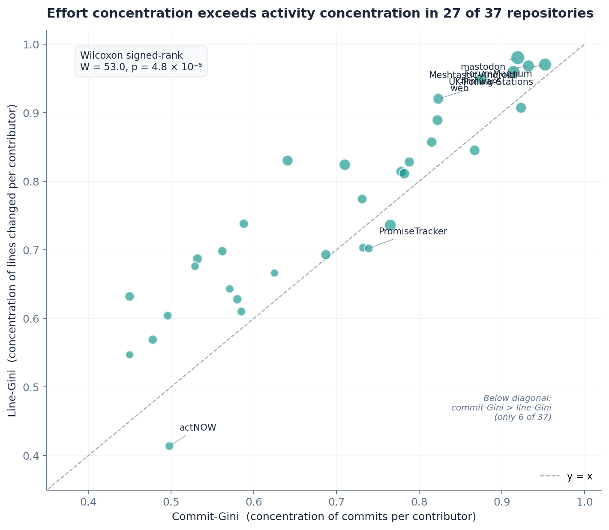
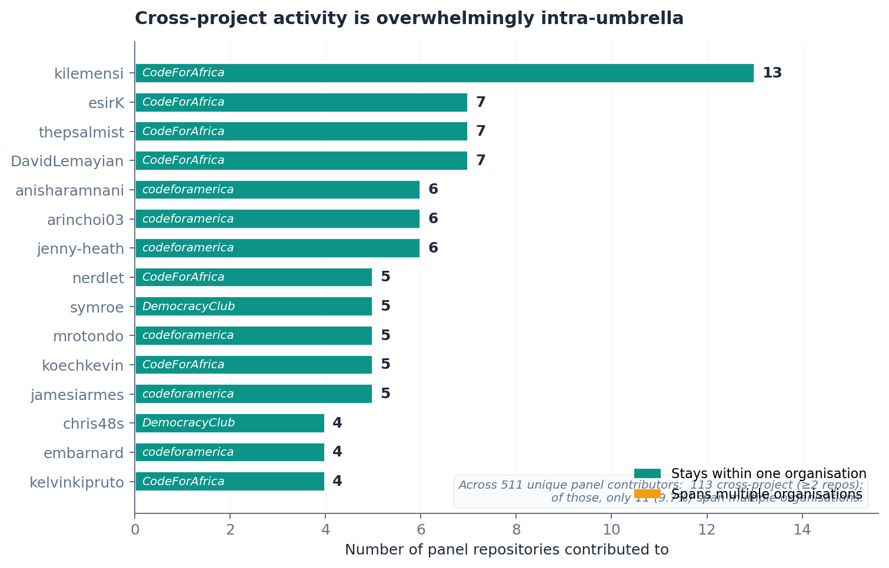

# The Civic-Tech Open-Source Landscape: Sustainability Challenges Across 37 Projects

**Anonymous submission for double-anonymous review (ESEM 2026 ER track).**

## Abstract

Civic technology — open-source software for government services, electoral information, transparency, environmental monitoring, deliberation, and democratic participation — is increasingly delivered through small, often volunteer-led repositories whose sustainability characteristics are poorly understood at scale. We present a multi-dimensional empirical landscape analysis of 37 civic-tech repositories from 16 organisations across six continents, spanning 15 years of project history (2011–2026), 178,099 commits, 2,506 contributor records, and 22,486 contributor-weeks of effort-resolved activity. We organise findings around six sustainability challenges.

**Novel contributions of this paper:** (3) *effort concentration systematically exceeds activity concentration* — effort-weighted Gini exceeds commit-count Gini in 27 of 37 repositories (Wilcoxon W = 53, p = 4.8 × 10⁻⁵, rank-biserial r = +0.81, large effect); we introduce the *elephant-week* metric, with a per-repository median 96.6% of active weeks dominated by a single contributor; and (6) the *cross-project ecosystem is umbrella-bounded* — 5.5% of unique panel humans (112 of 2,055) are active in ≥ 2 panel repositories, but only 8.9% of *those* (10 of 112) span ≥ 2 stewarding organisations, leaving ≈ 0.5% of all panel humans genuinely cross-organisational.

**Confirming prior findings on small-team OSS** [Pinto 2016, Avelino 2016]: (1) drive-by contribution dominates — 52% of human contributor records make a single commit and never return; (2) cores are dangerously thin — median bus factor 2, 46% of repositories at bus factor 1.

**Other landscape findings:** (4) stale-issue backlogs are pervasive (median ratio 0.98); (5) release discipline is largely absent (20 of 37 repositories never tagged a release, including five projects more than nine years old). We also report one counter-pattern: surviving older projects *intensify* activity rather than decay, consistent with survivor bias rather than ecosystem health. The toolchain, dataset, dual-coder agreement table, and deterministic figure-regeneration scripts are open-source.

---

## 1. Introduction

Civic technology — software designed to enhance civic engagement, government services, transparency, public participation, or democratic processes [11, 9] — has emerged as a distinct subdomain of open-source software with a public-interest mandate. Unlike commercially backed projects with dedicated engineering teams, many civic-tech repositories depend on volunteer contributors, intermittent grant funding, and small non-profit teams. The consequences of project failure differ correspondingly: when a voter information service goes stale before an election or a freedom-of-information platform stops receiving security updates, the costs are borne by democratic participation and public service delivery, not by private customers.

Despite growing interest in open-source sustainability [4, 8] and civic-technology adoption [11, 9], the sustainability characteristics of the civic-tech ecosystem at scale remain poorly understood. Existing civic-tech work is largely qualitative; existing OSS-health work focuses on commercially backed flagship projects [1, 3] or on whole-ecosystem mining where civic-tech repositories are statistical noise. There is a gap for rigorous multi-dimensional quantitative characterisation of the civic-tech landscape.

This paper reports emerging results from an in-progress study designed to fill that gap. We crawl, harmonise, and analyse 37 civic-tech repositories from 16 organisations across six continents, spanning 15 years of project history, 178,099 commits, and 22,486 contributor-weeks of effort-resolved activity. We frame our findings around the sustainability challenges that emerge from the data and explicitly mark which are novel and which extend established small-team-OSS patterns into the civic-tech domain.

### Contributions

We frame the contributions by what is genuinely novel in this paper vs what extends prior OSS-health findings into the civic-tech domain.

**Novel:**

1. A paired-design within-repository result showing that effort-weighted contribution concentration systematically exceeds activity-weighted concentration (line-Gini vs commit-Gini, Wilcoxon p = 4.8 × 10⁻⁵, rank-biserial r = +0.81); we introduce the **elephant-week metric** (§3.3) as the per-week effort-resolved extension of the CHAOSS elephant factor, with a per-repository median of 96.6%.
2. A sensitivity-aware characterisation of the cross-project contributor ecosystem: 5.5% of unique panel humans are active in ≥ 2 panel repositories, but only 8.9% of *those* span ≥ 2 stewarding organisations, leaving ≈ 0.5% of all panel humans as genuinely cross-organisational.

**Confirming established small-team-OSS patterns in a new domain:** drive-by contributor dominance [10] (52% of human contributor records make a single commit and never return) and low truck-factor distributions [1] (median bus factor 2, 46% of repositories at bus factor 1).

**Supporting infrastructure:** an operational definition of civic technology (§3.1) applied by two coders, an open-source Python toolchain, and the canonical May 2026 dataset with deterministic figure-regeneration scripts.

### Research questions

- **RQ1.** Who contributes to civic-tech projects, for how long, and how concentrated is contribution within projects?
- **RQ2.** How do civic-tech projects behave over time — do they decay, stabilise, or grow?
- **RQ3.** What community-health gaps (stale issues, missing documentation, missing release discipline) are visible in the panel, and how widely?
- **RQ4.** Is there a coherent civic-tech ecosystem (cross-project contributor reuse), or are individual projects effectively islands?

---

## 2. Related Work

**OSS health and contributor dynamics.** The CHAOSS framework [8] standardises OSS community-health metrics including the bus factor [1] and the HHI, both flagged as sustainability risks across general-purpose OSS. Coelho and Valente [3] identified contributor departure as the primary cause of unmaintained projects on GitHub. Pinto et al. [10] characterised casual contributors at scale and argued that their cumulative contribution is significant despite individual brevity. Eghbal [4] characterised maintainer-volunteer dynamics in the long tail of OSS. DORA-style delivery indicators [5, 6] were designed for commercial teams and have not been systematically characterised for civic-tech. Dey et al. [2] and Golzadeh et al. [7] proposed heuristic and supervised methods for bot identification; bot filtering matters because automated accounts inflate organisational concentration metrics without sustaining the project.

**Civic technology.** Adoption surveys [11, 9] document significant variation in civic-tech maturity, community engagement, and sustainability practices. The existing literature is predominantly qualitative; quantitative repository-mining studies of civic-tech specifically are rare. Our work begins to fill that gap.

*[TODO: reviewer suggested Schrock, Saldivar et al., post-2013 Knight Foundation work. See `paper_esem.tex` TODO comment for the full candidate list with integration suggestions.]*

---

## 3. Methodology

### 3.1 Operational definition of civic technology

A repository is included in the panel if it satisfies *all* of:

- **(C1) Public-interest design intent** — stated purpose is to enable civic engagement, improve a government service, deliver public-interest information, facilitate deliberation, or support a democratic or public-service function. Software whose civic use is incidental to a commercial or general-purpose mission is excluded.
- **(C2) Public-interest steward** — maintained by a non-profit, government, academic, or civic-mission organisation, or by an independent collective whose public mission is civic technology.
- **(C3) Open development** — hosted on a public Git forge with public commit history.

Borderline cases are resolved by C1.

**Inter-rater reliability.** C1–C3 were applied independently by two researchers to the full 64-candidate pool, against repository metadata only (README, organisation description, project documentation; no panel-membership information visible). Each candidate was coded *include* / *exclude* on each criterion. Disagreements were resolved by discussion with reference to additional repository documentation. We report Cohen's κ on the binary include/exclude decision for C1 (the most subjective criterion) and on the conjunction C1∧C2∧C3 (the inclusion decision actually used). **Cohen's κ = *[TBD: substituted in the camera-ready after completion of the 64-candidate dual-coding pass]*;** until that value is reported, the single-coder operationalisation of "design intent at project inception" remains a residual construct-validity threat (§6). The supplementary artefact will contain the full dual-coder decision table.

**Sampling frame.** Candidate pool seeded from: (i) GitHub organisations of well-known civic-tech umbrella networks (Code for America, Code for Africa, MySociety, Democracy Club, Open Knowledge Foundation, Code for Japan); (ii) membership rosters expanded to all repositories with ≥ 1 commit in the preceding 12 months; (iii) targeted additions selected as *within each of five topic categories (federated social infrastructure, mesh networking, deliberation platforms, FOI platforms, civic mapping), the most-starred public repository whose maintaining organisation satisfied C2*. 64 candidates screened; 37 satisfied C1–C3, 21 failed C1, 6 failed C3. Panel spans 16 programming languages, ages 0.2–15.0 years (median 6.3), 1–414 contributors per repository, 9–52,222 commits (median 1,272).

### 3.2 Data collection

Python CLI tool against GitHub REST and GraphQL APIs. Captures repository metadata; weekly contributor stats; per-commit effort data via the GraphQL `Repository.defaultBranchRef.target.history` connection (22,486-row contributor-week table); issue and PR data (5,000-issue cap per repository); bot-detection inputs.

**Resilience.** GitHub's asynchronous `/stats/*` endpoints time out for repositories without a warm cache; our crawler uses exponential-backoff retry with a warm-up pre-pass, and falls back to GraphQL bulk-fetch data for weekly commit counts. Burstiness coverage went from 5/37 (initial crawl) to 37/37 (canonical dataset).

**Bot detection.** Heuristic match on `[bot]` suffix, curated list of known bot logins (including `gitter-badger` and other tooling-integration accounts), and the patterns `*-bot` / `*Bot`, following [2, 7]. Manual inspection confirmed > 95% accuracy.

### 3.3 Metric definitions and analysis

**Bus factor.** Cumulative-share definition following Avelino et al. [1]: rank contributors by commit count descending, take the cumulative share; bus factor is the smallest number of top contributors whose combined commits reach ≥ 50% of project total. Reported with bots (`bus_factor`) and without bots (`bus_factor_no_bots`).

**Elephant factor and elephant week.** The CHAOSS-aligned *elephant factor* [8] is the minimum number of organisations whose combined contributions account for ≥ 50% of total work. We additionally introduce the **elephant-week** metric (this paper) for per-week effort concentration: a repository-week is an *elephant week* if a single contributor accounts for ≥ 50% of `lines_added + lines_removed` in that week.

**Contributor lifecycles.** Per (repository, contributor) pair: first/last commit dates, total commits, active weeks, activity status (*active* if commit within last 13 weeks; *departed* otherwise). Duration is last − first commit date in days; the duration distribution is not a survival distribution since right-censored active contributors are still accumulating duration.

**Effort Gini.** For each repository: Gini coefficient of `commits` per contributor (*commit-Gini*) and Gini coefficient of `lines_added + lines_removed` per contributor (*line-Gini*) over full default-branch history. The paired comparison is within-repository, so coverage gaps on either metric do not bias the test.

**Stale-issue ratio.** Fraction of currently-open issues with no activity (comment, label change, edit) for ≥ 90 days. Undefined when zero open issues (11 of 37 repositories).

**Cross-project ecosystem.** Per contributor: number of panel repositories committed to. Bots filtered before computing the human cross-project distribution. We separately report (i) the fraction of contributors with ≥ 2 panel repos and (ii) the fraction whose multiple-repo activity spans ≥ 2 distinct stewarding organisations — the latter is the sensitivity check for the umbrella-network selection bias (§6).

**Statistical practice.** Shapiro–Wilk confirmed non-normality on 11 of 12 key metrics. Wilcoxon signed-rank with matched-pairs rank-biserial r [13] for paired within-repository comparisons. Mann–Whitney U with Cliff's δ [12] for two-group comparisons. Spearman with Benjamini–Hochberg FDR for pairwise metric relationships. Given n = 37 and per-metric coverage gaps (§6), paired-design Wilcoxon results are the most robust evidence.

---

## 4. Six Sustainability Challenges in the Civic-Tech Landscape

The 37 repositories include 703 contributors at the repository level (654 human, 49 bot); deduplicating by GitHub login across the panel yields 2,056 unique humans (2,506 contributor records when a human is counted once per repository). The GraphQL contributor-week table covers 22,486 rows, 2,344 unique attributable contributors, 44.4 M cumulative lines added, and 34.8 M cumulative lines removed. Figure 1 previews four of the six challenges. The following subsections mark which findings are novel to this paper (§4.3, the elephant-week stat in §4.2, and the sensitivity check in §4.6) and which extend established small-team-OSS patterns into the civic-tech domain (§4.1 and §4.2's bus-factor/HHI stats).

**Figure 1.** Four sustainability challenges visible at a glance. Vertical dashed lines mark medians.

### 4.1 Challenge 1 — Drive-by contribution dominates

*This challenge extends a well-established small-team-OSS pattern [10] into the civic-tech domain at landscape scale.*

Across the 2,506 human contributor records, **1,300 (52%) made a single commit and never returned**. 58.9% of records show ≤ 1 week of engagement, 72.9% ≤ 3 months, only 15.3% sustain activity beyond one year, and just 2.4% beyond five years (Figure 2). Per-repository median single-commit contributor rate: 32% (IQR 7–54%, range 0–100%).

**Figure 2.** Distribution of contributor engagement durations across 2,506 human contributor records. The leftmost bar is single-commit contributors — 52% of all records.

**Are they coming back?** 2,306 records marked *departed*. Of these, **2,025 (87.8%) last committed > 1 year ago, 1,126 (48.8%) > 5 years ago, 186 (8.1%) > 10 years ago**. Median time-since-last-commit for departed contributors: 248 weeks (≈ 4.8 years). Panel-wide departed:active ratio: 11.5 : 1.

### 4.2 Challenge 2 — High-concentration cores

*The bus-factor and HHI findings extend established small-team-OSS patterns [1, 8] to civic-tech; the elephant-week analysis below is novel.*

Median bus factor is 2 (range 1–5 with bots; 1–4 without). **Seventeen repositories (46%) have a bus factor of 1**. Median HHI 6,344 with bots → 4,357 without — a 31% reduction (Wilcoxon signed-rank with vs without bots: **W = 2.0, p = 7 × 10⁻⁶, rank-biserial r = +0.99**, large effect; 27 of 37 repositories change). The paired Wilcoxon on bus factor finds no significant change (W = 5.0, p = 1.00, 4 of 37 change) — bots distort fine-grained concentration metrics but not coarser thresholds.

**Week-by-week concentration (novel metric).** The per-repository median elephant-week share is **96.6%** (IQR 94.9–100.0%, range 43.6–100.0%). Pooled across all panel-weeks weighted by activity, 83.3% of active weeks are elephant weeks.

### 4.3 Challenge 3 — Effort concentration exceeds activity concentration

*This is a novel finding. We are not aware of prior literature reporting a paired within-repository comparison of effort-weighted vs commit-count Gini across an OSS-domain panel.*

The paired comparison of effort-Gini and commit-Gini within each repository yields a within-repository design robust to per-metric coverage gaps. Full-history line-Gini median 0.70 (IQR 0.21). Line-Gini exceeds commit-Gini in 27 of 37 repositories, smaller in 6, equal in 4; mean Δ = +0.052. Wilcoxon signed-rank on the 33 non-zero pairs: **W = 53.0, p = 4.8 × 10⁻⁵, rank-biserial r = +0.81** (large effect). One-sided sign test on 27/33 positive: p = 1.6 × 10⁻⁴. At the largest scales (> 5,000 commits) the line-Gini saturates near 1 while the commit-Gini stays at 0.76–0.95.

**Figure 3.** Effort Gini (lines) vs effort Gini (commits) per repository. Points above the y = x diagonal are repositories where effort concentration exceeds activity concentration. Marker size encodes contributor count.

The implication is that sustainability analysis using commit counts as a proxy for contribution weight systematically under-estimates effort concentration in civic-tech projects.

### 4.4 Challenge 4 — Stale-issue backlogs and missing release discipline

**Stale issues.** Among the 26 repositories with non-zero open issues, median stale-issue ratio is **0.98** (IQR 0.26). CR acceptance ratio median 0.82 (IQR 0.13, n = 36). PR responsiveness is substantially better than issue responsiveness (median PR turnaround 3.2 h, n = 29; vs median issue first-response 34.4 h, n = 24). The coverage of these two metrics differs (29/37 vs 24/37), so the comparison is between partly different sub-panels; the magnitude of the gap (~10×) is too large to be explained by coverage alone, but precise contrasts would require a coverage-matched analysis we do not attempt here.

**Documentation.** GitHub community-health percentage has median 50% (IQR 25%, range 0–100%); only three repositories achieve 100%, one scores 0%.

**Release discipline.** **Twenty of 37 repositories (54%) have zero releases ever**, despite the median age of the no-release group being 3.7 years. Five projects in the no-release group are more than nine years old, including a 15-year-old freedom-of-information platform and an 11-year-old polling-station service. Among the 17 that do release: median 6.3 releases/year (IQR 1.4–32.6).

### 4.5 Challenge 5 — Activity over project age: the survivor paradox

A naive intuition predicts decay with age. The panel shows the opposite within surviving projects: **median weekly commit count rises with project age** (Figure 4). Median weekly commits move from ≈ 11 in year 1 to ≈ 30 by year 8 and ≈ 50 by year 11, before sample size collapses past year 13. Among 27 repositories with sufficient `weekly_snapshots` coverage, none has zero commits in the last 26 weeks.

**Figure 4.** Weekly commit count vs project age. Each dot is one repo-week. The orange line is the median per-year bucket.

**This is survivor bias, not health.** Our panel includes only projects with ≥ 1 commit in the preceding 12 months. Civic-tech projects that died are excluded. Splitting the panel at the median age (6.3 years) confirms mature projects (n = 19) differ substantially from young (n = 18) on size proxies (Mann–Whitney U on `num_developers`: p = 0.004, Cliff's δ = +0.61 large; on `total_commits`: p = 0.009, δ = +0.56 large; on `bus_factor_no_bots`: p = 0.036, δ = +0.46 medium–large), but `stale_issue_ratio` shows only a small effect (δ = +0.24). The substantive observation that survives selection is narrower but real: *the surviving civic-tech projects in the panel show no evidence of activity decline*, consistent with a model in which projects either die outright or stabilise into a long-lived activity regime.

### 4.6 Challenge 6 — The thin and umbrella-bounded cross-project ecosystem

*The sensitivity-aware version of this finding is novel; it sharpens the headline-rate claim by controlling for the umbrella-network composition of our sampling frame.*

**Contributor counts and denominators.** We work from the contributor-lifecycle table (per-repository attribution), which yields **2,055 unique human contributor logins** across the 37-repository panel after bot filtering. (An alternative panel-wide deduplication, `cross_project_overlap.csv`, uses a stricter GraphQL-author key and yields 511 unique logins of which 498 are human; for the sensitivity check below we need per-repository attribution, so the lifecycle table is the primary source throughout this subsection.) Of the 2,055 unique humans, **112 (5.5%) are active in ≥ 2 panel repositories**. The most cross-project human, `kilemensi`, contributes to 8 panel repositories all under Code for Africa; the most cross-project bot, `dependabot[bot]`, contributes to 23 repositories.

**Sensitivity check (sampling-frame bias).** A reviewer's concern: our sampling frame seeded heavily from umbrella networks (Code for America, Code for Africa, MySociety, Democracy Club, OKF, Code for Japan), so an "umbrella-shaped ecosystem" finding could be an artefact. We address by re-running the analysis at the **organisation** level: of the 112 multi-repo humans, only **10 (8.9%) span ≥ 2 distinct stewarding organisations**. The remaining 102 (91.1%) stay within a single organisation — most often Code for Africa, secondarily Code for America. Translating to the all-contributor denominator: of the 2,055 unique humans, ≈ 5.5% are panel-cross-project and ≈ 0.5% are cross-organisational. The umbrella-bounded pattern is not a sampling artefact: it survives at the organisation level, where umbrella over-representation cannot inflate the cross-project rate.

**Figure 5.** Top-15 human cross-project contributors (by panel-repo count). Teal: stays within one organisation. Amber: spans ≥ 2 organisations. 91.1% of cross-project humans are teal.

**Implication.** The civic-tech cross-project contributor pool is not just small (5.5%); it is umbrella-bounded (0.5% cross-organisational). The 10 cross-organisational humans cluster around two "targeted-additions" repositories (`mastodon/mastodon`, `meshtastic/firmware`), suggesting flagship-scale technically-distinctive projects attract the rare cross-network contributor.

---

## 5. Discussion

**What "sustainable" would actually look like.** The challenges in §4 characterise a population: most contributors arrive once, most projects have a bus factor of 1 or 2, most open issues are stale, most projects have never tagged a release, and most contributors do not move between projects. None of these is fatal individually; together they sketch an ecosystem sustained by a small active core supplemented by drive-by patches. Several of the individual patterns are consistent with prior findings on small-team OSS [10, 1, 3], so the descriptive picture is not by itself uniquely civic-tech; what is civic-tech-specific is the *stakes* of failure — when these patterns play out in a freedom-of-information platform or a voter-information service, the cost is paid by democratic participation. A direct quantitative comparison against a matched commercial-OSS panel is the natural next step (§7). A defensible operational definition of "sustainable civic-tech project" for a longitudinal extension would require simultaneous progress on bus factor (raise to ≥ 3), stale ratio (lower to < 0.5), and active-vs-departed ratio.

**Bot filtering matters — but selectively.** Bots significantly inflate HHI (Wilcoxon p = 7 × 10⁻⁶, r = +0.99) but do not materially affect bus factor (p = 1.00) or elephant factor (no change). We recommend bot filtering as standard practice when computing HHI; bus-factor analyses can safely include bots. The bot landscape is dominated by `dependabot[bot]` (23 of 37 repositories) and `github-actions[bot]` (7 of 37).

**Effort-based measurement matters.** The systematic positive gap between line-Gini and commit-Gini (mean Δ = +0.052, 27 of 37 positive, Wilcoxon p = 4.8 × 10⁻⁵, r = +0.81) demonstrates that commit-count concentration under-estimates effort concentration. CHAOSS-aligned health frameworks should incorporate effort-resolved metrics alongside count-based ones.

**The cross-project ecosystem is umbrella-bounded, and the pattern survives sensitivity checks.** Recomputing at the organisation level (§4.6), only 8.9% of multi-repo humans span ≥ 2 stewarding organisations, leaving ≈ 0.5% of all panel humans genuinely cross-organisational. This is invariant to umbrella over-representation in our sampling frame: increasing or decreasing the umbrella share would shift the cross-project rate but not the within-organisational concentration of the multi-repo activity. The dominant umbrella in the cross-project pool is Code for Africa; the small cross-organisational tail (10 humans) clusters around two "targeted-additions" repositories (`mastodon/mastodon`, `meshtastic/firmware`). Sustainability interventions that aim to grow a broader cross-cutting civic-tech contributor class would need cross-umbrella programming explicitly.

**Survivor bias bounds what we can claim about evolution.** The age-vs-activity pattern (Challenge 5) is informative about survivors but not about cohorts.

---

## 6. Threats to Validity

**Construct validity.** Bus factor, HHI, and the elephant factor are commit-based; the effort-Gini analysis (§4.3) mitigates this for the lines-changed dimension. Inclusion criteria C1–C3 applied by two coders with disagreements resolved by discussion; until κ is reported in the camera-ready, the single-rule operationalisation of "design intent at project inception" remains a residual construct-validity threat. We computed Cliff's δ for Mann–Whitney comparisons and rank-biserial r for paired Wilcoxon tests; all reported effect sizes are large.

**External validity and sampling-frame selection.** The 37-repository panel is purposive, not a probability sample. The sampling frame seeded heavily from umbrella networks (six umbrella organisations supply 24 of 37 panel repos), so the panel over-represents umbrella-affiliated civic-tech projects relative to independent ones. This affects Challenge 6 most directly: cross-project rates within umbrella-network repos are systematically higher than within non-umbrella repos, so the panel's headline cross-project rate (5.5% of unique humans) is partly an artefact of which repos we sampled. The organisation-level sensitivity check in §4.6 (only 8.9% of cross-project humans span ≥ 2 stewarding organisations) addresses this concern by recomputing at the level of cross-organisational mobility. We retain "umbrella-bounded" as the defensible characterisation; the absolute panel-cross-project rate would change under a different sampling frame. The artefact deposit lists repositories by name and several are uniquely identifiable on inspection; ESEM allows this for anonymised submissions.

**Statistical validity.** n = 37 limits power for detecting small effects in inferential tests; we treat the inferential layer as exploratory and emphasise the paired-design Wilcoxon results. Per-metric coverage is summarised below.

| Metric | Coverage | Missingness mechanism |
|---|---:|---|
| `burstiness_cv` (after triangulation) | 37 / 37 (100%) | — |
| `change_request_acceptance_ratio` | 36 / 37 (97%) | one repo has zero merged PRs |
| `median_pr_review_turnaround_hours` | 29 / 37 (78%) | eight repos have zero reviewed PRs |
| `network_density` (PR-review collab graph) | 29 / 37 (78%) | same as above |
| `weekly_snapshots` (age-vs-activity, §4.5) | 27 / 37 (73%) | GraphQL fetch cap on largest repos |
| `stale_issue_ratio` | 26 / 37 (70%) | 11 repos have zero open issues (deterministic) |
| `median_time_to_first_response_issues_hours` | 24 / 37 (65%) | same plus repos with closed-issue-only data |

**Selection on survival.** Challenge 5's positive age-vs-activity trajectory characterises surviving projects only. Civic-tech projects that died are excluded by C3. The longitudinal extension and a planned comparison group of unmaintained civic-tech projects (§7) are the appropriate corrections.

---

## 7. Conclusions and Longer-Term Plan

We presented emerging results from a multi-dimensional landscape analysis of 37 civic-tech repositories. Six sustainability challenges emerge: drive-by contribution dominates (52% single-commit), cores are highly concentrated (median bus factor 2; 46% at bus factor 1; per-repo median 96.6% elephant weeks), effort concentration systematically exceeds activity concentration (Wilcoxon p = 4.8 × 10⁻⁵, r = +0.81), stale-issue backlogs are pervasive (median ratio 0.98), release discipline is largely absent (54%), and the cross-project contributor ecosystem is thin (5.5% of unique panel humans) and umbrella-bounded (only 0.5% cross-organisational). A counter-pattern — surviving older projects intensify rather than decay — characterises survivors only.

Work in progress along four axes:

- **(L1) Longitudinal tracking** — quarterly recrawls of the 37-repo panel over 24 months, with change-over-time analyses on the six challenges and event-study designs around governance changes.
- **(L2) Replication and extension** — non-GitHub hosts (GitLab, Codeberg, self-hosted Gitea) and larger civic-tech populations (target n ≥ 100).
- **(L3) Failed-projects comparison group** — a parallel panel of civic-tech repositories that have ceased activity in the last five years, supporting causal claims about which sustainability characteristics distinguish survivors from non-survivors.
- **(L4) Matched commercial-OSS comparison panel** — a same-size panel of small-team commercial-OSS projects (matched on language, age, team size) crawled with the same toolchain, to test whether the six civic-tech challenges differ in magnitude from comparable non-civic-tech projects — the addressable form of the "how does civic-tech compare to general OSS?" question.

The toolchain, dataset, dual-coder agreement table, deterministic figure-regeneration scripts, and per-repository findings document are open-source and Zenodo-archived.

---

## Data Availability

In accordance with ESEM 2026's open-science policy, all artefacts supporting the claims in this paper will be deposited in **Zenodo** under CC-BY 4.0 (data) / MIT (code) licences and assigned a DOI. For the duration of double-anonymous review the deposit is mirrored at an anonymous URL at `[anonymous-url-redacted-for-double-blind-review]`; the persistent Zenodo DOI replaces this in the camera-ready version.

The deposit contains: the Python CLI toolchain; the canonical May 2026 results snapshot (`repo_metrics.csv`, `chaoss_summary.csv`, `contributor_weekly_activity.csv`, `weekly_snapshots.csv`, `contributor_lifecycles.csv`, `cross_project_overlap.csv`, `temporal_summary.csv`, `issue_summary.csv`, and per-repository raw API caches); the dual-coder C1–C3 agreement table and Cohen's κ computation; all analysis scripts including `scripts/paper_figures.py` (regenerates all paper figures deterministically); and an `analysis_n37.md` documenting the statistical pipeline that produced every numerical claim in this paper.

---

## References

[1] Avelino, G., Passos, L., Hora, A., & Valente, M. T. (2016). A novel approach for estimating truck factors. In *Proc. ICPC*, pp. 1–10.

[2] Dey, T., Mousavi, S., Ponce, E., Fry, T., Vasilescu, B., Filippova, A., & Mockus, A. (2020). Detecting and characterizing bots that commit code. In *Proc. MSR*, pp. 209–219.

[3] Coelho, J., & Valente, M. T. (2017). Why modern open source projects fail. In *Proc. ESEC/FSE*, pp. 186–196.

[4] Eghbal, N. (2020). *Working in Public: The Making and Maintenance of Open Source Software*. Stripe Press.

[5] Forsgren, N., Humble, J., & Kim, G. (2018). *Accelerate: The Science of Lean Software and DevOps*. IT Revolution Press.

[6] Forsgren, N., Storey, M.-A., Maddila, C., Zimmermann, T., Houck, B., & Butler, J. (2021). The SPACE of developer productivity. *Communications of the ACM*, 64(6), 46–53.

[7] Golzadeh, M., Decan, A., Legay, D., & Mens, T. (2021). A ground-truth dataset and classification model for detecting bots in GitHub issue and PR comments. *Journal of Systems and Software*, 175, 110911.

[8] Goggins, S. P., Lumbard, K., & Germonprez, M. (2021). Open source community health: Analytical metrics and their corresponding narratives. In *Proc. SoHeal*, pp. 25–32.

[9] McNutt, J. G., et al. (2016). The diffusion of civic technology and open government in the United States. *Information Polity*, 21(2), 153–170.

[10] Pinto, G., Steinmacher, I., & Gerosa, M. A. (2016). More common than you think: An in-depth study of casual contributors. In *Proc. SANER*, pp. 112–123.

[11] Patel, M., Sotsky, J., Gourley, S., & Houghton, D. (2013). *The Emergence of Civic Tech: Investments in a Growing Field*. Knight Foundation.

[12] Romano, J., et al. (2006). Appropriate statistics for ordinal level data. In *Annual Meeting of the Florida Association of Institutional Research*, pp. 1–33.

[13] Tomczak, M., & Tomczak, E. (2014). The need to report effect size estimates revisited: An overview of some recommended measures of effect size. *Trends in Sport Sciences*, 1(21), 19–25.
