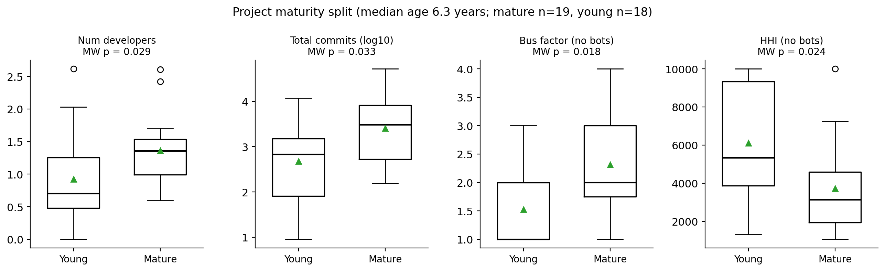
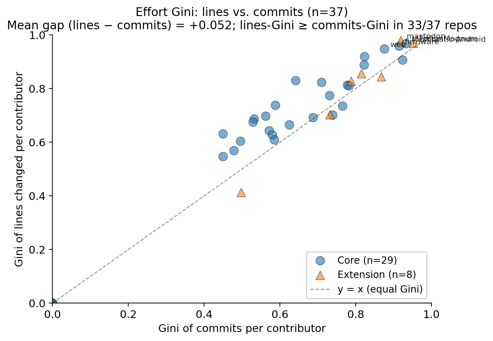

# Measuring Civic-Tech Repository Health: Emerging Results from a Multi-Dimensional Study of 37 Open-Source Projects

**Anonymous submission for double-anonymous review (ESEM 2026 ER track).**

## Abstract

Civic technology — software developed to support civic engagement, government transparency, and public participation — increasingly depends on small, often volunteer-led, open-source communities, yet its sustainability is poorly characterised at scale. We present emerging results from an in-progress multi-dimensional study of 37 civic-tech repositories drawn from 16 organisations (electoral systems, government services, environmental monitoring, mesh networking, federated social infrastructure, deliberation platforms, and digital rights) spanning 15 years of project history. We operationalise 25 CHAOSS-aligned metrics in an open-source Python toolchain, augment them with PR review network analysis and an effort-resolved view of weekly lines added/removed per contributor, and apply non-parametric statistical testing with FDR correction and partial-correlation controls. The panel reveals critically low contributor concentration (median bus factor 2; 46% of repositories at bus factor 1), high organisational concentration (median HHI 4,357 after bot filtering — above the DOJ "highly concentrated" threshold of 2,500), and a per-repository median elephant-week share of 96.6% (i.e. for the median project, almost every active week is dominated by a single contributor). Effort-weighted Gini systematically exceeds commit-count Gini (mean Δ = +0.052, positive in 27 of 37 repositories; Wilcoxon signed-rank p = 4.8 × 10⁻⁵). During the study we also discovered, and report here, a methodological pitfall: an earlier 29-repository pilot phase of the analysis produced a correlation between development burstiness and stale-issue ratio of ρ = 0.685 (FDR-significant on n=17 pairs), but expanding the panel to 37 repositories and triangulating burstiness with GraphQL bulk-fetch data exposed measurement-coverage bias in GitHub's `/stats/commit_activity` endpoint and attenuated the relationship to ρ = 0.444 (uncorrected significant, not FDR-significant). We position these findings as emerging results en route to a longitudinal civic-tech health programme and surface measurement-coverage bias as a systemic risk for small-sample OSS health research.

**Keywords:** civic technology; open-source sustainability; CHAOSS; bus factor; measurement-coverage bias; repository mining.

---

## 1. Introduction

Civic technology encompasses software designed to facilitate civic engagement, improve government services, enhance transparency, and enable democratic participation [11]. Unlike commercially backed open-source projects, many civic-tech projects depend on volunteer contributors, intermittent grant funding, and small non-profit teams. When such a project becomes unmaintained — a voter information service goes stale before an election, a freedom-of-information platform stops receiving security updates — the consequences extend beyond the developer community to democratic participation and public-service delivery.

Despite growing interest in OSS sustainability [4, 6, 8] and civic-tech adoption [9, 11], systematic empirical analysis of civic-tech project health remains limited. Existing work focuses either on large-scale mining of general-purpose repositories [3] or on qualitative case studies of individual initiatives [9]. There is a methodological gap for rigorous, multi-dimensional, quantitative analysis of civic-tech repository health using standardised metrics. The work reported here proceeded in two phases: an exploratory 29-repository pilot phase (autumn 2025) that exposed both reliability and measurement-coverage issues in our data pipeline, and the canonical 37-repository panel phase (May 2026) that this paper reports. The pilot was an internal milestone — not previously published or presented — and its main consequence for this paper is the cautionary case study reported in §4.4.1.

We contribute four pieces toward filling the empirical-analysis gap:

1. **A measurement framework** implementing 25 indicators from the CHAOSS project [8], augmented with PR review collaboration networks, contributor retention cohorts, organisational concentration indices, DORA delivery metrics [6], and an **effort-resolved view** that records weekly lines added/removed per contributor — a level of granularity not present in commit-count-based CHAOSS instantiations.

2. **An open-source toolchain** (Python CLI) that collects these metrics from the GitHub REST and GraphQL APIs, applies heuristic bot detection [2, 7], and exports structured datasets. The tool incorporates resilience features (exponential-backoff retry on async `/stats/*` endpoints with warm-up pre-pass, in-collector fallback to GraphQL-derived weekly snapshots, auto-respawn under external SIGKILL) developed in response to the measurement-coverage failures reported in §4.4.

3. **An empirical study of 37 civic-tech repositories** from 16 organisations across 16 programming languages and 15 years of project history. We apply Spearman correlations with Benjamini–Hochberg FDR correction, Mann–Whitney U and Wilcoxon signed-rank tests, Kruskal–Wallis tests, and partial correlations.

4. **A methodological pitfall discovered mid-study**, reported under the ESEM ER track's explicit welcome of negative findings. During the pilot phase we observed an apparently robust correlation between development burstiness and stale-issue ratio (ρ = 0.685, FDR-significant). Expanding the panel exposed measurement-coverage bias — GitHub's `/stats/commit_activity` endpoint had timed out for the majority of repositories, leaving burstiness available only for an opportunistically-cached subset. Triangulating with GraphQL bulk-fetch data attenuates the correlation to ρ = 0.444 (uncorrected significant, not FDR-significant). The relationship is real but smaller than the pilot suggested.

### Research questions

- **RQ1.** How concentrated are contributions in civic-tech projects, and does bot filtering change the picture?
- **RQ2.** What temporal patterns characterise civic-tech development, and how do they relate to issue management?
- **RQ3.** Which project-health metrics are correlated, and which correlations survive correction for multiple testing and control for project size?
- **RQ4.** How responsive are civic-tech communities to issues and pull requests, and what do PR review and software-delivery practices look like?
- **RQ5.** How do maturity and contextual factors relate to health outcomes?

The work is in progress; §7 outlines longer-term objectives.

---

## 2. Related Work

**Project health and contributor concentration.** The CHAOSS framework provides a standardised vocabulary for OSS community health metrics [8]. The bus factor [1] measures the minimum number of contributors whose departure would jeopardise a project; Avelino et al. analysed 133 popular GitHub projects and found that most have dangerously low values. Coelho and Valente [3] studied unmaintained GitHub projects and identified contributor departure as the primary cause of project death. Organisational diversity — captured by metrics such as the Herfindahl–Hirschman Index (HHI) and the elephant factor [8] — is a key sustainability indicator.

**Contributor dynamics.** Pinto et al. [10] studied casual contributors and showed that their individually small contributions collectively represent a significant portion of project activity. Eghbal [4] characterised the maintainer-volunteer model that dominates much of the OSS ecosystem.

**Civic technology.** Civic-tech adoption surveys [9, 11] identify significant variation in technical maturity, community engagement, and sustainability practices. Most existing civic-tech work is qualitative; we are not aware of prior quantitative multi-metric studies of civic-tech repository health at the scale presented here.

**Software delivery.** DORA metrics [5, 6] — deployment frequency, lead time for changes, change failure rate, time to restore — were designed for commercial teams but indicate the maturity of development practices in civic-tech projects.

**Bot detection.** Automated bots distort contributor metrics. Dey et al. [2] and Golzadeh et al. [7] proposed heuristic and supervised methods; failing to filter bots inflates activity metrics and skews concentration analyses.

**Measurement-coverage bias.** Repository-mining studies routinely depend on aggregate endpoints whose coverage is incomplete in ways that correlate with the variables of interest. GitHub's `/stats/*` endpoints, for instance, are computed asynchronously and may time out for active repositories; the repositories that *do* return are disproportionately those for which GitHub has cached recent results, which itself correlates with project popularity and activity. We are not aware of prior civic-tech-specific work that has flagged this risk; §4.4 of this paper revisits a previously-observed correlation in light of it.

*[TODO: 1–2 recent (2023–2025) OSS-health or sustainability references for currency; currently nothing 2022+ in the bibliography. Suggested venues: ICSE/FSE/MSR/EMSE 2023–2025 sustainability tracks; CHAOSS community papers; OpenSSF.]*

---

## 3. Methodology

### 3.1 Framework design

The framework implements 25 metrics organised into six categories: contributor concentration (bus factor, elephant factor, HHI in 3 variants, core/periphery counts); development activity (total commits, burstiness CV, new-contributor rate, weekly lines added/removed); community responsiveness (median time to first response on issues and PRs, PR review turnaround, stale-issue ratio); code review (CR acceptance ratio, average review comments per PR); organisational diversity (HHI by org, contributor org types, unknown-org count); and software delivery DORA (deployment frequency, median lead time, change failure rate). All concentration metrics are computed both with and without bot contributors, and HHI is additionally computed in a "known organisations only" variant.

### 3.2 Dataset

**Operational definition of civic technology.** We define a repository as civic technology if it satisfies *all* of the following binary criteria, applied by a single coder against repository metadata (README, organisation description, project documentation):

- **(C1) Public-interest design intent.** The project's stated purpose is to enable civic engagement, improve a government service, deliver public-interest information (electoral, environmental, transparency, FOI), facilitate deliberation, or support a democratic or public-service function. Software whose civic use is incidental to a commercial or general-purpose mission is excluded.
- **(C2) Public-interest steward.** The project is maintained by a non-profit, government, academic, or civic-mission organisation, *or* an independent collective whose public mission is civic technology. Commercial vendors of civic-tech-as-a-product are excluded.
- **(C3) Open development.** The project is hosted on a public Git forge with public commit history.

Borderline cases (general-purpose tools repurposed for civic uses; commercial products with civic features) are resolved by C1: design intent at project inception, not contemporary use, determines inclusion.

**Sampling frame.** The candidate pool was seeded from three sources: (i) the GitHub organisations of well-known civic-tech umbrella networks (Code for America, Code for Africa, MySociety, Democracy Club, Open Knowledge Foundation, Code for Japan); (ii) the membership rosters of those networks; and (iii) targeted additions to widen scale and topical breadth (federated social infrastructure, mesh networking, deliberation platforms). 64 candidate repositories were screened against C1–C3; 37 satisfied all three criteria, 21 failed C1 (general-purpose or product-marketing repositories within civic-tech organisations), and 6 failed C3 (private or archived without public history). The 37-repository panel is therefore a purposive but criterion-applied sample rather than a random sample; §6 discusses the consequences for external validity.

**Panel characteristics.** The dataset spans 16 primary programming languages, ages 0.2–15.0 years (median 6.3), 1–414 contributors per repository, and 9–52,222 commits (median 1,272). The full repository list is in the supplementary `repo_metrics.csv` (see Data Availability).

### 3.3 Data collection

Data were collected via an open-source Python CLI tool interacting with the GitHub REST and GraphQL APIs. Repository metadata, languages, license, topics, community profile; weekly contributor stats via `GET /repos/{owner}/{repo}/stats/contributors` (with iterative retry around HTTP 202 and a fallback to commit-history-derived attribution); **per-commit effort data** (oid, additions, deletions, committedDate, author) via the GraphQL `Repository.defaultBranchRef.target.history` connection (yielding a 22,486-row contributor × ISO-week table); weekly per-repo commit counts via the same GraphQL pipeline (used as the canonical burstiness source); issue and pull-request data via paginated endpoints (capped at 5,000 issues per repository); contributor profiles via `GET /users/{login}`; and technology detection (CI/CD, cloud, AI/ML) via file and dependency scanning.

**Bot detection.** A contributor is classified as a bot if the GitHub login matches: (a) the `[bot]` suffix, (b) a curated list of known bot logins, or (c) the patterns `*-bot` / `*Bot`. This follows established practice [2, 7]; manual inspection confirmed > 95% accuracy.

### 3.4 Resilience improvements

GitHub's `/stats/commit_activity` and `/stats/contributors` endpoints are computed asynchronously; first requests return HTTP 202 and the build can take 30–180 s for active repositories. A prior linear-backoff budget of 45 s was insufficient — only 5 of 37 repositories returned populated stats data within budget. We replaced it with exponential backoff capped at 30 s/retry over 10 attempts (≈225 s total) plus a warm-up pre-pass that fires one request per repository at crawl start so async builds proceed in parallel server-side. When `/stats/commit_activity` still does not return, the crawler derives weekly commit counts from a GraphQL bulk-fetch result. Burstiness coverage in the canonical panel is 37/37.

### 3.5 Burstiness and stale-issue definitions

**Burstiness.** Coefficient of variation (CV) of weekly commit counts over a trailing 52-week window (the same window used by the pilot-phase analysis in §4.4.1, retained for comparability). All values are derived from `weekly_snapshots.csv` (GraphQL), not from `/stats/commit_activity`. Validation on the 5 repositories where both sources are available shows trailing-52w agreement within ±0.07 in 4 of 5 cases. Four repositories are younger than 52 weeks (16, 38, 50, 50 weeks of history); for these the CV is computed over the full available history rather than truncated, with the consequence that their burstiness estimate has higher variance than that of older repositories. We retain them in the analysis but flag this in §6.

**Stale-issue ratio.** An open issue is *stale* if it has had no activity (comment, label change, or edit) for at least 90 days; the stale-issue ratio is the fraction of currently-open issues meeting this threshold. The 90-day window is the project's documented convention and matches the widely-used `stale[bot]` default. The ratio is undefined when a repository has zero open issues; §4.4 reports the coverage consequences.

### 3.6 Analysis approach

Shapiro–Wilk tests confirmed non-normality for 11 of 12 key metrics, justifying non-parametric methods throughout. We computed pairwise Spearman correlations across 17 metrics (136 unique pairs) and applied Benjamini–Hochberg FDR correction at α = 0.05. For 10 key pairs we additionally computed partial Spearman correlations controlling for `num_developers`. Group comparisons used Mann–Whitney U (two-group) and Kruskal–Wallis (three+ groups); Cliff's δ thresholds follow Romano et al. [12] and ε² is interpreted via Cohen-style η² benchmarks (0.01 small, 0.06 medium, 0.14 large) [13]. Paired metric variants were compared with the Wilcoxon signed-rank test.

---

## 4. Results

### 4.1 Dataset overview

The 37 repositories include 703 total contributors (654 human, 49 bot) and 178,099 commits. The GraphQL-derived contributor-week table covers 22,486 rows, 2,344 unique attributable contributors, 44.4 M cumulative lines added, and 34.8 M cumulative lines removed.

### 4.2 Contributor concentration (RQ1)

The median bus factor across all 37 repositories is **2** (IQR 1, range 1–5 with bots; 1–4 without). **Seventeen repositories (46%) have a bus factor of 1**. The median HHI is 6,344 (IQR 4,083) with bots and drops to 4,357 (IQR 4,585) without — a 31% reduction. The "known organisations only" HHI is 8,025. For reference, the US DOJ/FTC merger guidelines characterise markets with HHI above 2,500 as "highly concentrated" [14]; by that benchmark the median civic-tech project's contributor distribution is more concentrated than a market that would trigger antitrust review on a corporate merger.

**Bot impact is metric-specific.** Wilcoxon signed-rank test for HHI with vs without bots: **W = 2.0, p = 7 × 10⁻⁶** (n changed = 27). Bus factor: no significant difference (W = 5.0, p = 1.00). Elephant factor: unchanged in all 37 repositories. Bots distort fine-grained concentration metrics but not coarser thresholds.

### 4.3 Development patterns (RQ2)

Trailing-52w burstiness CV: median 0.91 (IQR 0.54, range 0.31–1.89). Three repositories exhibit CV > 1.5 — highly bursty, intermittently-funded or volunteer-sprint-driven projects. Community health percentage: median 50% (IQR 25%, range 0–100%); only three repositories achieve 100%. Stale-issue ratio: median **0.98** (IQR 0.26, n = 26) — the median civic-tech project has ≈ 98% of its open issues without recent activity. CR acceptance ratio: median 0.82 (IQR 0.13, range 0.22–1.00).

### 4.4 Correlation analysis and a methodological self-correction (RQ3)

Of 136 Spearman pairs, 47 were significant at uncorrected α = 0.05; **31 survived Benjamini–Hochberg FDR correction**. The strongest non-trivial relationship is between bus factor and HHI:

ρ(bus_factor_no_bots, HHI_no_bots) = **−0.920** (zero-order); partial ρ = **−0.872** controlling for `num_developers`.

**Figure 1.** Bus factor vs. HHI on the n=37 sample. The two metrics are non-independent summary statistics of the same contribution distribution, so part of the correlation is an arithmetic identity; the partial-correlation result bounds the size-independent component.

**A caveat on the bus-factor ↔ HHI relationship.** Bus factor and HHI are both summary statistics computed from the same per-contributor commit-count distribution: bus factor counts how many top contributors are needed to reach 50% of commits, and HHI is the sum of squared contribution shares. Negative correlation between the two is therefore partly an arithmetic identity rather than an independent empirical finding. What the partial control on `num_developers` (ρ_partial = −0.872) tells us is that the relationship holds even after team size is removed; it does *not* fully separate the arithmetic component from a substantive claim about contribution-distribution shape. We accordingly frame this as the strongest *observed* relationship in the panel rather than as an independent structural finding; a random-null simulation calibrating the expected ρ under contribution distributions of the observed shape would be a useful follow-up but is beyond the scope of this paper.

**Partial correlations.** Of 10 key pairs subjected to size-controlled partial analysis, **five relationships are robust** (Δρ < 0.10): bus_factor ↔ HHI; burstiness ↔ stale-issue ratio; core_contributor_count ↔ network_density (ρ_partial = −0.655); CR_acceptance ↔ PR_turnaround (ρ_partial = −0.542); burstiness ↔ health_percentage (ρ_partial = −0.304, borderline). **Five relationships are confounded by project size**.

#### 4.4.1 Burstiness ↔ stale-issue ratio: a measurement-coverage discovery

During the pilot phase we computed ρ = 0.685 (p = 0.002, FDR-significant; partial ρ = 0.553 after size control). That estimate was on **n = 17 of 29 repositories** — the only ones for which both burstiness and stale-issue ratio were populated. **Burstiness was the limiting factor**: GitHub's `/stats/commit_activity` endpoint had timed out for the other 12 repositories.

Expanding the panel to 37 repositories surfaced the issue. Recomputing burstiness from a GraphQL bulk-fetch source (§3.5) raises coverage to 37/37 and gives:

- **Zero-order**: ρ = 0.444, p = 0.023, n = 26 pairs. The pair's rank among the 136 BH-ordered tests is 35, with corresponding BH critical value 35 × 0.05 / 136 = 0.0129; the observed p = 0.023 > 0.0129, so the pair does *not* survive BH correction. For context, 31 pairs do survive, with the largest surviving p-value at rank 31 being 0.0092 (critical value 0.0114).
- **Partial controlling `num_developers`**: ρ = 0.393, p = 0.047, n = 25.

Decomposing the change shows that **sample composition is not the driver**: restricting the recomputed burstiness to only the original 29 pilot repositories yields ρ = 0.461, close to the wider-sample ρ = 0.444 and far from the pilot's ρ = 0.685.

| Sample | Pairs | ρ | p | Notes |
|---|---:|---:|---:|---|
| Pilot phase (n=29), `/stats` data only | 17 | 0.685 | 0.002 | Coverage-biased estimate |
| Full panel (n=37), recomputed | 26 | **0.444** | 0.023 | Wider repos AND fuller coverage |
| Pilot 29 only, recomputed | 19 | 0.461 | 0.039 | Wider coverage, same repos |

**Figure 2.** Burstiness vs. stale-issue ratio after the coverage fix. The direction is preserved; the magnitude is moderate rather than strong.

**Is the corrected estimate itself coverage-biased?** A reviewer-flagged concern: even with burstiness now at 37/37 coverage, the stale-issue ratio is populated for only 26 of 37 repositories (70.3%), so the ρ = 0.444 estimate is still computed on a subset. We checked the missingness mechanism: **all 11 missing repositories have zero open issues at crawl time**, making the stale-issue ratio undefined (0/0) rather than censored. The missingness is therefore deterministic with respect to current open-issue count, but the populated subset is biased toward larger and more active projects: Spearman(populated, total_commits) = +0.454 (p = 0.005); Spearman(populated, num_developers) = +0.280 (p = 0.09). Median `total_commits` is 254 in the missing group versus 2,034 in the populated group — an ~8× difference. The ρ = 0.444 estimate is best read as the burstiness/stale-issue relationship *conditional on the project having open issues*, which is itself a function of project scale. A population-level estimate would require either a stale-issue-equivalent metric defined for repositories with zero open issues, or a censored-data treatment that explicitly accounts for the missingness mechanism; we flag this for the longitudinal follow-up.

### 4.5 Review processes, delivery, and responsiveness (RQ4)

**Responsiveness.** Median time to first response for issues is **34.4 h** (IQR 71.6, n=24); median PR review turnaround is **3.20 h** (IQR 20.4, n=29). The negative correlation between PR acceptance and PR turnaround (ρ = −0.552, partial −0.542, n=29) survives size control.

**PR review collaboration networks.** For the 29 repositories with sufficient PR-review activity we constructed reviewer–author collaboration graphs (nodes = contributors, edges = at-least-one review interaction). Median network density 0.40 (IQR 0.22–0.50, range 0.13–1.00); 7 of 29 networks are dense (> 0.5), all of which are small (median ≤ 4 active reviewers). Core/periphery decomposition yields a median of 3 core reviewers per repository (IQR 1–4, max 9). Core-count negatively correlates with density (ρ_partial = −0.655): larger review-core teams produce sparser, more distributed review graphs.

**Software delivery (DORA).** Three DORA-aligned indicators are available for subsets of the panel. Deployment frequency (release-tag cadence): median 0.71 releases/month (IQR 0.04–2.72, n=17). Median lead time for changes (PR-open to PR-merge): 6.1 days (IQR 1.9–7.2, n=13). Change failure rate (proxied by revert/hotfix commit ratio): very low at 0.01 (IQR 0.00–0.02, n=36). Coverage on deployment-frequency and lead-time is limited by reliance on conventional tag/release semantics that many civic-tech repositories do not follow; we report these as descriptive observations rather than inferential claims.

### 4.6 Maturity and contextual factors (RQ5)

Splitting the panel at the median age (6.3 years) into mature (n=19) and young (n=18) cohorts, mature projects have significantly more developers (medians 27 vs. 5, p=0.004, δ=0.55), more total commits (3,521 vs. 638, p=0.009, δ=0.51), and higher bus factor (p=0.036, δ=0.38). Burstiness and health-percentage do not differ significantly by maturity (Figure 3). CI/CD adoption (31/37 repositories) is borderline associated with larger teams (U=140, p ≈ 0.055, δ=0.51).

**Figure 3.** Mature (≥ 6.3 years, n=19) vs. young (n=18) repositories. Mature projects gain developers, commits, and bus factor; HHI shows no significant difference.

We *exploratorily* compared the three organisations with n ≥ 3 repositories via Kruskal–Wallis tests; differences in `num_developers` (H=7.47, p=0.024) and stale-issue ratio (H=8.77, p=0.013) are descriptively suggestive but, with n=3 in two of the three groups, are best read as panel observations rather than statistical claims.

### 4.7 Effort concentration (lines vs commits)

**(A) Weekly elephant factor.** Two complementary aggregations matter:

- **Per-repository median:** 96.6% (IQR 94.9–100.0%, range 43.6%–100.0%). For half the panel, at least 96.6% of the repository's active weeks are dominated by one contributor.
- **Pooled across weeks:** weighted by each repository's number of active weeks, **83.3% of all active weeks** in the panel are "elephant weeks". This figure is dominated by the largest repositories (which have hundreds of active weeks each) and is lower than the per-repo median because the largest repositories are also the most collaborative.

Five repositories fall below the 65% mean-top-share threshold; all five have ≥ 5 contributors. Below that scale, single-author weeks are the norm.

**(B) Effort Gini coefficient.** Across 37 repositories, the full-history line-Gini has median 0.70 (IQR 0.21). Line-Gini is systematically higher than commit-Gini: **mean Δ = +0.052, positive in 27 of 37 repositories** (6 negative, 4 equal). A Wilcoxon signed-rank test on the 33 non-zero pairs rejects the null of zero difference: **W = 53.0, p = 4.8 × 10⁻⁵**. A one-sided sign test on 27/33 positive differences gives p = 1.6 × 10⁻⁴. At the largest scales (> 5,000 commits) the line-Gini saturates near 1 while the commit-Gini stays moderate (0.76–0.95) — a "mega-commit regime" in which large refactor or batch-merge commits dominate effort concentration.

**Figure 4.** Effort Gini (lines) vs. effort Gini (commits) per repository. Points above the y=x diagonal indicate effort concentration is more extreme than commit-count concentration suggests. The upper-right cluster is the mega-commit regime visible only at flagship scale.

**(C) Churn ratio.** Weekly churn = deletions / (additions + deletions). Median 0.34 (IQR 0.16) — below the 0.50 balanced-maintenance threshold, indicating most repositories are still in growth mode. Three repositories show net-negative full-history LOC, all attributable to one-off purges of committed generated data.

---

## 5. Discussion

**Contributor concentration is the strongest observed signal — with caveats.** The median bus factor of 2 means most civic-tech projects are one or two developer departures from critical risk; 46% sit at bus factor 1. The negative correlation between bus factor and HHI (ρ = −0.920, partial −0.872) is the strongest non-trivial association in the panel and survives a size control. As discussed in §4.4, the two metrics are non-independent summary statistics of the same contribution distribution, so part of this correlation is arithmetic; what the partial control tells us is that the relationship is not explained away by team size, not that it is independent of definitional overlap. Even with that caveat the observed concentration is high: the median HHI of 4,357 (without bots) is above the DOJ "highly concentrated" threshold of 2,500, and the per-repository median elephant-week share of 96.6% indicates that for the median project, almost every active week has a single dominant contributor.

**Effort-based measurement reveals concentration that commit counts hide.** The systematic positive gap between line-Gini and commit-Gini (mean Δ = +0.052, positive in 27 of 37 repositories; Wilcoxon p = 4.8 × 10⁻⁵) means that research using commit counts as a proxy for contribution weight systematically under-estimates concentration. The mega-commit regime at flagship scale (line-Gini ≥ 0.94 while commit-Gini stays at 0.76) further indicates that, at scale, large refactor or batch-merge commits dominate effort even when commit counts look balanced. We argue that CHAOSS-aligned health frameworks should incorporate effort-resolved metrics alongside count-based ones.

**Bot filtering matters — selectively.** Bots significantly inflate HHI (Wilcoxon p = 7 × 10⁻⁶) but do not materially affect bus factor (p = 1.00) or elephant factor (no change). We recommend bot filtering as standard practice when computing HHI; bus-factor analyses can safely include them.

**Project size confounds many apparent relationships.** Five of ten key correlations are entirely explained by team size. Partial correlations should be reported alongside zero-order correlations in multi-metric OSS health studies.

**Measurement-coverage bias is a systemic risk in small-sample OSS health research.** The attenuation of the burstiness ↔ stale-issue correlation from ρ = 0.685 (pilot phase) to ρ = 0.444 (corrected panel) reflects non-random missingness on the original burstiness measurement. The same pattern can affect any study that depends on aggregate endpoints whose computation budgets are exhausted by uncached repositories. We recommend three practices: report coverage per metric, document the missingness mechanism, and triangulate from independent sources where possible.

---

## 6. Threats to Validity

**Construct validity.** The bus factor captures commit-based contributions and may undervalue contributors who primarily review code, manage issues, or write documentation. The HHI depends on organisational affiliation data, which is often incomplete on GitHub. We mitigate via three-tier HHI reporting and via the effort-Gini analysis (§4.7).

**Internal validity.** Bot detection uses heuristic pattern matching; manual inspection confirmed > 95% accuracy.

**External validity.** The 37-repository panel is purposive (§3.2), not a probability sample of any defined civic-tech population, and may not generalise to all civic-tech projects, particularly self-hosted or non-GitHub projects. The civic-tech definition (C1–C3) emphasises explicit public-interest design intent rather than incidental public-interest use; broader definitions would change sample composition.

**De-facto identifiability of the dataset.** The artefact deposit lists repositories by name and the paper describes the largest entries by numerical attributes that are uniquely identifying given the panel definition. We rely on ESEM's allowance of GitHub references in anonymised submissions, but note explicitly that the dataset is identifiable to a reader who inspects the artefact deposit. This is a property of the open-science requirement combined with the purposive sample, not a double-anonymity violation.

**Statistical validity.** With n = 37, statistical power is limited for detecting small effects. We mitigate via effect-size reporting alongside p-values, FDR correction, non-parametric methods, and partial correlations.

**Measurement-coverage validity.** §4.4.1 documents how the pilot phase of this study was affected by non-random missingness on burstiness. Coverage per metric: `burstiness_cv` 37/37; `stale_issue_ratio` 26/37 (all 11 missing have zero open issues); `median_time_to_first_response_issues_hours` 24/37; `median_pr_review_turnaround_hours` 29/37; `network_density` 29/37; `dora_deployment_frequency_per_month` 17/37; `dora_median_lead_time_days` 13/37. The 178,099 vs. 162,033 commit-count discrepancy between `repo_metrics.total_commits` and the sum of `contributor_weekly_activity.commits` (9% overall, with ~87% of the gap concentrated in a single deliberation-platform repository whose `repo_metrics` count of 8,018 vs. GraphQL-derived 1,000 reflects branch-merge attribution rather than default-branch-only counting) reflects different attribution mechanisms; we use GraphQL-derived counts where contributor attribution matters. One repository hit the 5,000-issue cap; its aggregated time-to-close metrics are right-censored.

---

## 7. Conclusions and Longer-Term Plan

This paper presented emerging results from a multi-dimensional study of 37 civic-tech repositories. The framework, toolchain, and dataset are open-source. The n=37 panel exhibits high contributor and organisational concentration (median bus factor 2; 46% at bus factor 1; per-repo median elephant-week share 96.6%; median full-history line-Gini 0.70). The strongest observed metric relationship is between bus factor and HHI (ρ_partial = −0.872), with the caveat that the two metrics are partially algebraically dependent. A methodological discovery made mid-study documents how measurement-coverage bias in GitHub's `/stats/*` endpoints inflated a pilot-phase correlation from a corrected ρ = 0.444 to an apparent ρ = 0.685 — real but moderate rather than headline-strong, and a cautionary case study for small-sample OSS health research.

The work is in progress along three axes.

**(L1) Longitudinal tracking.** Quarterly recrawls of the 37-repository panel over a 24-month horizon; change-over-time analyses, contributor-lifecycle cohort effects, and event-study designs around governance changes.

**(L2) Replication and extension.** Extend to non-GitHub hosts (GitLab, Codeberg, self-hosted Gitea) and to a larger civic-tech population (target n ≥ 100), enabling more powerful tests of contextual hypotheses.

**(L3) Intervention design.** Scope a co-design study with two civic-tech maintainer organisations to evaluate whether onboarding programmes that reduce HHI also raise bus factor, and whether review-turnaround improvements raise acceptance ratios independently of size.

Future open-source health studies that depend on aggregate `/stats/*` endpoints should report coverage per metric, document missingness mechanisms, and triangulate from independent sources where possible.

---

## Data Availability

In accordance with ESEM 2026's open-science policy, all artefacts supporting the claims in this paper will be deposited in **Zenodo** under a CC-BY 4.0 (data) / MIT (code) licence and assigned a DOI. For the duration of double-anonymous review the deposit is mirrored at an anonymous URL at `[anonymous-url-redacted-for-double-blind-review]`; the persistent Zenodo DOI will be substituted in the camera-ready version.

The deposit contains the Python CLI toolchain (with the resilience features documented in §3.4); the canonical May 2026 results snapshot (`repo_metrics.csv`, `person_metrics.csv`, `chaoss_summary.csv`, `contributor_weekly_activity.csv` with 22,486 rows, `weekly_snapshots.csv`, `issue_summary.csv`, `pull_requests.csv`, `tags.csv`, `cross_project_overlap.csv`, `temporal_summary.csv`, `core_periphery.csv`, plus per-repository directories with raw API responses); all analysis scripts under `scripts/` including `scripts/paper_figures.py` (regenerates Figures 1–4 deterministically) and `scripts/recompute_burstiness.py` (the GraphQL-derived recompute used in §4.4.1); and a `per_repo_findings.md` plus `analysis_n37.md` documenting the statistical pipeline.

---

## References

[1] Avelino, G., Passos, L., Hora, A., & Valente, M. T. (2016). A novel approach for estimating truck factors. In *Proc. ICPC*, pp. 1–10.

[2] Dey, T., Mousavi, S., Ponce, E., Fry, T., Vasilescu, B., Filippova, A., & Mockus, A. (2020). Detecting and characterizing bots that commit code. In *Proc. MSR*, pp. 209–219.

[3] Coelho, J., & Valente, M. T. (2017). Why modern open source projects fail. In *Proc. ESEC/FSE*, pp. 186–196.

[4] Eghbal, N. (2020). *Working in Public: The Making and Maintenance of Open Source Software*. Stripe Press.

[5] Forsgren, N., Humble, J., & Kim, G. (2018). *Accelerate: The Science of Lean Software and DevOps*. IT Revolution Press.

[6] Forsgren, N., Storey, M.-A., Maddila, C., Zimmermann, T., Houck, B., & Butler, J. (2021). The SPACE of developer productivity. *Communications of the ACM*, 64(6), 46–53.

[7] Golzadeh, M., Decan, A., Legay, D., & Mens, T. (2021). A ground-truth dataset and classification model for detecting bots in GitHub issue and PR comments. *Journal of Systems and Software*, 175, 110911.

[8] Goggins, S. P., Lumbard, K., & Germonprez, M. (2021). Open source community health: Analytical metrics and their corresponding narratives. In *Proc. SoHeal*, pp. 25–32.

[9] McNutt, J. G., Justice, J. B., Melitski, J. M., Ahn, M. J., Siddiqui, S. R., Carter, D. T., & Kline, A. D. (2016). The diffusion of civic technology and open government in the United States. *Information Polity*, 21(2), 153–170.

[10] Pinto, G., Steinmacher, I., & Gerosa, M. A. (2016). More common than you think: An in-depth study of casual contributors. In *Proc. SANER*, pp. 112–123.

[11] Patel, M., Sotsky, J., Gourley, S., & Houghton, D. (2013). *The Emergence of Civic Tech: Investments in a Growing Field*. Knight Foundation.

[12] Romano, J., Kromrey, J. D., Coraggio, J., & Skowronek, J. (2006). Appropriate statistics for ordinal level data. In *Annual Meeting of the Florida Association of Institutional Research*, pp. 1–33.

[13] Tomczak, M., & Tomczak, E. (2014). The need to report effect size estimates revisited: An overview of some recommended measures of effect size. *Trends in Sport Sciences*, 1(21), 19–25.

[14] U.S. Department of Justice & Federal Trade Commission. (2023). *Merger Guidelines*. <https://www.justice.gov/atr/2023-merger-guidelines>
