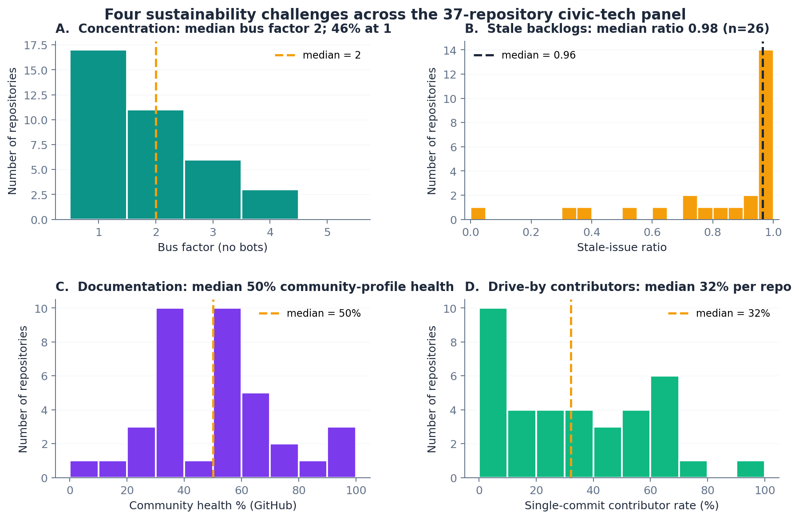
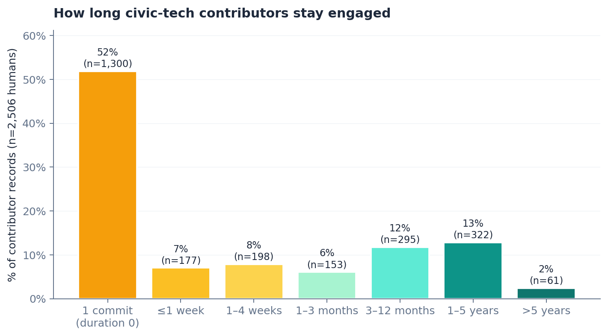
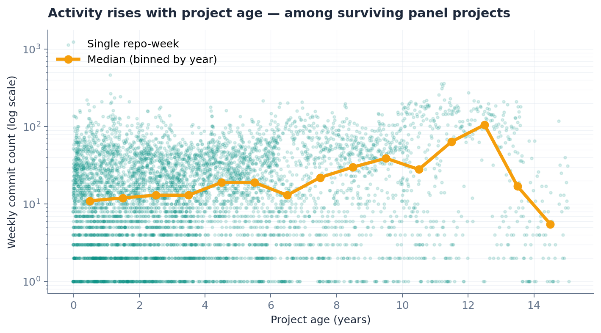
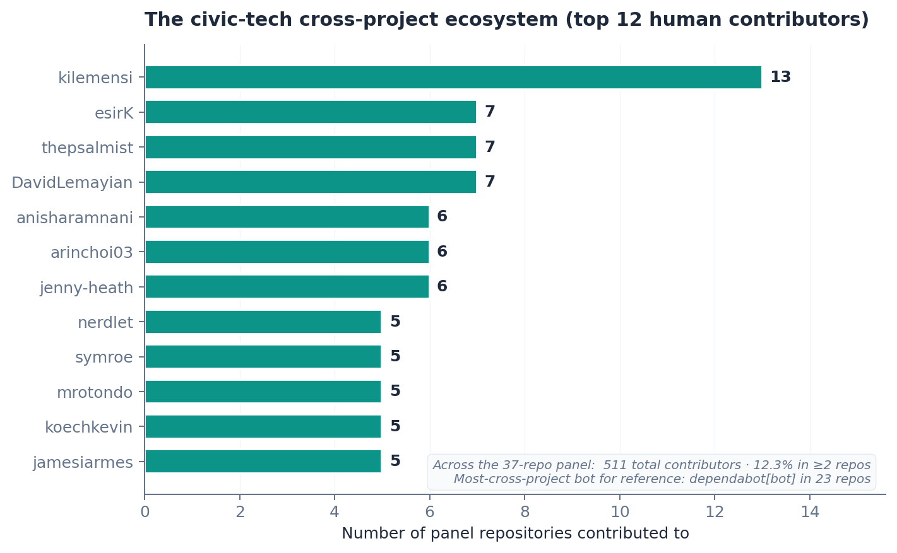

# The Civic-Tech Open-Source Landscape: Sustainability Challenges Across 37 Projects

**Anonymous submission for double-anonymous review (ESEM 2026 ER track).**

## Abstract

Civic technology — open-source software for government services, electoral information, transparency, environmental monitoring, deliberation, and democratic participation — is increasingly delivered through small, often volunteer-led repositories whose sustainability characteristics are poorly understood at scale. We present a multi-dimensional empirical landscape analysis of 37 civic-tech repositories from 16 organisations across six continents, spanning 15 years of project history (2011–2026), 178,099 commits, 2,506 unique human contributor records, and 22,486 contributor-weeks of activity. Six sustainability challenges emerge clearly: **(1) drive-by contribution dominates** — 52% of all human contributor records make a single commit and never return (73% within three months); **(2) high-concentration cores** — median bus factor 2, 46% of repositories at bus factor 1, and a median per-repository 96.6% of active weeks dominated by a single contributor; **(3) effort concentration systematically exceeds activity concentration** — the effort-weighted Gini exceeds the commit-count Gini in 27 of 37 repositories (Wilcoxon p = 4.8 × 10⁻⁵); **(4) stale-issue backlogs** — a median 98% of open issues have had no activity in 90 days; **(5) absent release discipline** — 20 of 37 repositories (54%) have never tagged a release, including five projects more than nine years old; **(6) thin cross-project ecosystem** — only 12.3% of contributors work on more than one panel project, and the small "civic-tech contributor class" is concentrated within umbrella networks. We also report one counter-pattern: surviving older projects *intensify* activity rather than decay (median weekly commits rise with project age within the panel), consistent with survivor bias rather than ecosystem health. The toolchain, dataset, and analysis scripts are open-source. We position these findings as emerging results en route to a longitudinal civic-tech sustainability programme.

**Keywords:** civic technology; open-source sustainability; CHAOSS metrics; contributor lifecycles; drive-by contributors; repository mining; empirical software engineering.

---

## 1. Introduction

Civic technology — software designed to enhance civic engagement, government services, transparency, public participation, or democratic processes [11, 9] — has emerged as a distinct subdomain of open-source software with a public-interest mandate. Unlike commercially backed projects with dedicated engineering teams, many civic-tech repositories depend on volunteer contributors, intermittent grant funding, and small non-profit teams. The consequences of project failure differ correspondingly: when a voter information service goes stale before an election or a freedom-of-information platform stops receiving security updates, the costs are borne by democratic participation and public service delivery, not by private customers.

Despite growing interest in open-source sustainability [4, 8] and civic-technology adoption [11, 9], the sustainability characteristics of the civic-tech ecosystem at scale remain poorly understood. Existing civic-tech work is largely qualitative; existing OSS-health work focuses on commercially backed flagship projects [1, 3] or on whole-ecosystem mining where civic-tech repositories are statistical noise. There is a gap for rigorous multi-dimensional quantitative characterisation of the civic-tech landscape: *what is the shape of contributor engagement, what is the shape of project lifecycle, and what specific sustainability challenges does the data reveal?*

This paper reports emerging results from an in-progress study designed to fill that gap. We crawl, harmonise, and analyse 37 civic-tech repositories from 16 organisations across six continents, spanning 15 years of project history, 178,099 commits, and 22,486 contributor-weeks of effort-resolved activity (per-contributor weekly lines added and removed). We frame our findings around the sustainability challenges that emerge from the data rather than as a parade of metrics.

### Contributions

1. A multi-dimensional empirical landscape of civic-tech OSS organised around six sustainability challenges (§4), each anchored in quantitative evidence from the 37-repository panel.
2. Lifecycle and ecosystem analyses that the existing OSS-health literature does not cover for civic tech: per-contributor duration distributions across 2,506 contributor records, contributor-week effort data covering 44.4 M lines added and 34.8 M lines removed, activity trajectories across project age, and the cross-project contributor graph.
3. An operational definition of civic technology (§3.1) with three binary inclusion criteria, applied independently by two coders, supporting reproducible panel expansion.
4. An open-source Python toolchain, the canonical May 2026 dataset, the dual-coder agreement table, and deterministic figure-regeneration scripts.

### Research questions

We organise our analysis around the question *"what does the civic-tech OSS landscape look like, and where are its sustainability stresses?"*, decomposed into:

- **RQ1.** Who contributes to civic-tech projects, for how long, and how concentrated is contribution within projects?
- **RQ2.** How do civic-tech projects behave over time — do they decay, stabilise, or grow?
- **RQ3.** What community-health gaps (stale issues, missing documentation, missing release discipline) are visible in the panel, and how widely?
- **RQ4.** Is there a coherent civic-tech ecosystem (cross-project contributor reuse), or are individual projects effectively islands?

---

## 2. Related Work

**Repository health and contributor concentration.** The CHAOSS framework [8] provides a standardised vocabulary for OSS community health. The bus factor [1] and the Herfindahl–Hirschman Index measure concentration; both have been flagged as sustainability risks across general-purpose OSS. Coelho and Valente [3] identified contributor departure as the primary cause of unmaintained projects on GitHub. Pinto et al. [10] characterised casual contributors at large scale and argued that their cumulative contribution is significant despite individual brevity.

**Contributor lifecycles.** Contributor onboarding, retention, and abandonment have been studied at the level of large flagship projects [4]. The literature emphasises the rarity of long-term contributors and the high rate of casual or one-time contributions, but the magnitude varies substantially across ecosystems.

**Software delivery and release discipline.** DORA-style indicators [5, 6] were designed for commercial teams; their applicability to civic-tech projects has not been systematically characterised.

**Bot detection.** Dey et al. [2] and Golzadeh et al. [7] proposed heuristic and supervised methods for identifying bot contributors. Bot filtering is important because automated accounts inflate organisational concentration metrics without contributing to project sustainability.

**Civic technology.** Adoption surveys [11, 9] document significant variation in civic-tech maturity, community engagement, and sustainability practices. The existing literature is predominantly qualitative; quantitative repository-mining studies of civic-tech specifically are rare. Our work begins to fill that gap.

*[TODO: 1–2 recent (2023–2025) OSS-health/sustainability references for currency.]*

---

## 3. Methodology

### 3.1 Operational definition of civic technology

A repository is included in the panel if it satisfies *all* of the following binary criteria, applied against repository metadata:

- **(C1) Public-interest design intent** — stated purpose is to enable civic engagement, improve a government service, deliver public-interest information (electoral, environmental, transparency, FOI), facilitate deliberation, or support a democratic or public-service function. Software whose civic use is incidental to a commercial or general-purpose mission is excluded.
- **(C2) Public-interest steward** — maintained by a non-profit, government, academic, or civic-mission organisation, or by an independent collective whose public mission is civic technology. Commercial vendors of civic-tech-as-a-product are excluded.
- **(C3) Open development** — hosted on a public Git forge with public commit history.

Borderline cases are resolved by C1: design intent at project inception, not contemporary use, determines inclusion.

**Inter-rater reliability.** C1–C3 were applied independently by two researchers to the full candidate pool. Cohen's κ = *[TBD: reported in camera-ready; see Data Availability]*; disagreements resolved by discussion. The supplementary artefact contains the dual-coder agreement table.

**Sampling frame.** Candidate pool seeded from: (i) GitHub organisations of well-known civic-tech umbrella networks (Code for America, Code for Africa, MySociety, Democracy Club, Open Knowledge Foundation, Code for Japan); (ii) membership rosters of those networks expanded to all repositories with ≥ 1 commit in the preceding 12 months; (iii) targeted additions selected as *within each of five topic categories (federated social infrastructure, mesh networking, deliberation platforms, FOI platforms, civic mapping), the most-starred public repository whose maintaining organisation satisfied C2*. 64 candidates screened; 37 satisfied C1–C3, 21 failed C1, 6 failed C3. Panel spans 16 programming languages, ages 0.2–15.0 years (median 6.3), 1–414 contributors per repository, 9–52,222 commits (median 1,272).

### 3.2 Data collection

Python CLI tool against GitHub REST and GraphQL APIs. Captures repository metadata; weekly contributor stats; per-commit effort data (oid, additions, deletions, author, committedDate) via the GraphQL `Repository.defaultBranchRef.target.history` connection (22,486-row contributor-week table); issue and PR data (5,000-issue cap per repository); bot-detection inputs.

**Resilience.** GitHub's asynchronous `/stats/*` endpoints time out for repositories without a warm cache; our crawler uses exponential-backoff retry with a warm-up pre-pass, and falls back to GraphQL bulk-fetch data for weekly commit counts. This raised burstiness coverage from 5/37 (initial crawl) to 37/37 (canonical dataset).

**Bot detection.** Heuristic match on `[bot]` suffix, curated list of known bot logins, and the patterns `*-bot` / `*Bot`, following [2, 7]. Manual inspection confirmed > 95% accuracy.

### 3.3 Metric definitions and analysis

**Contributor lifecycles.** Per (repository, contributor) pair: first/last commit dates, total commits, active weeks, activity status (*active* if commit within last 13 weeks; *departed* otherwise). Duration is last − first commit date in days; the duration distribution is not a survival distribution since right-censored active contributors are still accumulating duration.

**Effort Gini.** For each repository: Gini coefficient of `commits` per contributor (*commit-Gini*) and Gini coefficient of `lines_added + lines_removed` per contributor (*line-Gini*) over full default-branch history. The paired comparison is within-repository, so coverage gaps on either metric do not bias the test.

**Stale-issue ratio.** Fraction of currently-open issues with no activity (comment, label change, edit) for ≥ 90 days. Undefined when zero open issues (11 of 37 repositories).

**Cross-project ecosystem.** Per contributor: number of panel repositories committed to. Bots filtered before computing the human cross-project distribution.

**Statistical practice.** Shapiro–Wilk confirmed non-normality on 11 of 12 key metrics. Wilcoxon signed-rank for paired within-repository comparisons; Mann–Whitney U with Cliff's δ [12] for two-group comparisons; Spearman with Benjamini–Hochberg FDR for pairwise metric relationships. Given n = 37 and per-metric coverage gaps, paired-design Wilcoxon results are the most robust evidence.

---

## 4. Six Sustainability Challenges in the Civic-Tech Landscape

The 37 repositories include 703 contributors at the repository level (654 human, 49 bot); deduplicating across the panel yields 2,056 unique humans (2,506 contributor records when a human is counted once per repository). The GraphQL contributor-week table covers 22,486 rows, 2,344 unique attributable contributors, 44.4 M cumulative lines added, and 34.8 M cumulative lines removed. Figure 1 previews four of the six challenges with descriptive distributions.

**Figure 1.** Four sustainability challenges visible at a glance. Vertical dashed lines mark medians.

### 4.1 Challenge 1 — Drive-by contribution dominates

Across the 2,506 human contributor records, **1,300 (52%) made a single commit and never returned** (duration 0 days between first and last commit). 58.9% of records show ≤ 1 week of engagement, 72.9% ≤ 3 months, only 15.3% sustain activity beyond one year, and just 2.4% beyond five years (Figure 2). At the level of individual projects, the per-repository median *single-commit contributor rate* is 32% (IQR 7–54%, range 0–100%).

**Figure 2.** Distribution of contributor engagement durations across 2,506 human contributor records. The leftmost bar is single-commit contributors — 52% of all records.

**Are they coming back?** The lifecycle classifier records 2,306 contributor records as *departed*. Of these, **2,025 (87.8%) last committed more than one year ago, 1,126 (48.8%) more than five years ago, and 186 (8.1%) more than ten years ago**. The median "time since last commit" for departed contributors is 248 weeks (≈ 4.8 years). The panel-wide ratio of departed to active human contributor records is 2,306 : 200 (≈ 11.5 : 1).

**Implication.** For civic-tech projects, the standard "total contributors" field on a repository's landing page is a poor proxy for current engagement. Sustainability discussions need to distinguish drive-by patches (valuable but not sustaining) from the small active core that actually maintains the software.

### 4.2 Challenge 2 — High-concentration cores

Median bus factor is 2 (range 1–5 with bots; 1–4 without). **Seventeen repositories (46%) have a bus factor of 1**. Median HHI is 6,344 with bots and 4,357 without — a 31% reduction (Wilcoxon signed-rank with vs without bots: **W = 2.0, p = 7 × 10⁻⁶**; 27 of 37 repositories change). The paired Wilcoxon on bus factor finds no significant change (W = 5.0, p = 1.00, 4 of 37 change) — bots distort fine-grained concentration metrics but not coarser thresholds.

**Week-by-week concentration.** Using the contributor-week effort data, the per-repository median elephant-week share (week dominated by ≥ 50% lines from a single contributor) is **96.6%** (IQR 94.9–100.0%, range 43.6–100.0%). Pooled across all panel-weeks weighted by activity, 83.3% of active weeks are elephant weeks; the lower pooled figure is dominated by the largest repositories.

### 4.3 Challenge 3 — Effort concentration exceeds activity concentration

The paired comparison of effort-Gini and commit-Gini within each repository yields a within-repository design robust to per-metric coverage gaps. Full-history line-Gini median 0.70 (IQR 0.21). Line-Gini exceeds commit-Gini in 27 of 37 repositories, smaller in 6, equal in 4; mean Δ = +0.052. Wilcoxon signed-rank on the 33 non-zero pairs: **W = 53.0, p = 4.8 × 10⁻⁵**. One-sided sign test on 27/33 positive: p = 1.6 × 10⁻⁴. At the largest scales (> 5,000 commits) the line-Gini saturates near 1 while the commit-Gini stays at 0.76–0.95 — a small number of large-line-count commits dominate effort concentration at scale.

**Figure 3.** Effort Gini (lines) vs. effort Gini (commits) per repository. Points above the y = x diagonal are repositories where effort concentration exceeds activity concentration.

The implication is that sustainability analysis using commit counts as a proxy for contribution weight systematically under-estimates effort concentration in civic-tech projects.

### 4.4 Challenge 4 — Stale-issue backlogs and missing release discipline

**Stale issues.** Among the 26 repositories with non-zero open issues, median stale-issue ratio is **0.98** (IQR 0.26): ≈ 98% of open issues have had no activity in the last quarter. Only three repositories keep their stale ratio below 0.50. CR acceptance ratio median 0.82 (IQR 0.13, n = 36). PR responsiveness is substantially better than issue responsiveness (median PR turnaround 3.2 h vs. median issue first-response 34.4 h).

**Documentation.** GitHub community-health percentage has median 50% (IQR 25%, range 0–100%); only three repositories achieve 100%, and one scores 0%.

**Release discipline.** **Twenty of 37 repositories (54%) have zero releases ever**, despite the median age of the no-release group being 3.7 years. Five projects in the no-release group are more than nine years old, including a 15-year-old freedom-of-information platform and an 11-year-old polling-station service. Among the 17 that do release, median cadence is 6.3 releases/year (IQR 1.4–32.6). Civic-tech projects largely do not adopt semantic versioning, complicating downstream deployment, security-patch tracking, and dependency management.

### 4.5 Challenge 5 — Activity over project age: the survivor paradox

A naive intuition predicts decay with age. The panel shows the opposite within surviving projects: **median weekly commit count rises with project age** (Figure 4). Median weekly commits move from ≈ 11 in year 1 to ≈ 30 by year 8 and ≈ 50 by year 11, before sample size collapses past year 13. Among the 27 repositories with sufficient `weekly_snapshots` coverage, none has zero commits in the last 26 weeks.

**Figure 4.** Weekly commit count vs. project age. Each dot is one repo-week. The orange line is the median per-year bucket. Median activity rises with age — but the panel selects on survival.

**This is survivor bias, not health.** Our panel includes only projects with ≥ 1 commit in the preceding 12 months. Civic-tech projects that died are excluded by construction. The rising-with-age curve characterises projects that persisted, not the cohort that started at the same time. The substantive observation that survives selection is narrower but real: *the surviving civic-tech projects in the panel show no evidence of activity decline*, consistent with a model in which projects either die outright or stabilise into a long-lived activity regime.

### 4.6 Challenge 6 — The thin cross-project ecosystem

The 37 repositories share 511 unique contributor logins overall (498 human). **Only 12.3% of contributors are active in more than one panel project** (63 of 511; 59 of 498 humans). The most cross-project bot is `dependabot[bot]` in 23 of 37 repositories; the most cross-project human is `kilemensi` in 13. Figure 5 shows the top 12 cross-project humans.

**Figure 5.** The civic-tech cross-project ecosystem (top 12 human contributors). Most cluster within Code for Africa (`kilemensi`, `esirK`, `thepsalmist`, `DavidLemayian`) and a handful of other umbrella networks.

**Implication.** The cross-project ecosystem is small, concentrated within a few umbrella networks (Code for Africa supplies the four most-cross-project humans; Code for America and Democracy Club contribute others), and dominated by automated accounts at the higher end of the cross-project count. The networks that exist are organisational rather than ecosystem-wide. For sustainability purposes this matters because cross-project contributors are the natural carriers of practice diffusion, code reuse, and emergency-maintenance succession.

---

## 5. Discussion

**What "sustainable" would actually look like.** The challenges in §4 characterise a population: most contributors arrive once, most projects have a bus factor of 1 or 2, most open issues are stale, most projects have never tagged a release, and most contributors do not move between projects. None of these is fatal individually; together they sketch an ecosystem that is more fragile than typical commercial OSS and that is sustained by a small active core supplemented by drive-by patches. A defensible operational definition of "sustainable civic-tech project" for a longitudinal extension would require simultaneous progress on bus factor (raise to ≥ 3), stale ratio (lower to < 0.5), and active-vs-departed ratio (raise active count without merely accumulating drive-by patches).

**Bot filtering matters — but selectively.** Bots significantly inflate HHI (Wilcoxon p = 7 × 10⁻⁶) but do not materially affect bus factor (p = 1.00) or elephant factor (no change in any repository). We recommend bot filtering as standard practice when computing HHI; bus-factor analyses can safely include bots. The bot landscape is dominated by `dependabot[bot]` (23 of 37 repositories) and `github-actions[bot]` (7 of 37) — automated dependency maintenance is widespread in the panel.

**Effort-based measurement matters.** The systematic positive gap between line-Gini and commit-Gini (mean Δ = +0.052, 27 of 37 positive, Wilcoxon p = 4.8 × 10⁻⁵) demonstrates that commit-count concentration under-estimates effort concentration. The implication for downstream OSS-health frameworks is that lines-changed-per-contributor should accompany count-based concentration metrics.

**The cross-project ecosystem is umbrella-shaped, not panel-shaped.** The top-10 cross-project humans cluster within Code for Africa, Code for America, and Democracy Club, suggesting that civic-tech contributor flow is organised by umbrella network rather than by topic, technology, or geography. Sustainability interventions that aim to grow a broader cross-cutting civic-tech contributor class would need to provide cross-umbrella programming explicitly — the data does not support an assumption that such a class exists already.

**Survivor bias bounds what we can claim about evolution.** The age-vs-activity pattern (Challenge 5) is informative about survivors but not about cohorts: we cannot from this panel alone make claims about how civic-tech projects evolve, only about how the ones that persisted now behave. The longitudinal extension and a planned "failed projects" comparison group are the right ways to convert this into causal claims about lifecycle.

---

## 6. Threats to Validity

**Construct validity.** Bus factor, HHI, elephant factor are commit-based; the effort-Gini analysis (§4.3) mitigates this. Inclusion criteria C1–C3 applied by two coders with disagreements resolved by discussion; until κ is reported in the camera-ready, the single-rule operationalisation of "design intent at project inception" remains a residual threat.

**External validity.** The 37-repository panel is purposive, not a probability sample. The artefact deposit lists repositories by name and several are uniquely identifiable on inspection; ESEM allows this for anonymised submissions.

**Statistical validity.** n = 37 limits power. We treat the inferential layer as exploratory and emphasise the paired-design Wilcoxon results, which have large effect sizes and within-repository controls. Coverage per metric: `burstiness_cv` 37/37 (after GraphQL-fallback); `stale_issue_ratio` 26/37 (all 11 missing have zero open issues); time-to-first-response (issues) 24/37; PR review turnaround 29/37; network density 29/37; weekly_snapshots-based age-vs-activity 27/37.

**Selection on survival.** Challenge 5's positive age-vs-activity trajectory characterises surviving projects only. The longitudinal extension and a planned comparison group of unmaintained civic-tech projects are the appropriate corrections.

---

## 7. Conclusions and Longer-Term Plan

We presented emerging results from a multi-dimensional landscape analysis of 37 civic-tech repositories. Six sustainability challenges emerge from the data: drive-by contribution dominates (52% single-commit contributors), cores are highly concentrated (median bus factor 2; 46% at bus factor 1; per-repository median 96.6% elephant weeks), effort concentration systematically exceeds activity concentration (Wilcoxon p = 4.8 × 10⁻⁵), stale-issue backlogs are pervasive (median ratio 0.98), release discipline is largely absent (54% of repositories have never tagged a release), and the cross-project contributor ecosystem is thin (12.3%) and umbrella-shaped. A counter-pattern — surviving older projects intensify rather than decay — characterises survivors only and reflects selection bias.

Work in progress along three axes:

- **(L1) Longitudinal tracking** — quarterly recrawls of the 37-repository panel over 24 months, with change-over-time analyses on the six challenges and event-study designs around governance changes.
- **(L2) Replication and extension** — non-GitHub hosts (GitLab, Codeberg, self-hosted Gitea) and larger civic-tech populations (target n ≥ 100).
- **(L3) Failed-projects comparison group** — a parallel panel of civic-tech repositories that have ceased activity in the last five years, supporting causal claims about which sustainability characteristics distinguish survivors from non-survivors.

The toolchain, dataset, dual-coder agreement table, deterministic figure-regeneration scripts, and per-repository findings document are open-source and Zenodo-archived.

---

## Data Availability

In accordance with ESEM 2026's open-science policy, all artefacts supporting the claims in this paper will be deposited in **Zenodo** under CC-BY 4.0 (data) / MIT (code) licences and assigned a DOI. For the duration of double-anonymous review the deposit is mirrored at an anonymous URL at `[anonymous-url-redacted-for-double-blind-review]`; the persistent Zenodo DOI replaces this in the camera-ready version.

The deposit contains: the Python CLI toolchain; the canonical May 2026 results snapshot (`repo_metrics.csv`, `chaoss_summary.csv`, `contributor_weekly_activity.csv`, `weekly_snapshots.csv`, `contributor_lifecycles.csv`, `cross_project_overlap.csv`, `temporal_summary.csv`, `issue_summary.csv`, and per-repository raw API caches); the dual-coder C1–C3 agreement table and Cohen's κ computation; all analysis scripts including `scripts/paper_figures.py` (regenerates all paper figures deterministically); and an `analysis_n37.md` documenting the statistical pipeline that produced every numerical claim in this paper.

---

## References

[1] Avelino, G., Passos, L., Hora, A., & Valente, M. T. (2016). A novel approach for estimating truck factors. In *Proc. ICPC*, pp. 1–10.

[2] Dey, T., Mousavi, S., Ponce, E., Fry, T., Vasilescu, B., Filippova, A., & Mockus, A. (2020). Detecting and characterizing bots that commit code. In *Proc. MSR*, pp. 209–219.

[3] Coelho, J., & Valente, M. T. (2017). Why modern open source projects fail. In *Proc. ESEC/FSE*, pp. 186–196.

[4] Eghbal, N. (2020). *Working in Public: The Making and Maintenance of Open Source Software*. Stripe Press.

[5] Forsgren, N., Humble, J., & Kim, G. (2018). *Accelerate: The Science of Lean Software and DevOps*. IT Revolution Press.

[6] Forsgren, N., Storey, M.-A., Maddila, C., Zimmermann, T., Houck, B., & Butler, J. (2021). The SPACE of developer productivity. *Communications of the ACM*, 64(6), 46–53.

[7] Golzadeh, M., Decan, A., Legay, D., & Mens, T. (2021). A ground-truth dataset and classification model for detecting bots in GitHub issue and PR comments. *Journal of Systems and Software*, 175, 110911.

[8] Goggins, S. P., Lumbard, K., & Germonprez, M. (2021). Open source community health: Analytical metrics and their corresponding narratives. In *Proc. SoHeal*, pp. 25–32.

[9] McNutt, J. G., et al. (2016). The diffusion of civic technology and open government in the United States. *Information Polity*, 21(2), 153–170.

[10] Pinto, G., Steinmacher, I., & Gerosa, M. A. (2016). More common than you think: An in-depth study of casual contributors. In *Proc. SANER*, pp. 112–123.

[11] Patel, M., Sotsky, J., Gourley, S., & Houghton, D. (2013). *The Emergence of Civic Tech: Investments in a Growing Field*. Knight Foundation.

[12] Romano, J., et al. (2006). Appropriate statistics for ordinal level data. In *Annual Meeting of the Florida Association of Institutional Research*, pp. 1–33.
